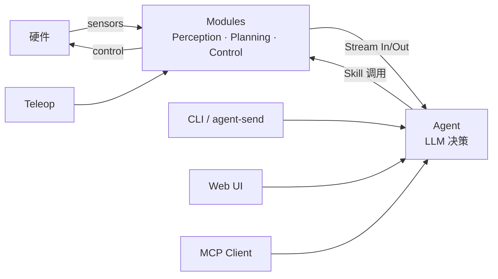

# DimOS 系统架构（System Architecture）

> 给新工程师的全景文档：通读后无需跳转即可建立完整心智模型（约 1.5 小时）。
> 想深入某个细节再翻同目录 5 份专题：[runtime-model](runtime-model.md) /
> [agent-stack](agent-stack.md) / [robot-platforms](robot-platforms.md) /
> [subsystems](subsystems.md) / [data-flow](data-flow.md)。

## 目录

- [§ 0. DimOS 是什么](#-0-dimos-是什么)
- [§ 0.5. 仓库布局总览](#-05-仓库布局总览)
- [§ 1. 三个核心抽象](#-1-三个核心抽象)
- [§ 2. 通信骨架](#-2-通信骨架)
- [§ 3. 运行时模型](#-3-运行时模型)
- [§ 4. Agent 系统](#-4-agent-系统)
- [§ 5. 机器人平台层](#-5-机器人平台层)
- [§ 6. 能力子系统全景](#-6-能力子系统全景)
- [§ 7. 端到端数据流](#-7-端到端数据流)
- [§ 8. 怎么继续读 + 常见踩坑](#-8-怎么继续读--常见踩坑)

---

### § 0. DimOS 是什么

DimOS 是面向通用机器人的智能体操作系统（The Agentive Operating System for Physical Space）。

传统机器人软件往往是一块铁板：感知、规划、控制、IO 被硬编码耦合在同一进程或同一框架里。换一个平台，换一个传感器，整套代码往往需要大幅重写。更棘手的是，机器人的"决策"通常藏在状态机或硬编码规则里，很难被外部指令灵活驱动。

DimOS 的核心思路是把这块铁板拆成两个正交维度：

**Module（模块）** 负责所有与硬件相关的运行时能力——感知流水线（摄像头、激光雷达、语音）、空间记忆与建图、导航与规划、运动控制与电机驱动。每个 Module 通过类型化 Stream 发布和消费数据；Stream 底层可以是 LCM、ROS2、DDS 或内存管道，对上层透明。多个 Module 被 Blueprint（蓝图）编排成可直接运行的机器人软件栈，一行 `dimos run <blueprint>` 即可启动。

**Agent（智能体）** 负责高层决策。它订阅 Module 暴露的 Stream、调用 Module 注册的 Skill（技能函数），用自然语言驱动机器人行为。用户可以通过 CLI（`dimos agent-send`）、Web UI 或 MCP 客户端向 Agent 下指令，由 Agent 翻译成 Skill 调用；Teleop 则绕过 Agent，直接以人手操作驱动 Module。无需修改底层 Module，只需更换或扩展 Skill，机器人的行为边界就随之改变。



> **本文档与 AGENTS.md / CLAUDE.md 的分工**
>
> - `AGENTS.md` — quick-start cheat-sheet 与必踩坑清单（命令速查、blueprint 表、`@skill` 规则、预提交钩子）；**事实之源**，有疑问先看这里。
> - `CLAUDE.md` — AI 代理工作护栏；指向 `AGENTS.md`，附加少量 Claude 专用约束（不重复 AGENTS.md 内容）。
> - 本架构文档 — 系统全景与设计取舍。
>
> 三者交叉引用，不重复。如需修改某条规则，只在其"主权"文档里改，其余文档只做引用。

### § 0.5. 仓库布局总览

```text
dimos/                    # 仓库根
├── dimos/                # 主 Python 包（所有运行时代码）
├── bin/                  # CI/开发辅助脚本（如 bin/pytest-slow）
├── scripts/              # 安装与运维辅助脚本
├── data/                 # 示例 / replay 数据集
├── docker/               # 容器构建上下文
├── examples/             # 跑得起来的示例代码
├── assets/               # 图标、静态资源
├── docs/                 # 文档（本文件所在）
├── pyproject.toml        # 项目元数据 + 依赖声明
├── setup.py              # 兼容 setuptools 入口（保留兼容）
├── uv.lock               # uv 锁定文件
├── flake.nix             # Nix flake 定义
├── flake.lock            # Nix 锁定
├── default.env           # 默认环境变量
├── MANIFEST.in           # 打包清单
├── LICENSE               # 许可证
├── CLA.md                # 贡献者许可协议
├── README.md             # 仓库主 README
├── CLAUDE.md             # Claude Code 工作护栏
└── AGENTS.md             # AI agent onboarding（事实之源）
```

| 顶级目录/文件 | 用途 |
|---|---|
| `dimos/` | 主 Python 包：所有运行时代码 |
| `bin/` | shell 包装（如 `bin/pytest-slow` 跑全套测试） |
| `scripts/` | 安装与运维辅助脚本（目前主要是 `install.sh`） |
| `data/` | 示例数据、replay 数据集 |
| `docker/` | Docker 构建文件 |
| `examples/` | 跑得起来的示例 |
| `assets/` | 图标、静态资源 |
| `docs/` | 文档：本文件所在 |
| `pyproject.toml` | 项目元数据 + 依赖声明（setuptools 构建后端，uv 管理依赖） |
| `setup.py` | 旧式 setuptools 入口（保留兼容） |
| `uv.lock` | uv 锁定 |
| `flake.nix` / `flake.lock` | Nix 复现构建 |
| `default.env` | 默认环境变量 |
| `MANIFEST.in` | 打包清单 |
| `LICENSE` | 许可证 |
| `CLA.md` | 贡献者许可协议 |
| `README.md` | 仓库主 README |
| `CLAUDE.md` | Claude Code 工作护栏 |
| `AGENTS.md` | AI agent onboarding（事实之源） |

> `dimos/utils/` 是 20 来个横切工具模块（`logging_config` / `llm_utils` /
> `transform_utils` / `gpu_utils` / `threadpool` / `urdf` 等），被几乎所有
> 子系统依赖。本文档不展开；需要时直接读源码。

### § 1. 三个核心抽象

<!-- TODO: Task 3 -->

### § 2. 通信骨架

<!-- TODO: Task 4 -->

### § 3. 运行时模型

<!-- TODO: Task 5 -->

### § 4. Agent 系统

<!-- TODO: Task 6 -->

### § 5. 机器人平台层

<!-- TODO: Task 7 -->

### § 6. 能力子系统全景

<!-- TODO: Tasks 8-10 -->

### § 7. 端到端数据流

<!-- TODO: Task 11 -->

### § 8. 怎么继续读 + 常见踩坑

<!-- TODO: Task 11 -->

---

## 扩展阅读

- 仓库速查与必踩坑：[`AGENTS.md`](../../AGENTS.md)
- 使用教程：[`docs/usage/`](../usage/)
- 能力深度文档：[`docs/capabilities/`](../capabilities/)
- 平台配置：[`docs/platforms/`](../platforms/)
- 安装：[`docs/installation/`](../installation/)
- 开发与测试：[`docs/development/`](../development/)
