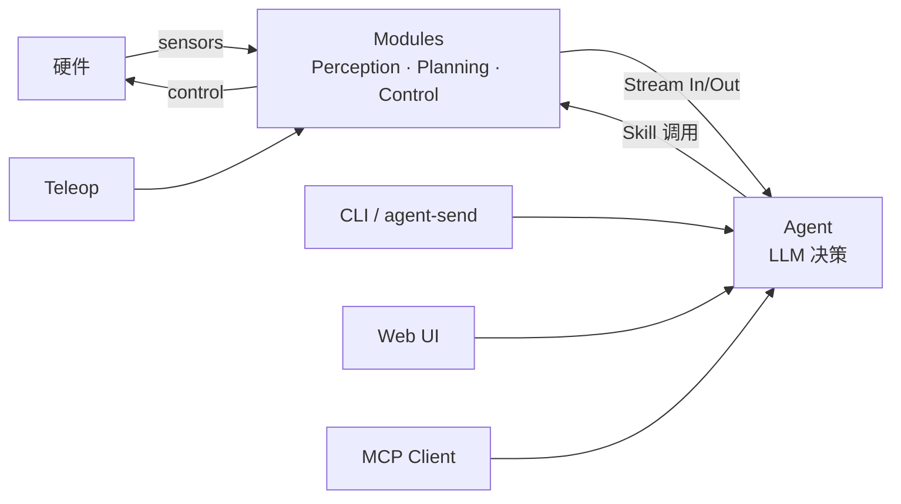
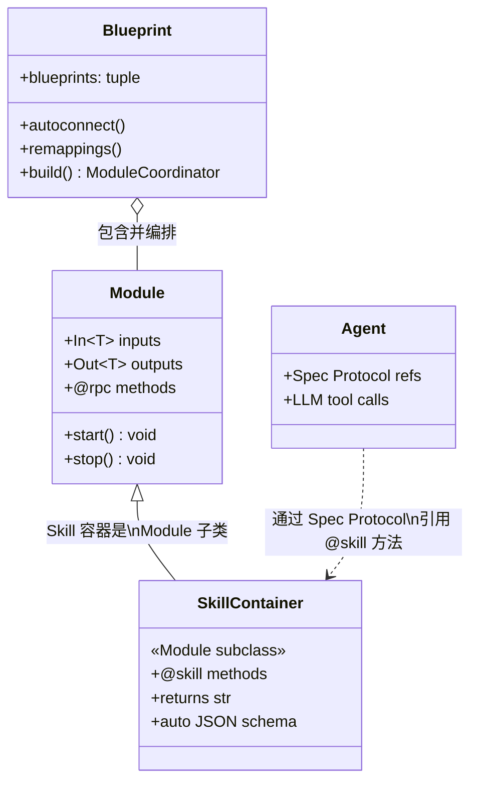
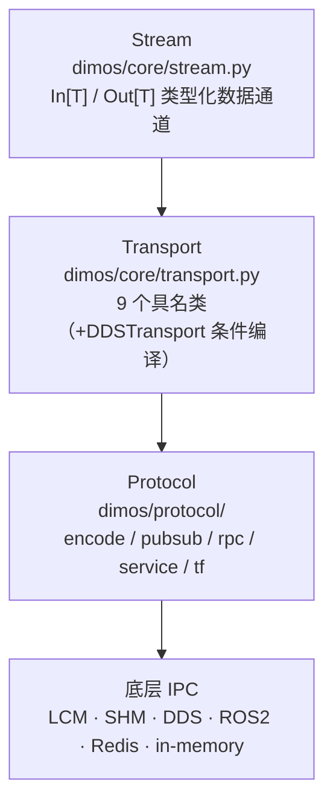
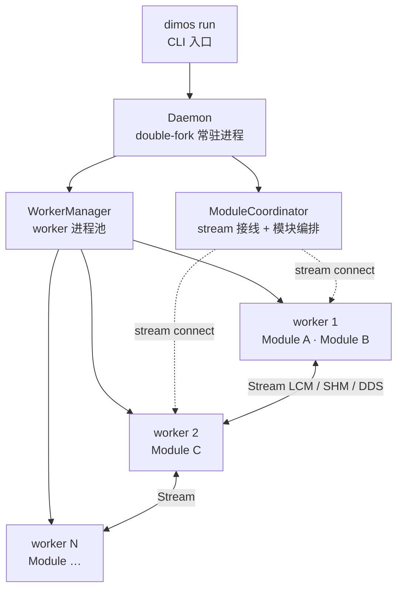
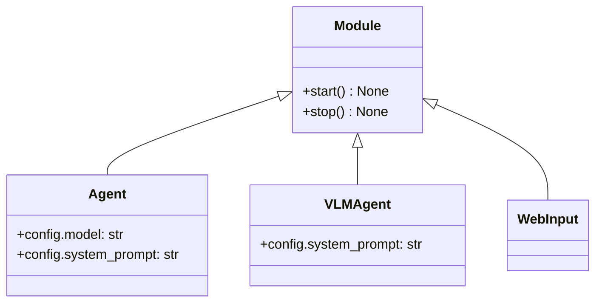
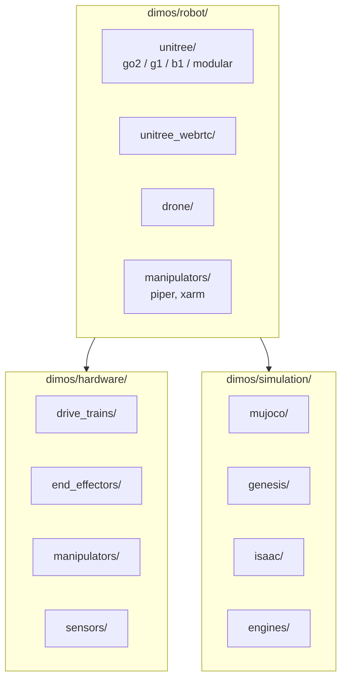
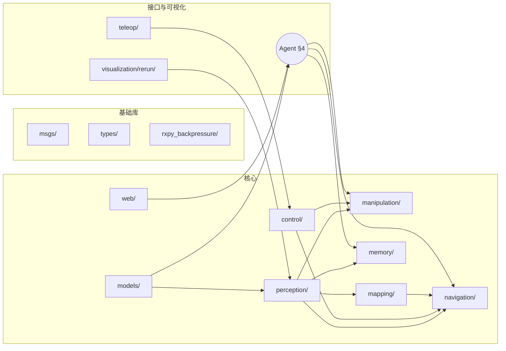

# DimOS 系统架构（System Architecture）

> 给新工程师的全景文档：通读后无需跳转即可建立完整心智模型（约 1.5 小时）。
> 想深入某个细节再翻同目录 5 份专题：[runtime-model](runtime-model.md) /
> [agent-stack](agent-stack.md) / [robot-platforms](robot-platforms.md) /
> [subsystems](subsystems.md) / [data-flow](data-flow.md)。

## 目录

- [§ 0. DimOS 是什么](#-0-dimos-是什么)
- [§ 0.5. 仓库布局总览](#-05-仓库布局总览)
- [§ 1. 三个核心抽象](#-1-三个核心抽象)
- [§ 2. 通信骨架](#-2-通信骨架)
- [§ 3. 运行时模型](#-3-运行时模型)
- [§ 4. Agent 系统](#-4-agent-系统)
- [§ 5. 机器人平台层](#-5-机器人平台层)
- [§ 6. 能力子系统全景](#-6-能力子系统全景)
- [§ 7. 端到端数据流](#-7-端到端数据流)
- [§ 8. 怎么继续读 + 常见踩坑](#-8-怎么继续读--常见踩坑)

---

### § 0. DimOS 是什么

DimOS 是面向通用机器人的智能体操作系统（The Agentive Operating System for Physical Space）。

传统机器人软件往往是一块铁板：感知、规划、控制、IO 被硬编码耦合在同一进程或同一框架里。换一个平台，换一个传感器，整套代码往往需要大幅重写。更棘手的是，机器人的"决策"通常藏在状态机或硬编码规则里，很难被外部指令灵活驱动。

DimOS 的核心思路是把这块铁板拆成两个正交维度：

**Module（模块）** 负责所有与硬件相关的运行时能力——感知流水线（摄像头、激光雷达、语音）、空间记忆与建图、导航与规划、运动控制与电机驱动。每个 Module 通过类型化 Stream 发布和消费数据；Stream 底层可以是 LCM、ROS2、DDS 或内存管道，对上层透明。多个 Module 被 Blueprint（蓝图）编排成可直接运行的机器人软件栈，一行 `dimos run <blueprint>` 即可启动。

**Agent（智能体）** 负责高层决策。它订阅 Module 暴露的 Stream、调用 Module 注册的 Skill（技能函数），用自然语言驱动机器人行为。用户可以通过 CLI（`dimos agent-send`）、Web UI 或 MCP 客户端向 Agent 下指令，由 Agent 翻译成 Skill 调用；Teleop 则绕过 Agent，直接以人手操作驱动 Module。无需修改底层 Module，只需更换或扩展 Skill，机器人的行为边界就随之改变。



> **本文档与 AGENTS.md / CLAUDE.md 的分工**
>
> - `AGENTS.md` — quick-start cheat-sheet 与必踩坑清单（命令速查、blueprint 表、`@skill` 规则、预提交钩子）；**事实之源**，有疑问先看这里。
> - `CLAUDE.md` — AI 代理工作护栏；指向 `AGENTS.md`，附加少量 Claude 专用约束（不重复 AGENTS.md 内容）。
> - 本架构文档 — 系统全景与设计取舍。
>
> 三者交叉引用，不重复。如需修改某条规则，只在其"主权"文档里改，其余文档只做引用。

### § 0.5. 仓库布局总览

```text
dimos/                    # 仓库根
├── dimos/                # 主 Python 包（所有运行时代码）
├── bin/                  # CI/开发辅助脚本（如 bin/pytest-slow）
├── scripts/              # 安装与运维辅助脚本
├── data/                 # 示例 / replay 数据集
├── docker/               # 容器构建上下文
├── examples/             # 跑得起来的示例代码
├── assets/               # 图标、静态资源
├── docs/                 # 文档（本文件所在）
├── pyproject.toml        # 项目元数据 + 依赖声明
├── setup.py              # 兼容 setuptools 入口（保留兼容）
├── uv.lock               # uv 锁定文件
├── flake.nix             # Nix flake 定义
├── flake.lock            # Nix 锁定
├── default.env           # 默认环境变量
├── MANIFEST.in           # 打包清单
├── LICENSE               # 许可证
├── CLA.md                # 贡献者许可协议
├── README.md             # 仓库主 README
├── CLAUDE.md             # Claude Code 工作护栏
└── AGENTS.md             # AI agent onboarding（事实之源）
```

| 顶级目录/文件 | 用途 |
|---|---|
| `dimos/` | 主 Python 包：所有运行时代码 |
| `bin/` | shell 包装（如 `bin/pytest-slow` 跑全套测试） |
| `scripts/` | 安装与运维辅助脚本（目前主要是 `install.sh`） |
| `data/` | 示例数据、replay 数据集 |
| `docker/` | Docker 构建文件 |
| `examples/` | 跑得起来的示例 |
| `assets/` | 图标、静态资源 |
| `docs/` | 文档：本文件所在 |
| `pyproject.toml` | 项目元数据 + 依赖声明（setuptools 构建后端，uv 管理依赖） |
| `setup.py` | 旧式 setuptools 入口（保留兼容） |
| `uv.lock` | uv 锁定 |
| `flake.nix` / `flake.lock` | Nix 复现构建 |
| `default.env` | 默认环境变量 |
| `MANIFEST.in` | 打包清单 |
| `LICENSE` | 许可证 |
| `CLA.md` | 贡献者许可协议 |
| `README.md` | 仓库主 README |
| `CLAUDE.md` | Claude Code 工作护栏 |
| `AGENTS.md` | AI agent onboarding（事实之源） |

> `dimos/utils/` 是 20 来个横切工具模块（`logging_config` / `llm_utils` /
> `transform_utils` / `gpu_utils` / `threadpool` / `urdf` 等），被几乎所有
> 子系统依赖。本文档不展开；需要时直接读源码。

### § 1. 三个核心抽象

DimOS 的所有运行代码都围绕三个抽象组装：**Module / Blueprint / Skill**。读懂这三者，整个仓库的 80% 代码读起来就有定位感。

#### Module —— 自治子系统

Module 是 DimOS 最基础的运行单元。每个 Module 是一个继承自 `Module` 基类的 Python 类，代表一个独立的、可组合的能力模块——例如摄像头驱动、目标检测、导航规划或运动控制。Module 运行在 forkserver 工作进程中，与主进程隔离；多个 Module 之间默认按 worker 池调度（详见 §3）；进程间通过 LCM 消息总线或共享内存进行通信。

Module 的数据接口通过类型注解声明：`In[T]` 表示输入流，`Out[T]` 表示输出流，`T` 是实际消息类型（如 `Image`、`PoseStamped`、`Twist`）。声明即接口——Blueprint 在构建时会读取这些注解，自动按 `(名称, 类型)` 匹配并连接各 Module 的流。流的底层传输是可替换的（LCM / ROS2 / DDS / 内存管道），Module 本身不感知传输细节。

Module 还通过 `@rpc` 装饰器暴露可远程调用的方法。`@rpc` 方法是 Module 的过程调用面：其他 Module 或框架代码可以跨进程调用它们，保留原始返回类型。所有 Module 天然拥有两个基础 `@rpc` 方法：`start()` 负责初始化订阅和定时器，`stop()` 负责安全关闭和资源释放。

#### Blueprint —— 用 autoconnect 拼装

Blueprint 是一张描述"哪些 Module 共同构成这台机器人软件栈"的配置图。它本身是不可变数据结构（冻结 dataclass），因此可以安全地在多处复用和组合。

`autoconnect(*blueprints)` 是拼装的核心：它接受多个 Module 级或 Blueprint 级蓝图，去重合并后返回一个新的 `Blueprint`。构建阶段（`.build()`）会为每个 Module 启动 forkserver 工作进程，然后扫描所有模块的 `In[T]` / `Out[T]` 注解，凡 `(名称, 类型)` 完全匹配的流对，自动共享同一个传输层实例——这就是"自动连线"。

若两个 Module 恰好有同名但含义不同的流，可以用 `.remappings([(ModuleA, "old_name", "new_name"), ...])` 解决命名冲突，将某个 Module 的特定流改名后再参与匹配。Module 之间的 RPC 引用则通过 `Spec` Protocol 注解在构建期（`.build()`）绑定，找不到匹配实现会在 build 阶段直接报错，而不是在运行时静默失败。

#### Skill —— 智能体可调用的动作

Skill 是 Agent 能调用的物理动作函数，定义在继承自 `Module` 的 Skill 容器类里。`@skill` 装饰器（`dimos/agents/annotation.py`）同时设置 `__rpc__ = True` 和 `__skill__ = True`：前者让该方法可以被跨进程 RPC 调用，后者让框架在注册时自动把函数签名和文档字符串转换成 LLM 工具调用所需的 JSON schema。

`@skill` 与 `@rpc` 在职责上是两个不同的层面：`@rpc` 是 Module 内部 / Module 间的过程调用面，保留原始 Python 返回类型；`@skill` 是 LLM 向外暴露的工具接口，**必须返回 `str`**，因为语言模型只消费文本。因此，不要将两者叠加使用——`@skill` 已经蕴含了 `@rpc`。`@skill` 函数还有几条硬性规则：必须有文档字符串、所有参数必须类型注解、返回值必须是 `str`；完整规则见 §4，违反任意一条都会导致模块注册失败或 LLM schema 缺失。

#### 关系图（类图）



#### 最小可运行 Blueprint 片段

```python
from dimos.core.module import Module
from dimos.core.stream import In, Out
from dimos.core.core import rpc
from dimos.agents.annotation import skill
from dimos.core.blueprints import autoconnect
from dimos.msgs.geometry_msgs import Twist
class DriveModule(Module):    # ① Module：类型化流 + @rpc 调用面
    cmd_vel: In[Twist]
    velocity_feedback: Out[Twist]
    @rpc
    def start(self) -> None:
        super().start()
        self.cmd_vel.subscribe(self._process)  # 实现略
class Skills(Module):         # ② Skill：@skill 向 LLM 暴露工具 schema
    @skill
    def move(self, speed: float = 0.5) -> str:
        """让机器人前进。Args: speed: m/s。"""
        return f"以 {speed} m/s 前进"
my_robot = autoconnect(DriveModule.blueprint(), Skills.blueprint())  # ③ Blueprint
```

#### 为什么这样分层

**类型化流（In[T] / Out[T]）** 的设计目标是把"哪个流连接到哪里"从运行时错误提前到构建期。流的 `(名称, 类型)` 双重匹配确保一个 `In[Image]` 不会意外接到 `Out[Twist]`——类型不符时 `autoconnect` 在 `.build()` 阶段就会拒绝连线，而不是等到消息在运行时被错误解码才爆出隐晦的 deserialization 错误。这也使得传输层可以无缝替换（LCM / ROS2 / DDS / 内存管道），因为上层代码只依赖类型，不依赖具体传输 API。

**forkserver 进程模型**的选择优先于 `fork`，原因有三：`fork` 会把父进程中已初始化的 CUDA 上下文、GPU 内存映射和打开的 socket 直接复制到子进程，几乎必然导致 CUDA 上下文损坏或文件描述符竞争；forkserver 则让每个工作进程从干净状态启动，只按需初始化自己所需的资源。相较于 `spawn`，forkserver 只需预分叉一次，后续 worker 启动更快，且可以预先加载共享库。每个 Module 运行在独立进程里，任一模块崩溃不会把整个机器人软件栈拖垮。

**`@skill` 与 `@rpc` 分层**的设计来自两个面向不同消费者的接口需求。`@rpc` 方法的调用者是其他 Module 或框架代码，它们是 Python 进程，可以直接处理 `bool`、`PoseStamped` 等原生类型，保留类型信息对编译器检查和序列化都有意义。`@skill` 方法的调用者是语言模型，它只能理解 JSON 参数和纯文本返回值——强制 `str` 返回确保 Agent 总能收到有意义的人类可读反馈，而不是 `None` 或二进制对象。两层分离还带来一个额外好处：一个 Module 可以有许多内部 `@rpc` 方法供其他 Module 调用，但只向 LLM 暴露经过精心设计、有完整文档的 `@skill` 子集。

### § 2. 通信骨架

DimOS 模块间通信采用三层栈：上层 **Stream**（架构语义层） → 中层 **Transport**（IPC 选型层） → 底层 **Protocol**（编码与 pub/sub 实现层）。三层解耦让同一个 Module 不改业务代码就能在 LCM、共享内存、ROS、DDS、Redis 等多种后端之间自由切换。§1 里提到的 `LCM / ROS2 / DDS / memory` 选项，正是由这一层栈来承接的。

#### Stream — 类型化的数据通道

`Stream`、`In[T]`、`Out[T]` 定义于 `dimos/core/stream.py`，是 DimOS 通信体系最高抽象层。`Out[T]` 代表一个模块对外发布的数据出口，`In[T]` 代表一个模块对外声明的数据入口。两者均以泛型类型参数 `T` 标注所携带的数据类型——例如 `Out[Image]` 只能连接到 `In[Image]`，类型不符时 `autoconnect` 在 `.build()` 阶段便会拒绝建链，而不是等到运行时产生难以追踪的反序列化错误。

每个 `Stream` 实例持有一个名称字段（`name`）和一个类型字段（`type`），`autoconnect` 依据"名称匹配且类型兼容"双重条件在蓝图拼装阶段自动连线；若需手动控制，也可在 Blueprint 里显式指定连接关系。每个 `Stream` 还关联一个 `Transport`，负责把数据实际搬运到发布/订阅后端——上层代码不感知传输细节，只调用 `Out.publish(msg)` 或订阅 `In.subscribe(callback)`。

`§1` 的最小代码示例里已经出现了 `In[str]` / `Out[str]`；本章的重点是它们背后的传输机制。

#### Transport — 9 个类，主用 6 个

`dimos/core/transport.py` 定义了 **9 个**功能性 Transport 类（外加一个内部基类 `PubSubTransport` 不计入）：**主用的六个**具体传输类（LCM、pLCM、SHM、pSHM、ROS、DDS）、**两个** JPEG 变体（JpegLcm、JpegShm）、**一个**占位 `ZenohTransport`。其中 `DDSTransport` 仅在编译时检测到 DDS 库才会启用（`if DDS_AVAILABLE:` 分支），其余 8 个无条件加载。

**主用六个传输类**各有不同的适用场景：

- **`LCMTransport`**：基于 LCM（Lightweight Communications and Marshalling）协议。LCM 使用 UDP 多播，天然跨主机、跨语言，序列化格式紧凑，是最通用的消息总线选择。需要额外指定消息类型（`type` 参数），底层通过 `lcmpubsub.py` 的 `LCM` 实例完成发布/订阅。
- **`pLCMTransport`**：在 `LCMTransport` 基础上改用 Pickle 序列化（`PickleLCM`），无需手写 LCM 消息定义，适合快速原型或 Python 内部对象的跨进程传递；代价是牺牲了跨语言兼容性。
- **`SHMTransport`**：基于 POSIX 共享内存（`BytesSharedMemory`），数据无需经过网络栈或内核 socket，同机进程间近似零拷贝传输，适合传输大对象（如原始图像帧）；天然不跨主机。
- **`pSHMTransport`**：SHM 的 Pickle 变体（`PickleSharedMemory`），同样适合同机大对象，但可以直接传递任意 Python 对象而无需手动字节化。
- **`ROSTransport`**：通过 `dimos/protocol/pubsub/impl/rospubsub.py` 桥接至 ROS2 话题，固定泛型类型为 `DimosMsg`，专为与 ROS 生态互通而设计。只要机器人已安装 ROS2，即可与现有 ROS 节点双向收发消息。
- **`DDSTransport`**：基于 CycloneDDS，在文件末尾以 `if DDS_AVAILABLE:` 条件编译定义（已计入上述 9 个功能性传输类中）。DDS 支持丰富的 QoS 策略，是 Unitree 真机产线的首选传输；未安装 `cyclonedds` 时该类不存在，代码依然可运行。

**JPEG 视频变体**：`JpegLcmTransport` 继承自 `LCMTransport`；`JpegShmTransport` 直接继承自基类 `PubSubTransport`（不是 `SHMTransport`），但同样基于共享内存路径。两者内部分别替换底层 pub/sub 实现为 `JpegLCM` 与 `JpegSharedMemory`，在传输前对图像帧做 JPEG 压缩编码，目的是降低跨进程传输视频流时的带宽占用与 CPU 拷贝开销。两者专为图像流场景设计，普通非图像消息应使用基础变体。

**占位类**：`ZenohTransport` 仅声明为 `class ZenohTransport(PubSubTransport[T]): ...`，方法体为空，尚未实现，当前不可用。Zenoh 协议预留于未来的去中心化边缘计算场景。

| 名称 | 跨语言 | 跨主机 | 零拷贝 | 适用场景 | 备注 |
|---|---|---|---|---|---|
| `LCMTransport` | ✓ | ✓（UDP 多播） | ✗ | 通用消息总线 | 需声明消息类型 |
| `pLCMTransport` | ✗（仅 Python） | ✓ | ✗ | 快速原型 / Python 对象 | Pickle 序列化 |
| `SHMTransport` | ✗（同机） | ✗ | ✓ | 同机大对象（原始帧） | `BytesSharedMemory` |
| `pSHMTransport` | ✗（同机） | ✗ | ✓ | 同机 Python 对象 | `PickleSharedMemory` |
| `ROSTransport` | ✓ | ✓ | ✗ | 与 ROS2 生态互通 | 固定 `DimosMsg` 类型 |
| `DDSTransport` | ✓ | ✓ | ✗（QoS 可控） | 真机产线（Unitree） | 需安装 `cyclonedds` |
| `JpegLcmTransport` | 同 LCMTransport | 同 LCMTransport | 部分 | 视频帧流传输（LCM） | JPEG 压缩降低带宽 |
| `JpegShmTransport` | ✗（同机） | ✗ | 部分 | 视频帧流传输（SHM） | 继承自 PubSubTransport，非 SHMTransport |
| `ZenohTransport` | — | — | — | 未来边缘场景 | 占位，尚未实现 |

#### Protocol — 比 Transport 更底层的封装层

`dimos/protocol/` 是 Transport 之下的实际编码与通信实现层，分为五个子目录。Transport 类是面向 Stream 的高层抽象，`protocol/` 里的各 impl 文件才是真正与 LCM daemon、共享内存段、DDS participant、ROS rclpy 节点等系统资源打交道的代码。两层的职责边界是：Transport 负责"数据如何被 Module 的流订阅/发布"，Protocol 负责"数据如何被序列化并搬运到底层 IPC 通道"。

```text
dimos/protocol/
├── encode/        # 序列化/反序列化（msgpack 等格式工具）
├── pubsub/        # 发布订阅核心
│   └── impl/
│       ├── lcmpubsub.py        # LCM / PickleLCM / JpegLCM 实现
│       ├── shmpubsub.py        # BytesSharedMemory / PickleSharedMemory
│       ├── jpeg_shm.py         # JpegSharedMemory（视频帧 JPEG 压缩共享内存）
│       ├── ddspubsub.py        # CycloneDDS pub/sub
│       ├── rospubsub.py        # ROS2 rclpy 订阅/发布
│       ├── redispubsub.py      # Redis 发布订阅（跨机低延迟）
│       └── memory.py           # 进程内内存通道（单元测试 / 无 IPC 场景）
├── rpc/           # 远程过程调用
│   ├── pubsubrpc.py            # 基于 pubsub 的 RPC 封装
│   ├── redisrpc.py             # 基于 Redis 的 RPC 实现
│   ├── spec.py                 # Spec Protocol —— 类型安全 RPC 声明（推荐新代码使用）
│   └── rpc_utils.py            # 公共工具函数
├── service/       # 请求/响应模式（LCM service / DDS service）
└── tf/            # 坐标变换（ROS tf2 桥接）
```

值得注意的是 `rpc/spec.py` 中的 `Spec` Protocol 模式：这是 AGENTS.md 推荐的新式 RPC 接线方式，以 Python `Protocol` 类型声明依赖，在构建期即可捕获接口不匹配，而不是等到运行时才报错。旧式的 `rpc_calls: list[str]` 方式仍可工作，但静默失败风险更高，新代码应优先使用 `Spec`。

`protocol/pubsub/impl/redispubsub.py` 对应的 Transport 层目前没有专门的 `RedisTransport` 类——Redis pub/sub 是通过更高层的 RPC 机制（`redisrpc.py`）使用，而非直接作为 Stream Transport 暴露。`memory.py` 提供进程内纯内存通道，主要用于单元测试和不需要任何外部 IPC 守护进程的场景。

#### 三层关系图



#### 关键避坑（命名重叠 1）：两种 Stream

DimOS 里有**两个**以 `stream` 命名的模块，**名字相近、用途完全不同**：

| 路径 | 角色 | 内容 |
|---|---|---|
| `dimos/core/stream.py` | 架构骨架：模块间类型化数据通道 | `Stream` / `In[T]` / `Out[T]` / `Transport` 基类 |
| `dimos/stream/` | 视频/音频 data provider（外部数据源接入） | `rtsp_video_provider.py` / `ros_video_provider.py` / `frame_processor.py` / `video_operators.py` / `audio/` 等 |

`dimos/core/stream.py` 里的 `Stream` 是抽象的通信信道——任何模块都用它来声明"我需要哪种数据、我输出哪种数据"。`dimos/stream/` 里的文件是具体的数据采集模块，负责从 RTSP 摄像头、ROS 话题、麦克风等外部设备抓取原始帧或音频，再通过 `Out[T]` 注入到系统的数据流中。两者在名称上的重叠是历史遗留，读代码时务必按完整 import 路径区分：`from dimos.core.stream import In` 与 `from dimos.stream.rtsp_video_provider import ...` 是截然不同的两件事。

### § 3. 运行时模型

#### forkserver 进程模型

DimOS 使用 Python 的 `forkserver` 启动上下文（`multiprocessing.get_context("forkserver")`）来生成每个 worker 进程，而不是更常见的 `fork`。这一选择有明确的工程理由，在 `dimos/core/worker.py` 的注释里有直接说明：

```python
# Global forkserver context. Using `forkserver` instead of `fork` because it
# avoids CUDA context corruption issues.
```

`fork` 在机器人/GPU 工程场景下有多个不可忽视的失效模式。第一，**CUDA 上下文污染**：父进程一旦初始化了 CUDA（哪怕只是加载了 PyTorch 或 OpenCV），`fork` 之后子进程会继承一个半初始化的 CUDA 上下文副本，后续 CUDA 调用几乎必然崩溃或返回不可预测结果。第二，**GPU 内存映射**：CUDA 的 unified memory 和 device buffer 映射是在父进程地址空间中建立的，`fork` 把整张地址空间的虚拟映射关系复制给子进程，但底层驱动状态无法同步，造成映射悬空。第三，**文件描述符继承**：`fork` 会把父进程所有打开的 socket、管道、LCM fd 原封不动地复制到子进程，导致多个进程同时持有同一个 LCM 多播 socket，收发行为混乱。第四，**GIL 锁状态**：在多线程父进程中调用 `fork` 时，子进程继承了 GIL 的内部锁状态，如果 `fork` 时某个线程正持有 GIL，子进程在单线程模式下永远无法获得 GIL，会立刻死锁。

`forkserver` 的做法是：主进程启动时预先 fork 出一个干净的"forkserver"守护进程，每次需要新 worker 时向它发请求，由它从自己的干净状态 fork 出子进程，再将模块代码和初始化参数通过 pipe 传入。由于 forkserver 本身从未初始化过 CUDA 或打开过业务 socket，每个 worker 都从真正干净的状态启动。相比 `spawn`（完全重新执行 Python 解释器），`forkserver` 只需在进程启动时预分叉一次，后续 worker 启动速度更快，且可以复用已预加载的共享库。任何一个 Module 崩溃或卡住，最坏结果是那个 worker 进程死掉，不会波及其余 worker 或主守护进程。

#### WorkerManager 与 ModuleCoordinator 分工

`WorkerManager`（`dimos/core/worker_manager.py`）与 `ModuleCoordinator`（`dimos/core/module_coordinator.py`）是 DimOS 进程管理层的两个责任分明的角色，不能混淆。

**WorkerManager** 是 worker 进程池的所有者，只关心进程生命周期：启动时创建 `n_workers`（默认值 `2`）个 worker 进程，每个进程运行一个 `_worker_entrypoint` 事件循环等待请求；它持有 `Worker` 对象列表，每次 `deploy()` 调用时选出当前 `module_count` 最小的 worker（最小负载优先分配），将 Module 类和初始化参数序列化后通过 pipe 发给该 worker 进程；worker 侧反序列化后实例化 Module、启动其内部线程。`WorkerManager` 还通过 `deploy_parallel()` 支持多个 Module 的并发部署——先顺序预分配 worker（保证计数准确），再用 `ThreadPoolExecutor` 并发执行跨 pipe 的实际 deploy 请求。

**ModuleCoordinator** 是更高层的编排者，持有 `WorkerManager` 引用并在其上构建 stream 接线逻辑。它读取 Blueprint 中各 Module 的 `In[T]` / `Out[T]` 注解，将匹配的流对连接到同一 Transport 实例，确保消息能在不同 worker 中的 Module 之间流动；同时维护所有已部署 Module 的 `ModuleProxy` 句柄供 `health_check()` 和 `stop()` 使用。

两者分工的关键含义是：**当 `n_workers` 小于 Module 总数时，多个 Module 会共享同一个 worker 进程**。WorkerManager 按最小负载将它们塞到同一个 `_worker_loop`，这些 Module 在该进程内串行处理 pipe 请求（各自有独立线程驱动内部逻辑，但 pipe 通信是串行的）。这在小型部署或测试场景下节省系统资源，但若某 Module CPU 密集，会对同 worker 内其他 Module 的响应延迟产生影响。

#### 进程关系图



CLI 执行 `dimos run <blueprint>` 后，若带 `--daemon` 标志则调用 `daemon.py` 的 `daemonize()` 做 double-fork 脱离终端，否则在前台运行。进程成为 daemon 后通过 RunRegistry 注册自身（写入 `run-id.json`），然后构建 Blueprint、启动 WorkerManager 和 ModuleCoordinator，最后进入 signal 等待循环。`SIGTERM` / `SIGINT` 触发 `coordinator.stop()` 并从 RunRegistry 中注销条目。

#### GlobalConfig 配置级联

`GlobalConfig`（`dimos/core/global_config.py`）是一个继承自 `pydantic-settings` `BaseSettings` 的 dataclass 单例。pydantic-settings 的级联机制决定了每个字段的最终取值，从低到高依次被覆盖：

```text
代码内 dataclass 字段默认值（如 n_workers = 2，mcp_port = 9990）
  ↓ 被覆盖
.env 文件（通过 SettingsConfigDict(env_file=".env") 加载）
  ↓ 被覆盖
环境变量（无前缀，直接匹配字段名，大小写不敏感）
  ↓ 被覆盖
Blueprint 显式调用 global_config.update(**overrides) 注入的覆写值
  ↓ 被覆盖
CLI 标志（dimos run --n-workers 4 等，typer 动态回调写入 global_config）
```

五层级联中，**CLI 标志优先级最高**，可以在不修改任何文件的情况下临时调整任何配置项，方便调试。Blueprint 层的覆写（`update()` 调用）则允许特定蓝图固定某些参数（如专用 MCP 端口），不受环境变量干扰。`.env` 文件适合把机器人 IP、API key 等部署级参数版本化但不提交（`.gitignore` 排除），团队成员各自维护本地 `.env`。所有 `GlobalConfig` 字段直接映射到同名环境变量（pydantic-settings 默认大小写不敏感，无前缀）：例如 `ROBOT_IP`、`N_WORKERS`、`SIMULATION` 均可直接覆盖对应字段，CI/容器环境通过注入环境变量即可完成配置，无需改代码。

每次 `GlobalConfig()` 实例化时（程序启动时仅做一次），pydantic-settings 按此顺序解析并合并所有来源。`global_config` 是模块级单例，整个运行期共享同一实例；`update()` 方法允许 Blueprint 在 build 阶段原地修改字段，后续代码感知同一对象上的最新值。

#### Daemon 与 RunRegistry

Daemon 与 RunRegistry 共同提供 DimOS 的"进程生命周期账本"，使 `dimos status`、`dimos log`、`dimos stop` 等命令能定位并操控正在运行的实例，即使这些实例已脱离终端后台运行。

**run-id** 是每次运行的唯一标识符，格式为 `{YYYYMMDD-HHMMSS}-{blueprint-name}`（由 `run_registry.py` 的 `generate_run_id()` 生成）。run-id 同时作为状态文件名和日志目录名，将注册表条目与日志文件关联起来：

```text
~/.local/state/dimos/
├── runs/<run-id>.json        # 运行注册表条目（pid、blueprint、grpc_port 等）
└── logs/<run-id>/main.jsonl  # 单次运行的结构化日志（structlog JSON Lines）
```

**`daemon.py`** 是 double-fork 逻辑与 signal handler 的所在处。`daemonize(log_dir)` 执行标准 Unix double-fork：第一次 fork 脱离前台进程组，`setsid()` 新建会话，第二次 fork 确保进程永不重新获取控制终端；stdin/stdout/stderr 全部重定向到 `/dev/null`，实际日志通过 structlog 的 `FileHandler` 写入 `main.jsonl`。`install_signal_handlers(entry, coordinator)` 注册 `SIGTERM` 和 `SIGINT` 的处理函数：收到信号时先调用 `coordinator.stop()` 优雅关闭所有 worker，再调用 `entry.remove()` 从 RunRegistry 注销自身。

**`run_registry.py`** 实现注册表的 CRUD 操作。`RunEntry` dataclass 包含 `run_id`、`pid`、`blueprint`、`started_at`、`log_dir`、`grpc_port` 等字段，序列化为 JSON 落盘到 `runs/` 目录。`list_runs(alive_only=True)` 遍历所有 `.json` 条目，对已死亡的进程（`os.kill(pid, 0)` 失败）自动清理过期条目，避免积累僵尸记录。`stop_entry()` 先发 `SIGTERM` 等待 5 秒，超时则升级到 `SIGKILL`，实现 `dimos stop` 命令的优雅停止逻辑。

**`log_viewer.py`** 是 `dimos log` 命令的后端。它按 run-id 在 RunRegistry 中定位对应的 `log_dir`，读取 `main.jsonl`（structlog 写入的 JSON Lines 格式），解析每行 JSON 记录，格式化为 `HH:MM:SS [lvl] logger  event  k=v …` 的可读输出并加 ANSI 颜色（error 红、warning 黄、debug 灰）。`dimos log -f` 模式使用 `follow_log()` 实现 `tail -f` 风格的实时追踪。

#### CLI 命令族

| 命令 | 作用 |
|---|---|
| `dimos run <blueprint>` | 启动一次蓝图运行（前台或 `--daemon`） |
| `dimos status` | 列出当前活动 run（run-id、PID、蓝图名、运行时长、日志路径） |
| `dimos log [-f]` | 查看日志（`-f` 实时追踪，`-n N` 指定行数） |
| `dimos stop` / `restart` | 优雅停止（SIGTERM → SIGKILL） / 停止后重启 |
| `dimos list` | 列出所有可运行 blueprint |
| `dimos show-config` | 输出当前生效的 GlobalConfig 值 |
| `dimos mcp` | MCP server 交互子命令（list-tools / call / status / modules） |
| `dimos agent-send "<text>"` | 通过 LCM 向正在运行的 agent 发送消息 |
| `dimos topic echo <topic>` / `topic send <topic> <expr>` | LCM topic 订阅调试 / 发布调试 |
| `dimos lcmspy` | LCM 流量嗅探工具 |
| `dimos agentspy` | Agent 消息嗅探工具 |
| `dimos humancli` | 人工介入 CLI（远程操控机器人动作） |
| `dimos top` | 类 top 实时进程监控（dtop） |
| `dimos rerun-bridge` | 启动独立的 Rerun 可视化桥接进程 |

完整参数与示例见 [`AGENTS.md`](../../AGENTS.md) CLI Reference 段。

#### 关键避坑（命名重叠 2）：agent-send 与 agent_send

`dimos agent-send`（CLI 命令，连字符形式）是 shell 层的入口，定义于 `dimos/robot/cli/dimos.py`：

```python
@main.command("agent-send")
def agent_send_cmd(message: str) -> None:
    ...
    text = _get_adapter().call_tool_text("agent_send", {"message": message})
```

`agent_send`（下划线形式）是 MCP 工具层的函数名，定义于 `dimos/agents/mcp/mcp_server.py`：

```python
def agent_send(self, message: str) -> str:
    ...
```

**两个名字、两层入口、同一动作**：CLI 命令用连字符（shell 习惯），MCP 工具用下划线（Python 函数命名规范）。CLI 内部调用 `call_tool_text("agent_send", ...)` 把消息转发给 MCP 层，再由 MCP 层路由到 agent。写文档时按上下文区分：描述 shell 命令写 `agent-send`，描述 MCP 工具调用写 `agent_send`。新工程师常见错误是在代码里写 `agent-send`（含连字符的字符串），或在 shell 里写 `dimos agent_send`（下划线）——两者均无法工作。

### § 4. Agent 系统

DimOS 的 agent 层不是单一类，而是一组协作的 Module：自动决策的 `Agent`、视频流推理的 `VLMAgent`、人工介入的 `WebInput`。它们都继承 `Module`，通过类型化 stream 与底层子系统通信，通过 `@skill` 装饰器把动作暴露给 LLM 工具调用图。理解 agent 层的前提是认清它在命名、包边界、文件布局上存在多处重叠陷阱——这正是新工程师最容易踩坑的地方。

#### Agent 体系实际形态

| 类型 | 文件 | 说明 |
|---|---|---|
| `Agent` | `dimos/agents/agent.py` | 主智能体类；`Module` 子类；使用 LangGraph + LangChain `create_agent`；默认 `model="gpt-4o"`；`model.startswith("ollama:")` 分支路由到本地 Ollama |
| `VLMAgent` | `dimos/agents/vlm_agent.py` | 独立的视觉语言模型推理 Module，专门处理视频流输入 |
| `WebInput` | `dimos/agents/web_human_input.py` | 人工介入 Module（文件名含 `web_human_input`，类名为 `WebInput`）；通过 Web 界面接收人类指令注入对话流 |
| 工具函数 | `dimos/agents/ollama_agent.py` | **不是类**；只暴露两个函数：`ensure_ollama_model` 和 `ollama_installed`；供 `Agent.__init__` 内部调用 |



> **Ollama 不是独立子类**：没有 `OllamaAgent` 类。是 `Agent` 读取 `model="ollama:llama3"` 这类前缀，在 `__init__` 里调用 `ensure_ollama_model()` 拉取模型，然后路由到本地 Ollama 推理。`dimos/agents/ollama_agent.py` 只是工具函数文件，新工程师若误以为此文件定义了独立子类，将浪费大量调试时间。

#### 关键避坑（命名重叠 3）：legacy 包 `dimos/agents_deprecated/`

`dimos/agents_deprecated/` 是历史遗留包，包含旧式 OpenAI/Claude agent 实现（`agent.py` 定义了 `LLMAgent` 和 `OpenAIAgent`，还有 `claude_agent.py`、`memory/`、`modules/`、`prompt_builder/`、`tokenizer/` 等子包）。目前仓库内 `dimos/web/dimos_interface/api/README.md` 还留有 `from dimos.agents_deprecated.agent import OpenAIAgent` 的过渡性引用。

**新代码中严禁使用 `dimos/agents_deprecated/`**。典型陷阱：新工程师用 `grep -rn "class Agent"` 在仓库中查找 Agent 定义，会同时命中 `dimos/agents/agent.py`（当前）和 `dimos/agents_deprecated/agent.py`（历史），若不加辨别便导入后者，会引入已废弃的 API、额外的依赖树，且在运行时与当前 Module/Blueprint 体系完全不兼容——错误往往在调用 `start()` 或尝试加入 blueprint 时才爆发，难以定位。判断方法：检查文件路径是否含 `_deprecated` 路径片段，或类是否继承 `Module`（当前体系）而非直接管理 OpenAI 客户端（旧体系）。

#### 关键避坑（命名重叠 4）：两套 skills 体系

仓库中存在两个 skills 目录，路径相近，功能有交叉：

| 目录 | 主要内容 | 特点 |
|---|---|---|
| `dimos/skills/` | `skills.py`（`SkillLibrary` 注册中心与 `AbstractSkill` 基类）、`kill_skill.py`、`speak.py`、`visual_navigation_skills.py`、`rest/`（rest.py）、`manipulation/`（6 个 `*_skill.py`）、`unitree/`（unitree_speak.py） | 历史积累 + 平台无关 + Unitree 平台特定的混合 |
| `dimos/agents/skills/` | `navigation.py`、`person_follow.py`、`speak_skill.py`、`gps_nav_skill.py`、`google_maps_skill_container.py`、`osm.py` | 历史积累 + 第三方服务接入 + 通用目的的混合 |

**诚实结论**：这两个目录的划分是历史形成的，并不存在一条清晰的"通用 vs 专用"分界线。在两者之间选择时，核心原则是**就近放置**——技能放在与其依赖关系最紧密的目录下。Unitree 平台专属技能放 `dimos/skills/unitree/`，依赖第三方地图 API 的技能放 `dimos/agents/skills/`，操控臂相关技能放 `dimos/skills/manipulation/`。详细决策树参见 `agent-stack.md`。

#### 关键避坑（命名重叠 5）：`dimos/skills/manipulation/` ≠ `dimos/manipulation/`

这两个目录名字高度相似，功能却完全不同：

- **`dimos/skills/manipulation/`**：LLM 可调用的技能层。包含 6 个文件，每个都带 `@skill` 装饰器：`abstract_manipulation_skill.py`（抽象基类）、`force_constraint_skill.py`、`manipulate_skill.py`、`pick_and_place.py`、`rotation_constraint_skill.py`、`translation_constraint_skill.py`。这里是 LLM "看到"的操控指令入口。

- **`dimos/manipulation/`**：底层算法与 Module 层。包含 `manipulation_module.py`、`manipulation_interface.py`、`pick_and_place_module.py`、`grasping/`、`planning/`、`control/` 等子系统，负责实际的轨迹规划、抓取计算和控制执行。

两者通过 RPC `Spec` Protocol 连接：`dimos/skills/manipulation/` 里的技能函数声明对 `dimos/manipulation/` 里某个 Module 的依赖，blueprint 在构建时完成注入。误把两个目录混用（例如从 skills 层直接 import manipulation 层的内部算法）会破坏 Module 边界，导致难以测试和难以替换的耦合。

#### 关键避坑（命名重叠 6）：speak 在 3 个不同位置

仓库里有 3 个 speak 相关文件，分属不同层次，不可互换：

- **`dimos/skills/speak.py`**：历史平台无关的 speak 技能实现，直接暴露 `@skill` 方法。
- **`dimos/skills/unitree/unitree_speak.py`**：Unitree 平台（Go2/G1）专属 speak 实现，使用 Unitree SDK 的 TTS 接口。
- **`dimos/agents/skills/speak_skill.py`**：作为独立 Module 的 speak 技能容器，当前标准 agentic blueprint（`_common_agentic`）实际引入的正是这个文件。

使用前必须确认目标平台和调用上下文。直接 import 错误版本不会在 import 时报错，但在运行时会调用到错误的底层接口，或在非 Unitree 平台上因缺少 SDK 而崩溃。判断标准：在 Unitree 平台 blueprint 里直接接入 Unitree TTS 用 `unitree/unitree_speak.py`；通用 agentic blueprint 中作为独立 Module 提供 LLM 工具调用用 `agents/skills/speak_skill.py`（基于 OpenAI TTS）；其他场景的轻量平台无关 fallback 用 `skills/speak.py`。

#### `@skill` 4 条硬性规则

`@skill` 装饰器定义在 `dimos/agents/annotation.py`。它同时设置 `__rpc__ = True` 和 `__skill__ = True`，把方法暴露给 LLM 工具调用图。（§1 已在最小蓝图片段中介绍 `@skill` 的基本用法；本节列出所有硬性规则。）以下 4 条规则缺一不可：

1. **docstring 必须存在**：缺少 docstring 会让 LangChain 在第一次 `get_skills()` 时抛 `ValueError`——错误**首次执行技能查询时才暴露**，而非启动时；调试时易被误判为运行时随机失败。

2. **所有参数必须有类型注解**：缺少注解导致生成的 JSON Schema 中该参数没有 `"type"` 字段，LLM 没有类型信息，调用时可能传入类型错误的值而没有显式报错。支持的参数类型：`str`、`int`、`float`、`bool`、`list[str]`、`list[float]`。

3. **返回类型必须是 `str`**：若方法返回 `None`（或无 `return` 语句），LLM 会收到固定回复 "It has started. You will be updated later."，Agent 无法获知动作是否成功，对话陷入盲目。

4. **不能与 `@rpc` 叠加**：`@skill` 已经隐含了 `@rpc` 的效果。若同时使用 `@skill` 和 `@rpc`，schema 会被错误地二次生成，导致工具描述异常或方法被注册两次。

详细规则与完整示例参见 `AGENTS.md` → "Schema generation rules"。

#### RPC Wiring

技能 Module 需要调用底层 Module（如导航、操控臂）时，必须声明对后者的 RPC 依赖，并让 blueprint 在构建时自动注入。

##### 推荐：Spec Protocol 类型注入

从 `dimos/spec/` 下（`control.py`、`mapping.py`、`nav.py`、`perception.py`、`utils.py`）导入或新建 Protocol 类，声明为模块的类属性，blueprint 在 `autoconnect()` 时按类型自动匹配并注入对应 Module 实例。优势：完全类型化，若没有匹配的 Module 在 blueprint 中，构建时（而非运行时）即报错，IDE 可静态分析。

```python
from dimos.spec.nav import Nav  # Protocol 定义

class MySkillContainer(Module):
    _nav: Nav  # blueprint 自动注入实现了 Nav 的 Module

    @skill
    def go_to(self, x: float, y: float) -> str:
        """Navigate to coordinates."""
        self._nav.set_goal(x, y)
        return f"Navigating to ({x}, {y})"
```

##### Legacy：`rpc_calls` + `get_rpc_calls(...)`（不推荐）

旧代码用 `rpc_calls: list[str]` 配合 `get_rpc_calls("ClassName.method")` 字符串方式声明依赖。这套方式目前仍能工作，但依赖目标的匹配在运行时才发生：若目标 Module 不存在或名字拼写有误，运行时才会静默失败（调用无响应而非报错）。新代码中禁止使用此方式。

#### 关键避坑（命名重叠 7）：`dimos/spec/` ≠ `dimos/protocol/rpc/spec.py`

两个路径都含 "spec"，但层次和职责截然不同：

| 路径 | 角色 | 使用者 |
|---|---|---|
| `dimos/spec/`（目录） | 用户侧 Protocol 定义：`control.py`、`mapping.py`、`nav.py`、`perception.py`、`utils.py` | 在新技能或 Module 中声明 RPC 依赖时 import 这里 |
| `dimos/protocol/rpc/spec.py`（文件） | RPC 实现层内部辅助：定义 `RPCInspectable`、`RPCClient`、`RPCServer`、`RPCSpec` 等底层 Protocol | 框架内部使用；普通功能开发不需要直接接触 |

新工程师常见错误：在技能文件里 import `dimos.protocol.rpc.spec` 以为这是声明 RPC 依赖的地方——实际上应该 import `dimos.spec.<domain>`。两者混淆不会立即报错，但会绕过 blueprint 的类型匹配机制，导致 RPC 在运行时找不到目标。

#### MCP 三件套

MCP（Model Context Protocol）提供标准化的工具调用协议，**两种使用模式都支持**：（a）外部客户端（如 Claude Desktop）通过 HTTP 直接调用 `McpServer` 暴露的技能；（b）进程内 `McpClient` 作为 Module 在同一 blueprint 进程中执行 LLM 推理并调用同进程的 `McpServer`。**DimOS 当前发布的 MCP blueprint（`unitree-go2-agentic-mcp`）采用 (b) 进程内模式**——`McpClient` 与 `McpServer` 共存于一个 blueprint 进程；外部客户端模式是协议层支持但目前未直接 ship 的形态。DimOS 中 MCP 由两个 Module 加一个辅助类协作实现，全部定义在 `dimos/agents/mcp/`：

- **`McpServer`**（`mcp_server.py`）：FastAPI HTTP 服务，监听 9990 端口，把 blueprint 中所有 `@skill` 方法注册为 MCP 工具端点。
- **`McpClient`**（`mcp_client.py`）：进程内 LLM 客户端，连接 McpServer，通过工具调用协议与技能交互。
- **`McpAdapter`**（`mcp_adapter.py`）：**普通 Python 类（非 Module）**，提供面向 Python 调用方的类型化接口，封装对运行中 MCP server 的 HTTP 调用；主要供测试 / 外部集成使用，非运行时必选组件。

**关键约束**：MCP 模式与进程内 `Agent` 模式互斥。在同一 blueprint 中，要么包含 `Agent`（本地 LLM 决策），要么包含 `McpServer` + `McpClient`（外部 MCP 客户端决策），不能同时存在两者。当前仓库中唯一正式发布的 MCP-enabled blueprint 是 `unitree-go2-agentic-mcp`（`dimos/robot/unitree/go2/blueprints/agentic/unitree_go2_agentic_mcp.py`）。新工程师若想在其他 blueprint 中使用 `dimos mcp` 命令，会发现 MCP 服务未启动——因为只有包含 `McpServer` 的 blueprint 才会开放该端点。

#### 系统提示词：Go2 vs G1

Agent 和 VLMAgent 都接受 `system_prompt` 参数。不同机器人平台有不同的技能集，必须匹配对应的系统提示词，否则 LLM 会凭空"幻觉"出不存在的技能名称，或忽略实际可用的技能。

| 机器人 | 文件 | 变量名 |
|---|---|---|
| Go2（默认） | `dimos/agents/system_prompt.py` | `SYSTEM_PROMPT` |
| G1 人形机器人 | `dimos/robot/unitree/g1/system_prompt.py` | `G1_SYSTEM_PROMPT` |

`Agent` 默认使用 `SYSTEM_PROMPT`（Go2 技能集）。在 G1 blueprint 中必须显式传入：`agent(system_prompt=G1_SYSTEM_PROMPT)`。G1 专属 agentic blueprint（`dimos/robot/unitree/g1/blueprints/agentic/_agentic_skills.py`）已正确配置此参数，但若新工程师手动构建 blueprint 时遗漏，LLM 将使用 Go2 提示词——调用 G1 特有动作时幻觉的技能名不存在，调用 Go2 提示词描述的动作时底层 G1 SDK 接口不匹配，调试成本极高。

### § 5. 机器人平台层

DimOS 把"机器人"拆成三层：`dimos/robot/`（具体平台胶水代码）、`dimos/hardware/`（硬件抽象）、`dimos/simulation/`（仿真后端）。三层各司其职，彼此通过模块接口解耦——上层 Agent 无需关心底下跑的是真机还是 MuJoCo 仿真器。这种分层策略的核心收益在于：当你为新机器人型号写驱动时，只需在 `dimos/robot/` 下新增平台目录并实现 Blueprint，硬件抽象层和仿真后端均不需改动；反之，当仿真引擎由 MuJoCo 切换至 Genesis 时，`robot/` 侧的业务逻辑同样无需感知。

#### `dimos/robot/` — 平台胶水

```text
dimos/robot/
├── unitree/                        # Unitree 主线
│   ├── go2/                        # Go2 四足机器狗（稳定主线）
│   ├── g1/                         # G1 人形机器人（稳定主线）
│   ├── b1/                         # B1 大型四足
│   ├── modular/                    # ⚠️ 探针级别：仅 detect.py，未投产
│   ├── params/                     # 通用参数定义
│   ├── testing/                    # Unitree 测试工具
│   ├── type/                       # 共享类型定义
│   ├── connection.py               # ROS / SDK 连接抽象
│   ├── mujoco_connection.py        # MuJoCo 仿真连接
│   ├── keyboard_teleop.py          # 键盘遥操
│   ├── rosnav.py                   # ROS Nav 接口
│   ├── demo_error_on_name_conflicts.py
│   └── unitree_skill_container.py  # 技能容器基类
├── unitree_webrtc/                 # ⚠️ unitree/ 的兄弟目录，不是子目录；WebRTC 传输层
├── drone/                          # MAVLink + DJI 视频流 + 视觉伺服 + 目标跟踪
│   ├── blueprints/                 # agentic / basic 蓝图
│   ├── camera_module.py
│   ├── connection_module.py
│   ├── dji_video_stream.py
│   ├── drone_tracking_module.py
│   ├── drone_visual_servoing_controller.py
│   └── mavlink_connection.py
├── manipulators/                   # 机械臂平台
│   ├── piper/
│   └── xarm/                      # xArm（稳定主线）
├── cli/                            # CLI 入口（dimos.py）
├── utils/                          # 调试工具（robot_debugger.py）
├── foxglove_bridge.py              # Foxglove WebSocket 桥接
├── ros_command_queue.py            # ROS 命令队列
├── position_stream.py              # 位置流（RxPY Observable）
├── robot.py                        # Robot 基类
├── get_all_blueprints.py           # 蓝图发现逻辑
└── all_blueprints.py               # ⚠️ 自动生成，勿手改（见下方说明）
```

`unitree_webrtc/` 是 `unitree/` 的**兄弟目录**，不是其子目录——两者同级于 `dimos/robot/` 之下。`unitree_webrtc/` 实现基于浏览器 WebRTC 的实时视频与控制传输，与 `unitree/` 下基于 SDK/ROS 的连接路径完全独立。新工程师最容易犯的错误是将 WebRTC 相关模块放入 `unitree/` 内——这会破坏 Blueprint 发现逻辑，且两条连接路径的依赖关系不同，混淆后很难排查。请始终记住：`unitree/` 和 `unitree_webrtc/` 是平级关系，而非父子关系。

**`all_blueprints.py` 自动生成说明**：该文件由 `get_all_blueprints.py` 驱动、通过运行 `pytest dimos/robot/test_all_blueprints_generation.py` 重新生成，CI 会检验其是否与仓库一致。**任何手动编辑都会被下一次生成覆盖**；若新增蓝图后 CI 报 stale，只需重跑上述测试命令即可。`dimos list` 命令实际上读取的正是此文件——如果你的新蓝图在列表中消失，首先检查该文件是否已重新生成，而不是去排查 CLI 本身的问题。

#### 平台拓扑



三层之间的依赖方向清晰：`robot/` 中的连接类需要 `hardware/` 中定义的末端/传感器抽象；仿真连接（`mujoco_connection.py`）则绕过真机 SDK，直接对接 `simulation/` 中的引擎层。图中 `robot → hw` 和 `robot → sim` 两条有向边描述的正是这一关系——`hardware/` 与 `simulation/` 之间没有直接依赖，各自保持独立演进。

#### `dimos/hardware/` — 硬件抽象

硬件抽象层将物理设备型号与上层逻辑解耦，使同一 Module 代码可在不同硬件配置下复用。每类设备都有对应的基类（如 `end_effectors/end_effector.py`、`sensors/` 下的相机/激光雷达抽象），具体型号的驱动实现该基类接口即可被上层 Module 透明使用，无需关心底层协议差异。

| 子目录 | 职责 |
|---|---|
| `drive_trains/` | 底盘驱动抽象（轮系、步态接口） |
| `end_effectors/` | 末端执行器（夹爪、工具头等） |
| `manipulators/` | 机械臂硬件规格（含 piper、xArm 的 `spec.py` / `registry.py`） |
| `sensors/` | 传感器抽象（相机、激光雷达等） |

#### `dimos/simulation/` — 多引擎仿真

| 子目录 | 职责 |
|---|---|
| `mujoco/` | MuJoCo 物理仿真（最成熟，含进程管理与 stream） |
| `genesis/` | Genesis 仿真后端（`simulator.py` + `stream.py`） |
| `isaac/` | Isaac Sim 后端（`simulator.py` + `stream.py`） |
| `engines/` | 统一引擎接口（`mujoco_engine.py`、`base.py`、`registry.py`） |
| `base/` | Simulator/Stream 基类（`simulator_base.py`、`stream_base.py`） |
| `manipulators/` | 仿真内机械臂接口（`sim_module.py`、`sim_manip_interface.py`） |
| `utils/` | 工具（`xml_parser.py` — 解析 MuJoCo MJCF 文件） |
| `sim_blueprints.py` | 仿真专用蓝图注册入口 |

#### 仿真 vs 真机切换

DimOS CLI 通过三个互斥（或组合）标志控制运行时后端：

| 标志 | 效果 |
|---|---|
| `--simulation <后端>` | 使用仿真引擎（mujoco / genesis / isaac），不连接真机网络 |
| `--replay` | 回放模式：从 `data/` 目录读取预录数据，无需真机或仿真进程 |
| `--robot-ip <ip>` | 直连真实机器人，覆盖蓝图中的默认 IP |

典型工作流：开发时用 `--replay` 快速验证逻辑（无需任何硬件或仿真进程，速度最快），本地跑通后切 `--simulation` 做物理在环测试（需要仿真引擎进程，但仍在本机），最后部署到真机时去掉仿真标志、加上 `--robot-ip <机器人IP>`。这三个阶段形成渐进的验证漏斗，大幅降低真机调试风险。

#### 添加新平台 / 末端 / 传感器

- **新机器人平台**：在 `dimos/robot/<厂商>/<型号>/` 下建立目录并实现 Blueprint，然后运行 `pytest dimos/robot/test_all_blueprints_generation.py` 重新生成 `all_blueprints.py`；无需手动注册，`dimos list` 将自动展示新蓝图。
- **新末端执行器**：在 `dimos/hardware/end_effectors/` 下添加实现文件，参照已有 `end_effector.py` 基类；若有型号专属参数，建议同时在 `hardware/manipulators/` 中添加 `spec.py` 描述硬件规格。
- **新传感器**：在 `dimos/hardware/sensors/` 下参照 `camera/` 或 `lidar/` 子目录结构添加模块；传感器抽象类的接口设计参见 `sensors/__init__.py`。

#### 成熟度提示

| 平台 | 状态 |
|---|---|
| Go2 / G1 / xArm | **稳定主线**：经过完整 CI 覆盖，生产可用 |
| drone | **活跃演进**：最近完成 CLI / Rerun / Replay 重构（PR #1520），接口仍在迭代 |
| `unitree/modular/` | **探针级别**：目录下仅 `detect.py`，git 历史极短，未投入实际使用 |

成熟度状态仅描述当前代码现状，不代表演进路线；具体规划以 GitHub Issues / Milestone 为准，避免文档与代码脱节。特别注意：`unitree/modular/` 目录下目前仅有一个 `detect.py` 文件，git 历史极短，尚未接入任何实际 Blueprint；若在 PR 中看到向该目录大量新增代码，务必核实其设计意图是否与现有 Unitree 主线兼容，避免形成孤立的平行实现。

### § 6. 能力子系统全景

DimOS 现有 13 个一级子系统。以下按职责拓扑排序，**核心 8 项每项详写**，**辅助 5 项每项简介**。每项末尾给"链到现有 docs/"，让读者按需深入。各子系统在代码层面均以 `dimos/<subsystem>/` 顶层包形式存在，通过 RxPY `Observable` stream 互联，不持有跨系统的直接对象引用。



---

#### 1. control/ — 低层控制循环

**职责**

`control/` 是 DimOS 中唯一负责实时确定性执行的子系统。它将"决策"与"执行"彻底解耦：上层 Module（Agent、Manipulation、Navigation）只需向 stream 推送目标（Goal/Task），`control/` 内部的 tick 循环负责读取硬件状态、计算各任务输出、对每个关节执行优先级仲裁，最终将指令路由至硬件。这一设计让控制频率与业务逻辑完全隔离，任意 Module 崩溃都不会打断底层运动。

**关键文件**

```
dimos/control/
├── tick_loop.py          # 核心：read→compute→arbitrate→route→write 单次 tick
├── coordinator.py        # ControlCoordinator：Module 封装，管理所有 ConnectedHardware
├── components.py         # 数据类：HardwareComponent、HardwareId、JointState
├── hardware_interface.py # ConnectedHardware / ConnectedTwistBase 适配器包装
├── tasks/
│   ├── cartesian_ik_task.py   # 笛卡尔空间 IK 任务
│   ├── trajectory_task.py     # 轨迹跟踪任务
│   ├── servo_task.py          # 伺服任务（实时跟随目标位姿）
│   ├── teleop_task.py         # 遥操作任务
│   └── velocity_task.py       # 速度控制任务
└── blueprints.py         # 预配置 Blueprint：coordinator-mock / coordinator-xarm7 / coordinator-dual-mock
```

**主要 stream**

| 方向 | Stream 类型 | 说明 |
|------|-------------|------|
| 输入 | `HardwareCommand`（来自各 Task） | 各任务推送目标关节指令 |
| 输入 | `TwistCmd`（来自 navigation/teleop） | 底盘速度指令 |
| 输出 | `JointState`（聚合广播） | tick 结束后发布所有关节当前状态 |
| 输出 | 抢占通知 | 仲裁结果变化时通知被抢占的任务 |

**设计取舍**

- **单 tick 循环**：coordinator 内只运行一个 `tick_loop` 线程，频率固定（默认 200 Hz），避免多线程竞态。上层 Module 通过 Subject/stream 异步推送目标，tick 每次读取最新值。
- **per-joint 仲裁**：不同任务可同时控制不同关节，优先级以任务注册顺序决定；最高优先级任务控制某关节时，低优先级任务该关节静默。
- **部分指令支持**：任务只需描述"它关心的关节"，其余关节保持上一指令或硬件默认行为，不强制全关节覆盖。
- **适配器统一接口**：`ConnectedHardware`（关节臂）与 `ConnectedTwistBase`（差分底盘）暴露相同 `read_state / write_command` duck-type 接口，tick 无需区分硬件类型。

**详细参考**：[`docs/capabilities/`](../../docs/capabilities/)，以及 `dimos/control/README.md`。

---

#### 2. perception/ — 感知（拆为三层）

**职责**

`perception/` 将原始相机帧转化为结构化语义信息。架构拆为三层：**检测核心**（纯算法，无 Module 依赖）、**上层封装**（时序融合、ReID、空间注册）、**实验性时序记忆**（基于 RAG 的时空语义检索）。三层相互解耦，可独立替换内部实现。

**关键文件**

```
dimos/perception/
│
├── 检测核心（detection/）
│   ├── module2D.py           # 2D 检测 Module：Frame → Detection2DArray
│   ├── module3D.py           # 3D 检测 Module：融合深度图/点云
│   ├── moduleDB.py           # 检测数据库 Module，持久化检测历史
│   ├── objectDB.py           # 对象数据库：跨帧聚合同一物体
│   ├── person_tracker.py     # 专用行人跟踪器
│   ├── detectors/            # 算法实现：YOLO、YOLOE、BBox 检测器配置
│   ├── reid/                 # Re-ID：跨摄像头/跨帧身份匹配（embedding + 匹配模块）
│   └── type/                 # 类型定义：Detection2D、Detection3D、ImageDetections
│
├── 上层封装
│   ├── object_tracker_2d.py         # 2D 多目标跟踪封装
│   ├── object_tracker_3d.py         # 3D 多目标跟踪封装
│   ├── object_tracker.py            # 通用跟踪 Module Coordinator
│   ├── spatial_perception.py        # 空间语义记忆模块
│   ├── object_scene_registration.py # 将检测结果注册到场景坐标系
│   └── perceive_loop_skill.py       # @skill 封装，供 Agent 调用感知循环
│
└── 实验性（experimental/temporal_memory/）
    ├── temporal_memory.py        # 时序语义记忆核心（PR #1511，CLIP + 向量检索）
    ├── entity_graph_db.py        # 实体图数据库
    ├── frame_window_accumulator.py # 滑动窗口帧积累器
    ├── window_analyzer.py        # 窗口分析器
    ├── clip_filter.py            # CLIP 过滤器
    └── temporal_state.py         # 时序状态管理
```

**主要 stream**

| 方向 | Stream 类型 | 说明 |
|------|-------------|------|
| 输入 | `Image`（相机帧） | 来自硬件驱动或 Replay |
| 输入 | `CameraInfo`（内参） | 3D 反投影所需 |
| 输出 | `Detection2DArray` / `Detection3DArray` | 每帧检测结果 |
| 输出 | `Track`（跨帧） | ReID 融合后的稳定轨迹 |
| 输出 | `SpatialEntry` | 场景坐标系中的语义对象条目 |

**设计取舍**

- **检测核心保持纯算法**：`detection/` 内的类不继承 Module，不持有 stream，只实现算法逻辑，便于单元测试和 Mock。
- **上层封装承担 stream 编排**：时序对齐、ReID、空间融合在上层封装中以 RxPY operator chain 实现，不侵入检测核心。
- **`temporal_memory/` 标注为实验性**：PR #1511 引入基于 CLIP embedding 的时空 RAG；目前未接入主线 Blueprint，接口仍在迭代，生产环境慎用。
- **分层可替换**：可单独替换 `detectors/yolo.py` 为其他推理后端，不影响上层跟踪逻辑。

**详细参考**：[`docs/capabilities/perception/`](../../docs/capabilities/perception/)，PR #1511（temporal_memory 引入）。

---

#### 3. navigation/ — 导航与重规划

**职责**

`navigation/` 提供从"当前位姿"到"目标位姿"的路径规划与执行能力，并以策略模式并存多种算法：已知地图下的 A* 全局重规划、未知环境下的 Wavefront Frontier 探索、基于视觉的短距离追踪（视觉伺服与 BBox 导航）、以及通过 ROS Nav2 桥接的生产级路由。各策略共享 `NavigationInterface` 抽象，Agent 可在运行时动态选择策略。

**关键文件**

```
dimos/navigation/
├── base.py                    # NavigationInterface 抽象 + NavigationState 枚举
├── replanning_a_star/         # A* 全局规划 + 动态重规划
│   ├── module.py              # ReplanningAStarPlanner Module（stream 接口）
│   ├── global_planner.py      # 全局代价地图 A* 实现（C++ 扩展加速）
│   ├── local_planner.py       # 本地跟踪控制器
│   ├── min_cost_astar.py      # 最小代价 A* 核心（含 .cpp 源码与 .so 扩展）
│   ├── navigation_map.py      # 占用栅格地图管理
│   ├── replan_limiter.py      # 重规划频率限制
│   └── path_clearance.py      # 路径净空校验
├── frontier_exploration/
│   ├── wavefront_frontier_goal_selector.py  # Wavefront 前沿目标选择器
│   └── utils.py               # 探索辅助工具
├── visual_servoing/
│   ├── visual_servoing_2d.py  # 2D 视觉伺服控制器（像素→Twist）
│   └── detection_navigation.py # 基于检测的导航 Module
├── bbox_navigation.py         # BBoxNavigationModule（按检测框导航）
├── visual/
│   └── query.py               # 视觉语义查询辅助
└── rosnav.py                  # ROS Nav2 桥接 Module
```

**主要 stream**

| 方向 | Stream 类型 | 说明 |
|------|-------------|------|
| 输入 | `PoseStamped`（里程计/定位） | 当前机器人位姿 |
| 输入 | `OccupancyGrid`（代价地图） | 来自 mapping/ 或 ROS |
| 输入 | `PoseStamped`（目标点） | 来自 Agent 或用户点击 |
| 输入 | `Detection2DArray` | 视觉伺服/BBox 导航使用 |
| 输出 | `Path` | 规划路径（全局） |
| 输出 | `Twist`（cmd\_vel） | 底盘速度指令 |
| 输出 | `Bool`（goal\_reached） | 目标到达信号 |

**设计取舍**

- **多策略并存**：A* 适用于已知地图精确导航；Frontier 适用于未知环境探索；视觉伺服适用于短距离目标跟踪；ROS Nav2 桥接面向生产部署。策略间通过 `NavigationInterface` 多态切换，不强制统一实现路径。
- **A* C++ 扩展加速**：`min_cost_astar_ext.so` 由 `min_cost_astar_cpp.cpp` 编译，热路径在 C++ 层执行，Python 层仅做调度。
- **cmd\_vel 直接输出至 control/**：导航不持有硬件引用，输出 `Twist` stream 由 `control/ControlCoordinator` 订阅并路由至底盘适配器，保持关注点分离。
- **重规划频率受限**：`replan_limiter.py` 防止地图频繁更新导致规划抖动，避免无效轨迹切换。

**详细参考**：[`docs/capabilities/navigation/`](../../docs/capabilities/navigation/)。

---

#### 4. manipulation/ — 抓取与操作

**职责**

`manipulation/` 提供机械臂的运动规划、抓取生成与拾放执行能力。架构分为两层：**算法层**（`manipulation/`）实现运动学、轨迹规划、抓取姿态生成等核心算法；**LLM 调用面**（`dimos/skills/manipulation/`）将算法层封装为 `@skill`，供 Agent 以自然语言调用。两层之间通过 `@rpc` / `@skill` 边界明确分工，避免算法逻辑与 LLM prompt 耦合（参见 §4 命名重叠 5：`manipulation/` vs `skills/manipulation/` 的职责边界）。

**关键文件**

```
dimos/manipulation/
├── manipulation_module.py      # ManipulationModule：@rpc 低层积木（plan_to_pose、execute 等）
│                               #   + @skill 短时域动作（move_to_pose、open_gripper、go_home）
├── pick_and_place_module.py    # PickAndPlaceModule（继承 ManipulationModule）
│                               #   + 感知集成（objects port、scan_objects）
│                               #   + @skill 长时域（pick、place、pick_and_place）
├── manipulation_interface.py   # ManipulationInterface 抽象
├── grasping/
│   ├── grasping.py             # 抓取姿态计算核心
│   ├── graspgen_module.py      # GraspGen Docker Module（异步抓取生成服务）
│   └── demo_grasping.py        # 演示脚本（前缀 demo_ 不被 pytest 收集）
├── planning/
│   ├── factory.py              # 规划器工厂（根据配置选择 MoveIt/MuJoCo/Mock）
│   ├── kinematics/             # 正/逆运动学求解
│   ├── planners/               # 具体规划器实现
│   ├── trajectory_generator/   # 轨迹生成与平滑
│   └── world/                  # 碰撞世界表示
└── control/
    ├── coordinator_client.py   # 与 ControlCoordinator 通信的客户端
    ├── trajectory_setter.py    # 将轨迹提交至 control/ tick 循环
    ├── trajectory_controller/  # 轨迹执行控制器
    └── servo_control/          # 伺服模式控制
```

**LLM 调用面**（`dimos/skills/manipulation/`）

```
dimos/skills/manipulation/
├── abstract_manipulation_skill.py  # 抽象基类
├── manipulate_skill.py             # 通用操作 @skill
├── pick_and_place.py               # pick/place @skill 封装
├── force_constraint_skill.py       # 力约束 @skill
├── rotation_constraint_skill.py    # 旋转约束 @skill
└── translation_constraint_skill.py # 平移约束 @skill
```

**主要 stream**

| 方向 | Stream 类型 | 说明 |
|------|-------------|------|
| 输入 | `Detection2DArray` / `ObjectPose` | 来自 perception/，目标物体位姿 |
| 输入 | `PoseStamped`（Goal） | 来自 Agent @skill 调用 |
| 输出 | `JointTrajectory` | 规划轨迹，发送至 control/ |
| 输出 | `GripperCmd` | 夹爪指令 |

**设计取舍**

- **算法层 vs LLM 调用面**：`manipulation/` 内部方法均为 `@rpc`（同步、可组合）；`skills/manipulation/` 内才有 `@skill`（返回 `str`，可被 Agent 直接调用）。这一分层确保算法单元可单独测试，不依赖 Agent 运行时。
- **GraspGen 异步 Docker 服务**：`graspgen_module.py` 将耗时的抓取姿态生成卸载到 Docker 容器，主进程非阻塞；`pick_and_place_module.py` 通过 `generate_grasps @rpc` 触发并等待结果。
- **轨迹执行不绕过 control/**：所有关节指令经由 `coordinator_client.py` 进入 `control/ControlCoordinator` 的 tick 循环，不直接写硬件，保持仲裁机制完整。
- **碰撞世界可插拔**：`planning/world/` 支持 MuJoCo 仿真世界与真实世界两种模式，通过 `planning/factory.py` 在 Blueprint 层选择，代码路径一致。

**详细参考**：[`docs/capabilities/manipulation/`](../../docs/capabilities/manipulation/)，`dimos/manipulation/planning/README.md`。

<!-- TODO: Tasks 9-10 (subsystems 5-13) -->

### § 7. 端到端数据流

<!-- TODO: Task 11 -->

### § 8. 怎么继续读 + 常见踩坑

<!-- TODO: Task 11 -->

---

## 扩展阅读

- 仓库速查与必踩坑：[`AGENTS.md`](../../AGENTS.md)
- 使用教程：[`docs/usage/`](../usage/)
- 能力深度文档：[`docs/capabilities/`](../capabilities/)
- 平台配置：[`docs/platforms/`](../platforms/)
- 安装：[`docs/installation/`](../installation/)
- 开发与测试：[`docs/development/`](../development/)
