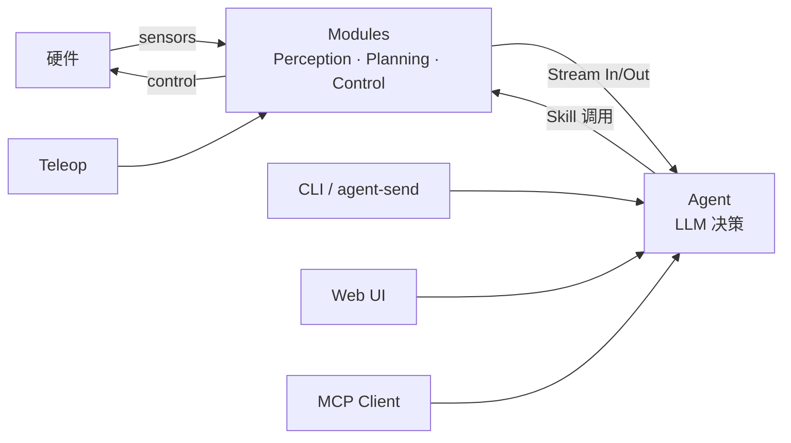
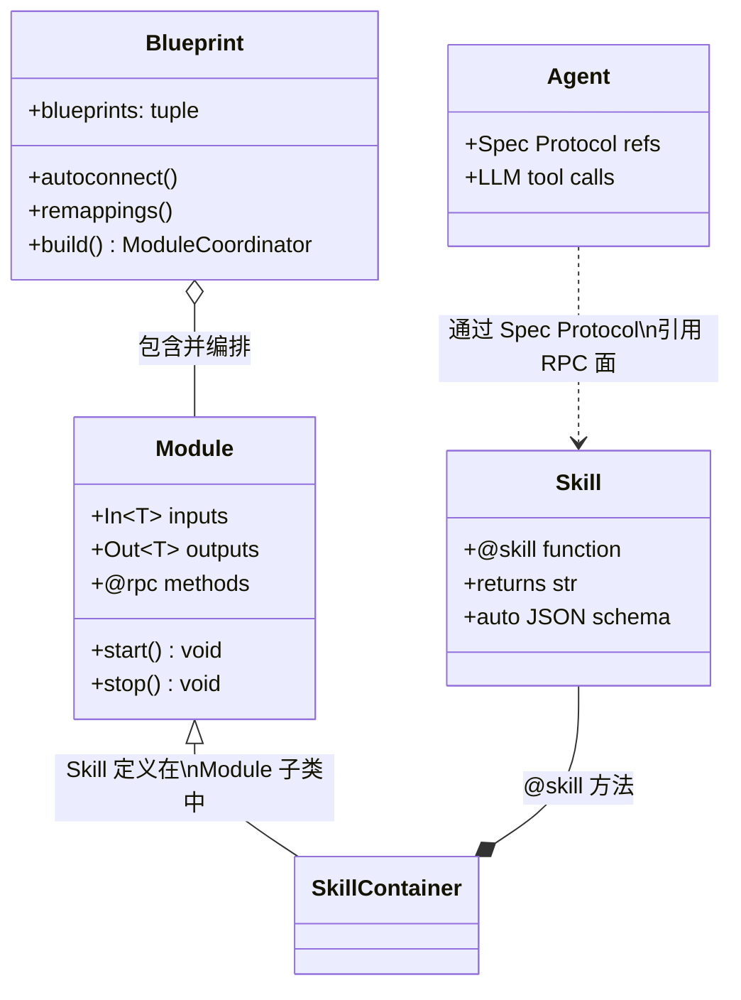

# DimOS 系统架构（System Architecture）

> 给新工程师的全景文档：通读后无需跳转即可建立完整心智模型（约 1.5 小时）。
> 想深入某个细节再翻同目录 5 份专题：[runtime-model](runtime-model.md) /
> [agent-stack](agent-stack.md) / [robot-platforms](robot-platforms.md) /
> [subsystems](subsystems.md) / [data-flow](data-flow.md)。

## 目录

- [§ 0. DimOS 是什么](#-0-dimos-是什么)
- [§ 0.5. 仓库布局总览](#-05-仓库布局总览)
- [§ 1. 三个核心抽象](#-1-三个核心抽象)
- [§ 2. 通信骨架](#-2-通信骨架)
- [§ 3. 运行时模型](#-3-运行时模型)
- [§ 4. Agent 系统](#-4-agent-系统)
- [§ 5. 机器人平台层](#-5-机器人平台层)
- [§ 6. 能力子系统全景](#-6-能力子系统全景)
- [§ 7. 端到端数据流](#-7-端到端数据流)
- [§ 8. 怎么继续读 + 常见踩坑](#-8-怎么继续读--常见踩坑)

---

### § 0. DimOS 是什么

DimOS 是面向通用机器人的智能体操作系统（The Agentive Operating System for Physical Space）。

传统机器人软件往往是一块铁板：感知、规划、控制、IO 被硬编码耦合在同一进程或同一框架里。换一个平台，换一个传感器，整套代码往往需要大幅重写。更棘手的是，机器人的"决策"通常藏在状态机或硬编码规则里，很难被外部指令灵活驱动。

DimOS 的核心思路是把这块铁板拆成两个正交维度：

**Module（模块）** 负责所有与硬件相关的运行时能力——感知流水线（摄像头、激光雷达、语音）、空间记忆与建图、导航与规划、运动控制与电机驱动。每个 Module 通过类型化 Stream 发布和消费数据；Stream 底层可以是 LCM、ROS2、DDS 或内存管道，对上层透明。多个 Module 被 Blueprint（蓝图）编排成可直接运行的机器人软件栈，一行 `dimos run <blueprint>` 即可启动。

**Agent（智能体）** 负责高层决策。它订阅 Module 暴露的 Stream、调用 Module 注册的 Skill（技能函数），用自然语言驱动机器人行为。用户可以通过 CLI（`dimos agent-send`）、Web UI 或 MCP 客户端向 Agent 下指令，由 Agent 翻译成 Skill 调用；Teleop 则绕过 Agent，直接以人手操作驱动 Module。无需修改底层 Module，只需更换或扩展 Skill，机器人的行为边界就随之改变。



> **本文档与 AGENTS.md / CLAUDE.md 的分工**
>
> - `AGENTS.md` — quick-start cheat-sheet 与必踩坑清单（命令速查、blueprint 表、`@skill` 规则、预提交钩子）；**事实之源**，有疑问先看这里。
> - `CLAUDE.md` — AI 代理工作护栏；指向 `AGENTS.md`，附加少量 Claude 专用约束（不重复 AGENTS.md 内容）。
> - 本架构文档 — 系统全景与设计取舍。
>
> 三者交叉引用，不重复。如需修改某条规则，只在其"主权"文档里改，其余文档只做引用。

### § 0.5. 仓库布局总览

```text
dimos/                    # 仓库根
├── dimos/                # 主 Python 包（所有运行时代码）
├── bin/                  # CI/开发辅助脚本（如 bin/pytest-slow）
├── scripts/              # 安装与运维辅助脚本
├── data/                 # 示例 / replay 数据集
├── docker/               # 容器构建上下文
├── examples/             # 跑得起来的示例代码
├── assets/               # 图标、静态资源
├── docs/                 # 文档（本文件所在）
├── pyproject.toml        # 项目元数据 + 依赖声明
├── setup.py              # 兼容 setuptools 入口（保留兼容）
├── uv.lock               # uv 锁定文件
├── flake.nix             # Nix flake 定义
├── flake.lock            # Nix 锁定
├── default.env           # 默认环境变量
├── MANIFEST.in           # 打包清单
├── LICENSE               # 许可证
├── CLA.md                # 贡献者许可协议
├── README.md             # 仓库主 README
├── CLAUDE.md             # Claude Code 工作护栏
└── AGENTS.md             # AI agent onboarding（事实之源）
```

| 顶级目录/文件 | 用途 |
|---|---|
| `dimos/` | 主 Python 包：所有运行时代码 |
| `bin/` | shell 包装（如 `bin/pytest-slow` 跑全套测试） |
| `scripts/` | 安装与运维辅助脚本（目前主要是 `install.sh`） |
| `data/` | 示例数据、replay 数据集 |
| `docker/` | Docker 构建文件 |
| `examples/` | 跑得起来的示例 |
| `assets/` | 图标、静态资源 |
| `docs/` | 文档：本文件所在 |
| `pyproject.toml` | 项目元数据 + 依赖声明（setuptools 构建后端，uv 管理依赖） |
| `setup.py` | 旧式 setuptools 入口（保留兼容） |
| `uv.lock` | uv 锁定 |
| `flake.nix` / `flake.lock` | Nix 复现构建 |
| `default.env` | 默认环境变量 |
| `MANIFEST.in` | 打包清单 |
| `LICENSE` | 许可证 |
| `CLA.md` | 贡献者许可协议 |
| `README.md` | 仓库主 README |
| `CLAUDE.md` | Claude Code 工作护栏 |
| `AGENTS.md` | AI agent onboarding（事实之源） |

> `dimos/utils/` 是 20 来个横切工具模块（`logging_config` / `llm_utils` /
> `transform_utils` / `gpu_utils` / `threadpool` / `urdf` 等），被几乎所有
> 子系统依赖。本文档不展开；需要时直接读源码。

### § 1. 三个核心抽象

DimOS 的所有运行代码都围绕三个抽象组装：**Module / Blueprint / Skill**。读懂这三者，整个仓库的 80% 代码读起来就有定位感。

#### Module —— 自治子系统

Module 是 DimOS 最基础的运行单元。每个 Module 是一个继承自 `Module` 基类的 Python 类，代表一个独立的、可组合的能力模块——例如摄像头驱动、目标检测、导航规划或运动控制。Module 运行在独立的 forkserver 工作进程中，与主进程和其他 Module 物理隔离；进程间通过 LCM 消息总线或共享内存进行通信。

Module 的数据接口通过类型注解声明：`In[T]` 表示输入流，`Out[T]` 表示输出流，`T` 是实际消息类型（如 `Image`、`PoseStamped`、`Twist`）。声明即接口——Blueprint 在构建时会读取这些注解，自动按 `(名称, 类型)` 匹配并连接各 Module 的流。流的底层传输是可替换的（LCM / ROS2 / DDS / 内存管道），Module 本身不感知传输细节。

Module 还通过 `@rpc` 装饰器暴露可远程调用的方法。`@rpc` 方法是 Module 的过程调用面：其他 Module 或框架代码可以跨进程调用它们，保留原始返回类型。所有 Module 天然拥有两个基础 `@rpc` 方法：`start()` 负责初始化订阅和定时器，`stop()` 负责安全关闭和资源释放。

#### Blueprint —— 用 autoconnect 拼装

Blueprint 是一张描述"哪些 Module 共同构成这台机器人软件栈"的配置图。它本身是不可变数据结构（冻结 dataclass），因此可以安全地在多处复用和组合。

`autoconnect(*blueprints)` 是拼装的核心：它接受多个 Module 级或 Blueprint 级蓝图，去重合并后返回一个新的 `Blueprint`。构建阶段（`.build()`）会为每个 Module 启动 forkserver 工作进程，然后扫描所有模块的 `In[T]` / `Out[T]` 注解，凡 `(名称, 类型)` 完全匹配的流对，自动共享同一个传输层实例——这就是"自动连线"。

若两个 Module 恰好有同名但含义不同的流，可以用 `.remappings([(ModuleA, "old_name", "new_name"), ...])` 解决命名冲突，将某个 Module 的特定流改名后再参与匹配。Module 之间的 RPC 引用则通过 `Spec` Protocol 注解在编译时绑定，找不到匹配实现会在 build 阶段直接报错，而不是在运行时静默失败。

#### Skill —— 智能体可调用的动作

Skill 是 Agent 能调用的物理动作函数，定义在继承自 `Module` 的 Skill 容器类里。`@skill` 装饰器（`dimos/agents/annotation.py`）同时设置 `__rpc__ = True` 和 `__skill__ = True`：前者让该方法可以被跨进程 RPC 调用，后者让框架在注册时自动把函数签名和文档字符串转换成 LLM 工具调用所需的 JSON schema。

`@skill` 与 `@rpc` 在职责上是两个不同的层面：`@rpc` 是 Module 内部 / Module 间的过程调用面，保留原始 Python 返回类型；`@skill` 是 LLM 向外暴露的工具接口，**必须返回 `str`**，因为语言模型只消费文本。因此，不要将两者叠加使用——`@skill` 已经蕴含了 `@rpc`。`@skill` 函数还有三条硬性规则：必须有文档字符串、所有参数必须类型注解、返回值必须是 `str`；违反任意一条都会导致模块注册失败或 LLM schema 缺失（详见 §4）。

#### 三者关系（类图）



#### 最小可运行 Blueprint 片段

```python
from dimos.core.module import Module
from dimos.core.stream import In, Out
from dimos.core.core import rpc; from dimos.agents.annotation import skill
from dimos.core.blueprints import autoconnect; from dimos.msgs.geometry_msgs import Twist
class DriveModule(Module):    # ① Module：类型化流 + @rpc 调用面
    cmd_vel: In[Twist]
    @rpc
    def start(self) -> None:
        self.cmd_vel.subscribe(self._process)
class Skills(Module):         # ② Skill：@skill 向 LLM 暴露工具 schema
    @skill
    def move(self, speed: float = 0.5) -> str:
        """让机器人前进。Args: speed: m/s。"""
        return f"以 {speed} m/s 前进"
my_robot = autoconnect(DriveModule.blueprint(), Skills.blueprint())  # ③ Blueprint
```

#### 为什么这样分层

**类型化流（In[T] / Out[T]）** 的设计目标是把"哪个流连接到哪里"从运行时错误提前到构建期。流的 `(名称, 类型)` 双重匹配确保一个 `In[Image]` 不会意外接到 `Out[Twist]`——类型不符时 `autoconnect` 在 `.build()` 阶段就会拒绝连线，而不是等到消息在运行时被错误解码才爆出隐晦的 deserialization 错误。这也使得传输层可以无缝替换（LCM / ROS2 / DDS / 内存管道），因为上层代码只依赖类型，不依赖具体传输 API。

**forkserver 进程模型**的选择优先于 `fork`，原因有三：`fork` 会把父进程中已初始化的 CUDA 上下文、GPU 内存映射和打开的 socket 直接复制到子进程，几乎必然导致 CUDA 上下文损坏或文件描述符竞争；forkserver 则让每个工作进程从干净状态启动，只按需初始化自己所需的资源。相较于 `spawn`，forkserver 只需预分叉一次，后续 worker 启动更快，且可以预先加载共享库。每个 Module 运行在独立进程里，任一模块崩溃不会把整个机器人软件栈拖垮。

**`@skill` 与 `@rpc` 分层**的设计来自两个面向不同消费者的接口需求。`@rpc` 方法的调用者是其他 Module 或框架代码，它们是 Python 进程，可以直接处理 `bool`、`PoseStamped` 等原生类型，保留类型信息对编译器检查和序列化都有意义。`@skill` 方法的调用者是语言模型，它只能理解 JSON 参数和纯文本返回值——强制 `str` 返回确保 Agent 总能收到有意义的人类可读反馈，而不是 `None` 或二进制对象。两层分离还带来一个额外好处：一个 Module 可以有许多内部 `@rpc` 方法供其他 Module 调用，但只向 LLM 暴露经过精心设计、有完整文档的 `@skill` 子集。

### § 2. 通信骨架

<!-- TODO: Task 4 -->

### § 3. 运行时模型

<!-- TODO: Task 5 -->

### § 4. Agent 系统

<!-- TODO: Task 6 -->

### § 5. 机器人平台层

<!-- TODO: Task 7 -->

### § 6. 能力子系统全景

<!-- TODO: Tasks 8-10 -->

### § 7. 端到端数据流

<!-- TODO: Task 11 -->

### § 8. 怎么继续读 + 常见踩坑

<!-- TODO: Task 11 -->

---

## 扩展阅读

- 仓库速查与必踩坑：[`AGENTS.md`](../../AGENTS.md)
- 使用教程：[`docs/usage/`](../usage/)
- 能力深度文档：[`docs/capabilities/`](../capabilities/)
- 平台配置：[`docs/platforms/`](../platforms/)
- 安装：[`docs/installation/`](../installation/)
- 开发与测试：[`docs/development/`](../development/)
