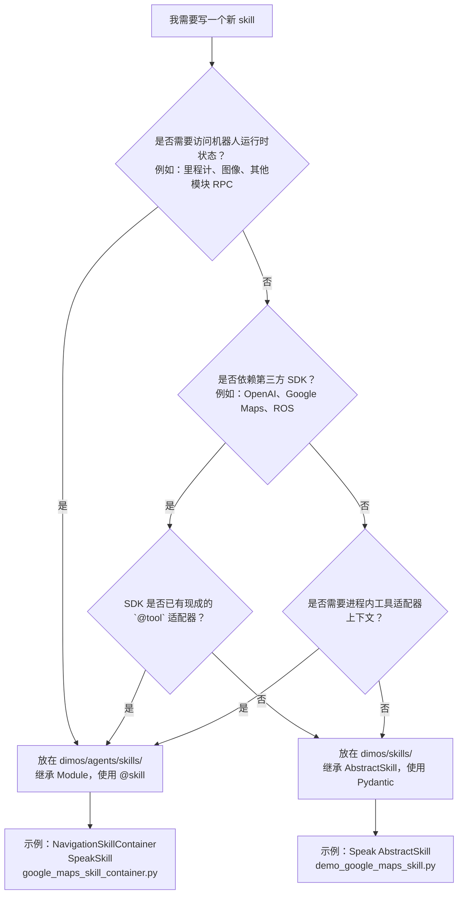

# 专题：Agent 栈（Agent Stack）

> 与 [README § 4](/docs/architecture/README.md#-4-agent-系统) 配套深入：Agent 内部循环、@skill schema、双 skills 决策树、Spec、MCP、agent 变种。
> 目标读者：正在编写新 skill、集成新 LLM、或组合 MCP-enabled blueprint 的工程师。

## 目录

- [1. Agent 内部循环](#1-agent-内部循环)
- [2. @skill schema 生成](#2-skill-schema-生成)
- [3. 双 skills 对比与决策树](#3-双-skills-对比与决策树)
- [4. Spec Protocol 与编译期类型检查](#4-spec-protocol-与编译期类型检查)
- [5. MCP 三件套](#5-mcp-三件套)
- [6. Agent 变种清单](#6-agent-变种清单)

---

## 1. Agent 内部循环

当前仓库里**没有唯一的 "Agent 类"**。Agent 是一组契约（Protocol）+ 模板蓝图（demo_agent）+ 若干实现者（VLM 模块、Ollama 工具函数等）的组合。运行时看到的 Agent 由 blueprint 按需拼装——谁实现 `AgentSpec` 谁就是 Agent，配什么 MCP tools 就决定它能做什么。

### 1.1 AgentSpec 契约

`dimos/agents/agent_spec.py:22` 定义：

```python
class AgentSpec(Spec, Protocol):
    @rpc
    def add_message(self, message: dict[str, Any]) -> None: ...
    @rpc
    def dispatch_continuation(self) -> None: ...
```

`AgentSpec` 同时是 **Spec**（`dimos.protocol.rpc.spec.Spec` — 参与 blueprint 的编译期类型检查；§4）与 **Protocol**（Python typing.Protocol — 鸭子类型约束）。两个核心 RPC：

- `add_message(message)`：把一条消息（通常是 `HumanMessage` / tool-result / system message 的 dict 形式）写入 agent 的会话历史。
- `dispatch_continuation()`：触发一次"继续推理"——让实现者决定用什么 LLM、上什么历史、调什么工具。

**运行时形态就是"任何 AgentSpec 实现者 + 任何 McpClient/MCP tools 组合"**。没有 base class——历史上的 `dimos/agents/agent.py` 单体 Module 文件已从仓库删除。新实现只要满足 Protocol 就能被 `autoconnect` 识别成 agent 角色。

### 1.2 VLM 孪生：VLMAgentSpec

`dimos/agents/vlm_agent_spec.py:21` 定义 `VLMAgentSpec(Spec, Protocol)`——面向"视觉 LLM + 图像输入"场景的独立 Protocol。它的 RPC 集合和 `AgentSpec` 不同（围绕 `query_stream` + 最新图像帧进行单次问答，不跑完整工具调用循环）。

`VLMAgent`（`dimos/agents/vlm_agent.py:39`）是目前唯一的 `VLMAgentSpec` 实现者，用于流式视觉问答。典型用法：订阅 `color_image` 流、接收 `query_stream` 上的 `HumanMessage`，把最新帧 + 查询一次性喂给多模态 LLM，把 `AIMessage` 发回 `answer_stream`。

### 1.3 纯 MCP 蓝图模板：demo_agent / demo_agent_camera

`dimos/agents/demo_agent.py` 里没有新 class，只有**两个模块级 blueprint 变量**：

```python
demo_agent         = autoconnect(McpServer.blueprint(), McpClient.blueprint())
demo_agent_camera  = autoconnect(McpServer.blueprint(), McpClient.blueprint(),
                                 CameraModule.blueprint(hardware=_create_webcam))
```

它们**不绑任何机器人硬件**——只把 `McpServer`（暴露本地 MCP HTTP 端点）和 `McpClient`（进程内消费 MCP tools 的 AgentSpec 实现者）拼成一个最小可跑回环，`demo_agent_camera` 再加一路 `CameraModule`。作用是：

1. **新 agent 蓝图的起点模板**——复制一份、加上硬件模块就是一台新机器人的 agentic 蓝图。
2. **集成测试 / 开发调试**——跑 `demo_agent` 就能在本地测 MCP 链路（`dimos mcp tools` / `dimos mcp call …`）而不必连接真机。

### 1.4 实现者家族

当前代码库里 `AgentSpec` / `VLMAgentSpec` 的实现者与相关工具文件如下：

| 文件 | 暴露符号 | 角色 |
|------|---------|------|
| `dimos/agents/mcp/mcp_client.py` | `McpClient`（`Module`） | 目前最常用的 `AgentSpec` 实现者——通过 HTTP 从远端 McpServer 拉 tools，跑 LLM 推理循环 |
| `dimos/agents/vlm_agent.py` | `VLMAgent`（`Module`） | 唯一的 `VLMAgentSpec` 实现者 |
| `dimos/agents/ollama_agent.py` | `ensure_ollama_model` / `ollama_installed`（**只有两个 def**，无 class） | 供其他实现者在检测到 `"ollama:"` 前缀时调用的本地模型拉取 / 可用性检查工具 |

**注意**：`ollama_agent.py` 里**没有任何 Agent 或 Module 类**，误当作 Agent 变种去找 `class OllamaAgent` 会一无所获。`dimos/agents_deprecated/`（legacy 包）保留了一套基于 OpenAI SDK 直接调用的旧式 Agent 类，严禁在新代码中引用——详见 [README § 4 命名重叠 3](/docs/architecture/README.md#关键避坑命名重叠-3legacy-包-dimosagents_deprecated)。

---

## 2. @skill schema 生成

### 2.1 装饰器的本质

`@skill`（`dimos/agents/annotation.py`）是一个极简装饰器：

```python
def skill(func: F) -> F:
    func.__rpc__ = True
    func.__skill__ = True
    return func
```

它只在函数对象上设置两个属性标记，不做任何包装或 schema 生成。真正的 schema 生成发生在 `Module.get_skills()`（`dimos/core/module.py`）中：

```python
def get_skills(self) -> list[SkillInfo]:
    skills: list[SkillInfo] = []
    for name in dir(self):
        attr = getattr(self, name)
        if callable(attr) and hasattr(attr, "__skill__"):
            schema = json.dumps(tool(attr).args_schema.model_json_schema())
            skills.append(SkillInfo(
                class_name=self.__class__.__name__,
                func_name=name,
                args_schema=schema
            ))
    return skills
```

关键路径：`tool(attr)`（内置的 `@tool` 工具适配器工厂）→ `.args_schema`（Pydantic 模型）→ `.model_json_schema()`（JSON Schema 字典）→ `json.dumps` → `SkillInfo.args_schema` 字段。

**实现注脚**：上面的 `tool(attr)` 即 `from langchain_core.tools import tool`（LangChain 的 `@tool` 工厂）——DimOS 的 `@skill` 装饰器只打属性标记，真正的 args schema 是靠 `langchain_core.tools.tool()` 基于函数签名生成 Pydantic 模型后序列化而成。这是当前 schema 生成对 LangChain 的依赖点之一；`McpClient` 的推理循环与 `StructuredTool` 构造同样走 LangChain（详见 [§5.3 实现注脚](#53-mcpclient进程内模块连接远端-mcpserver)）。Protocol 契约本身不依赖任何特定框架——替换掉 LangChain 需要同时改 `get_skills()` 的 schema 工厂与所有现存实现者，但不影响 `AgentSpec` / `VLMAgentSpec` 的对外契约。

### 2.2 schema 生成的 4 条铁律

#### 规则一：必须有 docstring

**要求**：被 `@skill` 装饰的方法必须有非空 docstring。

**失败时机**：`get_skills()` 会在 agent 实现者启动流程（典型是 `on_system_modules` 回调）中被调用，此刻内置 `tool()` 工厂尝试从 docstring 中提取工具描述。若 docstring 缺失，`tool()` 生成的工具适配器 `description` 字段为空字符串或抛出异常，导致 LLM 收到无描述的工具——LLM 几乎不会调用它，表现为 agent 面对相关请求沉默或乱猜。**错误不会在 import 时或模块注册时报出，而是在运行时工具被忽略，排查极难。**

```python
# 错误示例——LLM 不会调用此工具
@skill
def move_forward(self, distance: float) -> str:
    return f"moving {distance}m"

# 正确示例
@skill
def move_forward(self, distance: float) -> str:
    """Move the robot forward by the specified distance in meters.

    Args:
        distance (float): distance to move in meters
    Returns:
        str: outcome description
    """
    return f"moving {distance}m"
```

#### 规则二：所有参数必须有类型注解

**要求**：每个参数（除 `self` 外）都必须有 Python 类型注解。

**失败时机**：`tool(attr).args_schema` 由 `@tool` 适配器基于函数签名自动生成 Pydantic 模型。若参数无注解，Pydantic 无法推断字段类型，生成的 Pydantic 模型字段类型为 `Any`，进而导致 JSON Schema 中缺少 `type` 字段。**失败在 `get_skills()` 被首次调用时静默发生**（不抛异常），但 LLM 收到格式不完整的 schema，可能传入错误类型的参数，导致 RPC 调用时类型错误在运行时才暴露。

```python
# 错误示例——schema 生成不完整
@skill
def set_speed(self, speed, direction) -> str:
    """Set robot speed and direction."""
    ...

# 正确示例
@skill
def set_speed(self, speed: float, direction: str) -> str:
    """Set robot speed and direction."""
    ...
```

#### 规则三：返回类型必须是 str

**要求**：`@skill` 方法的返回类型注解必须是 `str`，实际也必须返回字符串。

**失败时机**：`_skill_to_tool` 中的 `wrapped_func` 直接 `return str(result)` 将结果传回给 agent 的工具调用层。若方法实际返回非字符串（如 `dict`、`None`、`Image`），框架会尝试转换——`None` 返回时特别处理为 `"It has started. You will be updated later."`，`Image`（有 `agent_encode` 方法）则触发图像追加到历史的特殊路径。**返回 `str` 以外的普通对象会被 `str()` 强转，LLM 收到原始 repr 字符串，逻辑通常但信息可能不可读。** 若方法抛出异常，`wrapped_func` 会捕获并返回 `f"Exception: Error: {e}"`，LLM 会看到该字符串并试图自行处理。注意：`mypy` 在 return type 不是 `str` 时会报错，**类型检查阶段就会发现**。

#### 规则四：不得同时叠加 @rpc 与 @skill

**要求**：同一方法上不能同时叠加 `@rpc` 和 `@skill`。

**失败时机**：`@rpc` 将方法注册为 RPC 端点；`@skill` 将其标记为 LLM 可见的工具。两者共存时，`@rpc` 的包装层会干扰 `tool()` 对函数签名的自省——`tool()` 看到的是 `@rpc` 包装后的内部函数，其签名可能已被修改，导致 Pydantic 模型生成错误，或 `args_schema` 字段缺失。**失败在模块注册阶段（`start()` 时）就可能引发 `AttributeError` 或 `ValidationError`，阻止整个 blueprint 启动。**

```python
# 绝对错误——两者不能共存
@rpc
@skill
def dangerous_method(self, x: int) -> str:
    """Do something."""
    return str(x)

# 正确：普通 skill（不需要 @rpc）
@skill
def safe_skill(self, x: int) -> str:
    """Do something."""
    return str(x)
```

---

## 3. 双 skills 对比与决策树

DimOS 存在两个 skill 目录，它们的设计哲学和适用场景截然不同。

### 3.1 `dimos/skills/`：平台无关的 Pydantic 技能库

**技术基础**：基于 `AbstractSkill`（`dimos/skills/skills.py` 中的 `SkillLibrary` 体系）和 `pydantic.BaseModel`，用于构建与旧式 `agents_deprecated` 体系兼容的技能容器。工具描述通过 `pydantic_function_tool`（OpenAI SDK）转换。

**特征**：
- 每个 skill 是一个独立的 Pydantic 模型类，继承 `AbstractSkill`。
- 在 `SkillLibrary` 的 `__init__` 中自动发现（通过 `dir(self.__class__)`）。
- 使用 `openai.pydantic_function_tool` 生成 OpenAI function-calling schema。
- **不依赖 `Module` 生命周期**（无 `start`/`stop`），可独立实例化。
- 典型例子：`dimos/skills/speak.py` 的 `Speak`（直接调用 TTS，不需感知任何其他模块状态）。

**适合场景**：依赖第三方 SDK（OpenAI、Google Maps 等）、与机器人硬件无关、需在不启动完整 Module 系统的情况下独立使用的技能。

### 3.2 `dimos/agents/skills/`：Module-aware 的 @skill 容器

**技术基础**：基于 `Module`（`dimos/core/module.py`）+ `@skill` 装饰器（`dimos/agents/annotation.py`），通过框架内置的工具适配器（`tool()` → Pydantic schema）把方法喂给实现 `AgentSpec` 的 LLM 客户端。

**特征**：
- 每个 skill 容器是一个完整的 `Module` 子类，有 `start`/`stop` 生命周期。
- 通过 `@skill` 装饰的方法由 `get_skills()` 自动发现并注册为 LLM 可见的工具。
- 可持有 `In`/`Out` 流（订阅图像、里程计等），可调用其他模块的 RPC。
- 工具调用通过 RPC（LCM）在跨进程之间传递，天然隔离。
- 典型例子：`dimos/agents/skills/navigation.py` 的 `NavigationSkillContainer`（需订阅里程计 `odom` 流、调用 `SpatialMemory`/`NavigationInterface` RPC）。

**适合场景**：需要机器人运行时状态（传感器流、其他模块 RPC）、依赖进程内工具适配器上下文、平台相关的技能。

### 3.3 决策树

下面的 Mermaid flowchart 帮助你判断新 skill 应该放在哪里：



### 3.4 实际放置示例

| Skill | 目录 | 原因 |
|---|---|---|
| `NavigationSkillContainer` | `dimos/agents/skills/` | 需订阅 `odom`、调用 `SpatialMemory` RPC |
| `SpeakSkill` | `dimos/agents/skills/` | 需初始化 TTS 节点，有 `start`/`stop` 生命周期 |
| `GoogleMapsSkillContainer` | `dimos/agents/skills/` | 需进程内工具适配器上下文传递 |
| `Speak`（AbstractSkill） | `dimos/skills/` | 独立于 Module 系统，直接调用 TTS 库 |
| `GpsNavSkill` | `dimos/agents/skills/` | 需访问导航接口 RPC |

---

## 4. Spec Protocol 与编译期类型检查

### 4.1 Spec 是什么

`Spec`（`dimos/spec/utils.py`）是一个特殊标记基类：

```python
class Spec(Protocol):
    pass
```

凡是继承了 `Spec` 的 Protocol 子类，都是"模块规格描述符"——用来在 Blueprint 的 `autoconnect` 阶段描述"我需要一个提供 X 能力的模块"，而不必指定具体是哪个类。Blueprint 引擎会在所有已注册的模块中自动寻找满足该 Spec 的实现。

### 4.2 五个 Spec 文件一览

**`dimos/spec/control.py`**：定义运动控制 Spec：

```python
class LocalPlanner(Protocol):
    cmd_vel: Out[Twist]
```

任何发布 `cmd_vel`（`Twist` 类型 Out 流）的模块都满足此 Spec，例如 DWA 局部规划器或直接速度控制器。

**`dimos/spec/perception.py`**：定义感知 Spec 层次：

```python
class Image(Protocol):
    color_image: Out[ImageMsg]

class Camera(Image):
    camera_info: Out[CameraInfo]

class DepthCamera(Camera):
    depth_image: Out[ImageMsg]
    depth_camera_info: Out[CameraInfo]

class Odometry(Protocol):
    odometry: Out[OdometryMsg]

class Lidar(Protocol):
    lidar: Out[PointCloud2]
```

通过继承实现能力的分层描述——`DepthCamera` 自动满足 `Camera`，`Camera` 自动满足 `Image`。

**`dimos/spec/nav.py`**：定义完整导航 Spec：

```python
class Nav(Protocol):
    goal_req: In[PoseStamped]
    goal_active: Out[PoseStamped]
    path_active: Out[Path]
    cmd_vel: Out[Twist]
```

满足此 Spec 的模块必须同时提供目标接收（`goal_req`）、当前目标广播（`goal_active`）、路径广播（`path_active`）、速度输出（`cmd_vel`）——约束远比单个能力接口严格。

**`dimos/spec/mapping.py`**：定义地图 Spec：

```python
class GlobalPointcloud(Protocol):
    global_map: Out[PointCloud2]

class GlobalCostmap(Protocol):
    global_costmap: Out[OccupancyGrid]
```

**`dimos/spec/utils.py`**：提供 `is_spec`、`spec_structural_compliance`、`spec_annotation_compliance` 三个工具函数，被 `dimos/core/coordination/blueprints.py` 在 `autoconnect` 阶段调用。

### 4.3 构建期验证流程

Blueprint 的 `autoconnect` 在实际部署前进行 Spec 匹配验证，整个流程在**构建期（Python import 阶段）**完成，不等到运行时：

```
autoconnect(ModuleA, ModuleB, ...)
    │
    ├─ 解析每个 Module 的类型注解
    │   ├─ In[T] / Out[T] → StreamRef
    │   └─ Spec 子类注解 → ModuleRef
    │
    ├─ 对每个 ModuleRef，遍历所有候选 Module
    │   ├─ spec_structural_compliance(candidate, spec)  # 结构检查（方法名/流名存在）
    │   └─ spec_annotation_compliance(candidate, spec)  # 严格注解检查（类型完全匹配）
    │
    ├─ 若只有一个候选通过 → 自动连接
    ├─ 若有多个候选通过 → 抛出歧义错误（见 remappings）
    └─ 若没有候选通过 → 抛出 "no module meets spec" 错误
```

**结构检查**（`spec_structural_compliance`）使用 Python 内置的 `isinstance(obj, runtime_checkable(spec))`，只验证方法名/属性名是否存在，**忽略类型注解**。

**注解检查**（`spec_annotation_compliance`）通过 `annotation_protocol` 第三方库构建严格的运行时 Protocol，同时验证名称和类型注解——只有完全匹配才通过。

### 4.4 remappings 解决多候选歧义

当多个模块都满足某个 Spec 时（例如两个相机模块都实现了 `spec.perception.Image`），Blueprint 引擎会抛出歧义错误。`remappings` 是解决此问题的标准机制：

```python
from dimos.spec.perception import Image
from dimos.robot.unitree.go2.camera import DepthCamera, RGBCamera

blueprint = autoconnect(
    MyNavigationModule,
    DepthCamera,
    RGBCamera,
).remappings([
    # 显式指定 MyNavigationModule 的 color_image 来自 RGBCamera
    (MyNavigationModule, "color_image", RGBCamera),
])
```

`remappings` 的签名是 `list[tuple[type[Module], str, str | type[Module] | type[Spec]]]`——三元组中，第一个元素是请求方模块类，第二个是属性名，第三个是目标模块类或 Spec。`remapping_map` 在 `Blueprint` 中以不可变 `MappingProxyType` 存储，每次调用 `.remappings()` 返回一个新的 `Blueprint` 实例（不可变设计）。

**失败模式**：若多个候选满足 Spec 且未设置 remapping，`blueprints.py` 的 `_check_ambiguity` 方法会在 `autoconnect` 阶段抛出 `ValueError`，明确列出冲突的模块名称。**此错误发生在 `dimos run` 启动 blueprint 时的构建阶段，属于编译期行为**，不会等到实际 RPC 通信才暴露。

---

## 5. MCP 三件套

### 5.1 架构概览

MCP（Model Context Protocol）支持由三个组件构成，它们的角色截然不同，不可混淆：

```
外部 MCP 客户端（Claude、Cursor 等）
    │  HTTP POST /mcp（JSON-RPC 2.0）
    ▼
McpServer（Module）    ← in-process Module，暴露 HTTP 端点
    │  RPC 调用（LCM）
    ▼
普通技能模块（NavigationSkillContainer 等）

McpClient（Module）    ← in-process Module，连接远端 McpServer
    │  HTTP POST → McpServer
    ▼
外部 McpServer

McpAdapter             ← 纯 Python 辅助类（非 Module！）
    │  HTTP POST → McpServer
    ▼
  CLI / 测试代码
```

### 5.2 McpServer：暴露 HTTP 端点

**`dimos/agents/mcp/mcp_server.py`**

`McpServer` 是一个完整的 `Module`，在 `start()` 时启动一个 `uvicorn` + `FastAPI` HTTP 服务器，默认监听 `GlobalConfig.mcp_port`（通常为 9990）。

**暴露的 HTTP 端点**：

| 端点 | 方法 | 描述 |
|------|------|------|
| `POST /mcp` | JSON-RPC 2.0 | 唯一入口，按 `method` 字段路由 |

**支持的 JSON-RPC 方法**：

| method | 描述 |
|--------|------|
| `initialize` | 握手，返回 protocol 版本（2025-11-25）和能力声明 |
| `tools/list` | 返回所有已注册 skill 的 JSON Schema 描述 |
| `tools/call` | 按名称调用指定 skill，通过 RPC 转发给实际模块 |

`on_system_modules` 被调用时，`McpServer` 收集所有模块的 `SkillInfo` 列表，存入 FastAPI 应用全局状态（`app.state.skills`），并为每个 skill 预建 `RpcCall` 对象存入 `app.state.rpc_calls`。工具调用时，通过 `asyncio.get_event_loop().run_in_executor` 在线程池中同步执行 RPC 调用，避免阻塞 uvicorn 事件循环。

`McpServer` 自身也通过 `@skill` 暴露了两个内省工具：`server_status`（返回 PID、模块列表、skill 列表）和 `list_modules`（返回按模块分组的 skill 清单）。

### 5.3 McpClient：进程内模块连接远端 McpServer

**`dimos/agents/mcp/mcp_client.py`**

`McpClient` 是另一个完整的 `Module`，它**不暴露 HTTP 端点**，而是**作为消费方**通过 HTTP 调用远端 `McpServer`。它是 `AgentSpec` Protocol 目前最常用的实现者：持有 `_message_queue`、`_history`、`_state_graph`、`_thread`，内部运行一个标准的"LLM 节点 / 工具节点"状态机推理循环。

**与早期单体 `Agent` 实现的关键区别**：

| | 旧单体 Agent（已删） | `McpClient` |
|--|---------|-------------|
| 工具来源 | 进程内 RPC 调用（`_get_tools_from_modules`） | 通过 HTTP 从 McpServer 拉取（`_fetch_tools`） |
| 工具调用 | 直接 RPC，同进程 | HTTP POST `/mcp` → `tools/call` |
| HTTP 库 | 无 | `httpx.Client`（超时 120s） |
| 工具发现时机 | `on_system_modules`（系统启动） | `on_system_modules` + 轮询直到 McpServer 就绪 |

`_fetch_tools` 会轮询 `mcp_server_url`（默认 `http://localhost:9990/mcp`），调用 `initialize` 握手，再调用 `tools/list` 获取工具列表，将其转换为进程内工具适配器对象。图像类工具的响应同样通过追加到历史的方式处理。

**实现注脚**：当前 `McpClient` 内部通过 `from langchain.agents import create_agent`（`mcp_client.py:23`）构建推理循环——`self._state_graph = create_agent(...)`（`:222`）把 LLM 节点 + 工具节点拼成一张 LangGraph 状态图。`_fetch_tools` 把 MCP `tools/list` 响应经 `_mcp_tool_to_langchain`（`:166`）转为 `langchain_core.tools.StructuredTool`（导入自 `:26`；`:133` / `:188` 为构造位点）。这些是 `McpClient` 当前的实现细节，**不是** `AgentSpec` Protocol 契约的一部分——Protocol 只要求 `add_message` + `dispatch_continuation`，任何其他实现者（自研 ReAct 循环、直接调 OpenAI SDK 等）都可以在不依赖 LangChain 的前提下满足契约。

### 5.4 McpAdapter：纯 Python 辅助类（非 Module）

**`dimos/agents/mcp/mcp_adapter.py`**

**关键事实：`McpAdapter` 不是 `Module`，不在 Blueprint 体系内，不通过 RPC 通信。**

它是一个普通 Python 类，使用 `requests` 库直接发送 HTTP 请求到 McpServer，用于：

- **CLI 命令**：`dimos mcp tools`、`dimos mcp call <tool>` 等命令通过 `McpAdapter.from_run_entry()` 发现运行中的 McpServer 并调用。
- **集成测试 / e2e 测试**：在 `dimos/agents/mcp/test_mcp_*.py` 中，测试代码用 `McpAdapter` 验证工具注册和调用结果，无需启动完整的 Blueprint。
- **任何需要与 McpServer 通信的非 Module 代码**。

`McpAdapter.from_run_entry()` 类方法会从 `RunRegistry` 查找最近运行的进程条目，读取其 `mcp_url` 字段，实现零配置的进程发现。

### 5.5 三者的互斥关系

在同一个进程（Blueprint）中，**`McpServer` 和进程内 `Agent` 是互斥的**：

- 含 `McpServer` 的 blueprint（如 `unitree-go2-agentic-mcp`）不包含 `Agent`——因为 `McpServer` 已经将所有 skill 通过 HTTP 暴露给外部 MCP 客户端，再在同进程中运行 `Agent` 是重复的。
- `McpClient` 必须和 `McpServer` 在**不同进程**中（或至少不同 blueprint 中），因为 `McpClient` 的 `mcp_server_url` 指向外部 HTTP 地址。

### 5.6 支持 MCP 的 blueprint 两大家族

**只有包含 `McpServer` 的 blueprint 才能被 `dimos mcp …` CLI 命令发现。** 当前仓库里这类 blueprint 分两类：

**A. 硬件绑定的 agentic blueprint（5 个，`dimos/robot/unitree/go2/blueprints/agentic/`）：**

| Blueprint | 文件 | 特点 |
|-----------|------|------|
| `unitree_go2_agentic` | `unitree_go2_agentic.py` | 标准 Go2 agentic 栈（OpenAI 默认） |
| `unitree_go2_agentic_huggingface` | `unitree_go2_agentic_huggingface.py` | 改用 HuggingFace-hosted 模型 |
| `unitree_go2_agentic_ollama` | `unitree_go2_agentic_ollama.py` | 切本地 Ollama 后端 |
| `unitree_go2_security` | `unitree_go2_security.py` | 安全/巡逻取向的技能组合 |
| `unitree_go2_temporal_memory` | `unitree_go2_temporal_memory.py` | 叠加时序记忆 RAG |

（同目录下的 `_common_agentic.py` 是共享辅助，不作为独立 blueprint 对用户暴露。）

**B. 纯 MCP 模板 blueprint（2 个，`dimos/agents/demo_agent.py`）：**

| Blueprint | 说明 |
|-----------|------|
| `demo_agent` | `autoconnect(McpServer.blueprint(), McpClient.blueprint())`——**不绑硬件**，最小 MCP 回环 |
| `demo_agent_camera` | 在 `demo_agent` 基础上再加一路 `CameraModule`（默认 Webcam） |

这两个是模板型 blueprint：复制一份、加上自家硬件模块就是一台新机器人的 agentic 蓝图（§1.3 已介绍）。

对**不包含** `McpServer` 的 blueprint 执行 `dimos mcp …` 会连接失败（McpServer 未启动，HTTP 端口不监听）。

### 5.7 Tool Streams：服务端主动推送

PR #1713 引入的 `ToolStream`（`dimos/agents/mcp/tool_stream.py:103`）允许一个运行中的 `@skill` **在后台工作仍未结束时**，持续向所有已连接的 MCP 客户端推送文本更新。典型场景：长耗时导航/操控技能要向用户汇报"已到第 3 个路径点 / 还剩 12m"。

**关键常量与绑定**：

- `TOOL_STREAM_TOPIC = "/tool_streams"`（`tool_stream.py:46`）：全局 LCM 主题。
- `current_skill_context`（`dimos.agents.annotation`）：`@skill` 调用进入时绑定的 ContextVar，持有 MCP 客户端传入的 `progressToken`。`ToolStream` 构造时从中抓取，之后后台线程 `send()` 不再依赖调用栈。
- 两种 JSON-RPC 帧：`notifications/progress`（含 `progressToken` 时首选）或 `notifications/message`（无 token 的日志式 fallback）。

**端到端事件流**：

```
skill 体内 ToolStream().send("halfway there")
        │
        ├─ make_progress_notification({progressToken, progress, message})
        │
        ▼
pLCMTransport(/tool_streams).publish(frame)    ← 跨 worker 进程的 LCM 总线
        │
        ▼
McpServer（另一进程）订阅 /tool_streams 一次
        │  每帧原样转发给所有 GET /mcp 的 SSE 客户端
        ▼
外部 MCP 客户端（Claude / Cursor / curl / McpClient）
   收到 notifications/progress | notifications/message
```

**为什么要走 LCM 而不是直接调用**：`@skill` 运行的 worker 进程和 `McpServer` 进程通常不是同一个（blueprint 拓扑决定）。`pLCMTransport` 提供进程间本地组播，让 skill 侧不必知道 McpServer 是否存在、在哪——没人订阅就自然丢帧。`ToolStream` 实例的生命周期 = 所属 skill 调用的生命周期：首次 `send` 时懒创建 transport，`stop()` 时销毁；没有模块级 / 进程级共享状态。

---

## 6. Agent 变种清单

### 6.1 运行时组合 — 没有"标准 Agent 类"

历史上的 `dimos/agents/agent.py` 单体 Module 已从仓库删除。Agent 的运行时形态由"**实现 `AgentSpec` Protocol 的 Module** + **任意 MCP tools / skills 组合**"决定，没有唯一的标准类供继承。具体契约、目前的 Protocol 实现者（`McpClient` / `VLMAgent` 等）与模板蓝图（`demo_agent` / `demo_agent_camera`）见 [§1 Agent 内部循环](#1-agent-内部循环)；MCP 相关细节见 [§5 MCP 三件套](#5-mcp-三件套)。

### 6.2 `VLMAgent`（`dimos/agents/vlm_agent.py`）——视觉语言智能体

**场景**：流式视觉问答，适合需要持续处理图像并回答自然语言问题的应用。目前是 `VLMAgentSpec` Protocol 的唯一实现者（§1.2）。

**与普通 agentic 实现者（如 `McpClient`）的核心区别**：

| | 普通 Agent 实现者 | `VLMAgent` |
|--|---------|------------|
| 输入流 | `human_input: In[str]` | `color_image: In[Image]` + `query_stream: In[HumanMessage]` |
| 输出流 | `agent: Out[BaseMessage]` | `answer_stream: Out[AIMessage]` |
| 工具支持 | 是（通过 MCP tools） | 否（直接 `_llm.invoke`） |
| 历史管理 | 完整会话上下文 | 手动列表（仅 `_invoke` 时追加） |
| 推理范式 | ReAct 循环 | 单次问答 |

**工作模式**：`VLMAgent` 订阅 `color_image` 流，每次新图像到来时暂存为 `_latest_image`。当 `query_stream` 收到 `HumanMessage` 时，将最新图像和查询文本组合（通过 `image.agent_encode()` 转为多模态内容）调用 LLM，将 `AIMessage` 发布到 `answer_stream`。

`VLMAgent` 同样支持 `"ollama:"` 前缀路由，由 `ensure_ollama_model`（`dimos/agents/ollama_agent.py`）在启动时拉取本地模型。

**实现注脚**：`VLMAgent` 内部通过 `from langchain.chat_models import init_chat_model`（`vlm_agent.py:17`）做模型路由——`"ollama:<model>"` 前缀交给 Ollama 后端，其他走对应 provider。和 `McpClient` 一样，这是当前实现对 LangChain 的依赖点，不是 `VLMAgentSpec` Protocol 的契约。

### 6.3 `WebInput`（`dimos/agents/web_human_input.py`）——非 Agent 输入桥接模块

**重要说明**：`WebInput` **不是一个 Agent**，它是一个 `Module`，作用是桥接 Web 浏览器的输入（文本 + 音频）到 LCM Transport。

**功能**：
- 启动一个 `RobotWebInterface` HTTP 服务器（端口 5555）。
- 接收浏览器的直接文本输入，通过 `pLCMTransport("/human_input")` 发布。
- 接收浏览器的音频流，经 `AudioNormalizer` → `WhisperNode`（STT）转录后，同样发布到 `/human_input` 传输层。
- 不运行任何 LLM，不处理任何工具调用。

**典型用法**：在 blueprint 中与 `Agent` 配合，`WebInput` 将 `/human_input` 流接入 `Agent.human_input`，实现网页前端对话。

### 6.4 `ollama_agent.py`——仅工具函数，无 Agent 类

**`dimos/agents/ollama_agent.py`** 文件只包含两个模块级函数：

- `ensure_ollama_model(model_name: str) -> None`：检查并按需拉取 Ollama 模型。
- `ollama_installed() -> str | None`：检查 Ollama 守护进程是否可用，返回错误提示字符串或 `None`。

**此文件中没有任何 Agent 或 Module 子类。** `ensure_ollama_model` 被 `Agent` 和 `VLMAgent` 在检测到 `"ollama:"` 前缀时调用；`ollama_installed` 被 `requirements` 检查钩子使用，在 blueprint 启动前验证依赖。

### 6.5 `dimos/agents_deprecated/`——遗留包，禁止在新代码中使用

`dimos/agents_deprecated/` 是早期版本遗留的 Agent 框架，包含：

- `agent.py`：基于 OpenAI SDK 直接调用的旧式 `Agent` 类（使用 `openai.OpenAI` 客户端而非 agentic 框架封装）。
- `claude_agent.py`：基于 Anthropic SDK 的旧式 Agent。
- `memory/`：基于 Chroma 向量库的语义记忆实现。
- `modules/`：旧式模块系统（非 `dimos.core.Module`）。
- `prompt_builder/`：手动构建 prompt 的工具类。
- `tokenizer/`：手动分词计数器。

**为何不能复用**：`agents_deprecated` 使用 `dimos.skills.skills.AbstractSkill`（Pydantic 体系）而非 `dimos.agents.annotation.skill`（Module 体系），与当前 `Module`/`Blueprint` 架构不兼容。它的 Agent 不通过 `on_system_modules` 接收模块，不支持 Spec Protocol 连线，不支持 MCP。**所有新代码请实现 `dimos.agents.agent_spec.AgentSpec` Protocol，或直接以 `demo_agent` / `vlm_agent` 蓝图为模板。`dimos/agents_deprecated/` 仅为 legacy 兼容保留，严禁在新代码中引用。**

---

## 扩展阅读

- 总览：[README](/docs/architecture/README.md)
- 运行时模型深度：[runtime-model.md](/docs/architecture/runtime-model.md)
- 能力：[`docs/capabilities/agents/`](../capabilities/agents/)
- `AGENTS.md`：@skill 完整规则、Spec/RPC 接线规范、系统提示词参考
