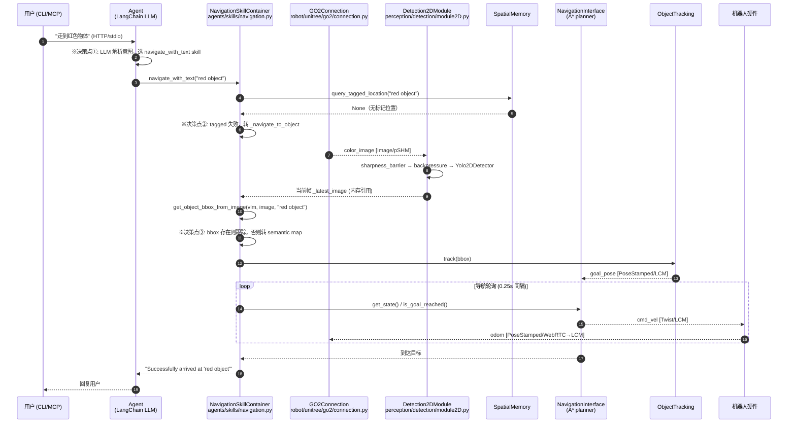
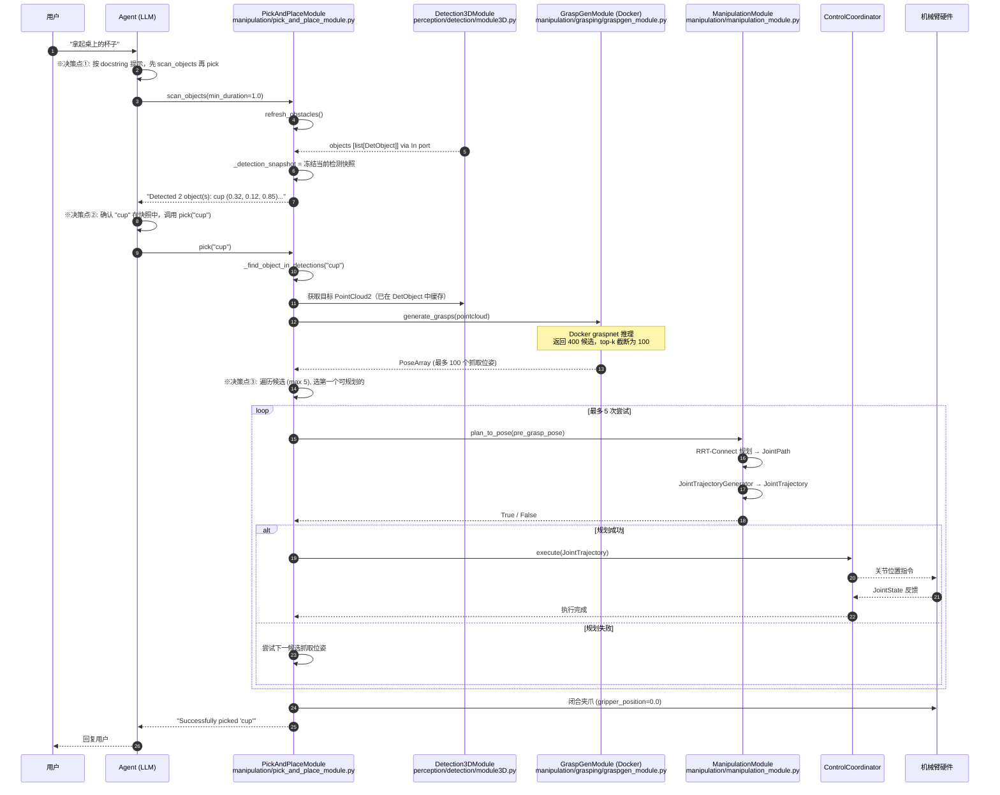
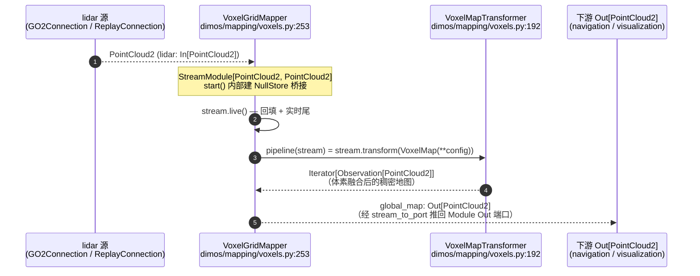

# 专题：端到端数据流（Data Flow）

> 与 [README § 7](/docs/architecture/README.md#-7-端到端数据流) 配套深入：完整字段级 trace、--replay 模式差异、第二个 manipulation trace。
>
> **目标读者**：正在调试流停滞（stream stall）、类型不匹配（type mismatch）或 replay 模式行为差异的工程师。本文提供字段级别的数据追踪，使你无需反复在源码中跳转。

## 目录

- [1. perception 路径完整 trace](#1-perception-路径完整-trace--走到红色物体)
- [2. manipulation 路径 trace](#2-manipulation-路径-trace--拿起桌上的杯子)
- [3. --replay 模式差异](#3---replay-模式差异)

---

## 1. perception 路径完整 trace —— "走到红色物体"

### 1.1 总体时序图

下图展示从用户指令到机器人移动的完整调用链。每个箭头上方标注了消息类型或函数调用名；决策点（Agent 需要做出选择的地方）用「※决策」标注。



### 1.2 字段级数据追踪表

每一行对应时序图中的一个数据流节点。「关键字段」列精确到消息内的成员变量，方便在调试时快速定位哪个字段可能为空或类型不对。

| 步骤 | 模块类 + 文件 | Stream 名 / 方法 | 消息类型 | 关键字段 | Transport | 调试线索 |
|------|-------------|----------------|---------|---------|-----------|---------|
| 1 | `GO2Connection` (`robot/unitree/go2/connection.py`) | `video_stream()` | `Image` | `data: np.ndarray`、`format: ImageFormat.RGB`、`frame_id: "camera_optical"` | `pSHMTransport("/image")` | BGR→RGB coerce 在 `_autocast_video()` 中；若 format 错误先查这里 |
| 2 | `Detection2DModule` (`perception/detection/module2D.py`) | `color_image` (In) | `Image` | 同上，经 `sharpness_barrier(max_freq=10)` 限流 | pSHM → 内存 pipe | `sharpness_barrier` 丢弃模糊帧；流速低时检查相机抖动 |
| 3 | `Detection2DModule` | `sharp_image_stream()` | `Image` | `data`、`ts: float` (epoch 秒) | RxPY 内存 Observable | `backpressure()` 用 `ReplaySubject` 隔离快/慢订阅者 |
| 4 | `Yolo2DDetector` (`perception/detection/detectors/yolo.py`) | `process_image()` | `ImageDetections2D` | `image: Image`、`detections: list[Detection2D]`（每个含 `center_bbox: tuple[int,int]`、`bbox: BBox`、`label: str`、`score: float`） | 纯内存 | 若检测到但 label 不对，检查 `Config.filter` 白名单 |
| 5 | `Detection2DModule` | `detections` (Out) | `Detection2DArray` | `header.stamp.sec/nsec`、`detections[i].bbox.center.x/y`、`detections[i].results[0].score` | `LCMTransport("/detector2d/detections")` | LCM 时间戳来自 `Image.ts`；若出现时间跳变，先核对 `to_timestamp()` 转换 |
| 6 | `NavigationSkillContainer` (`agents/skills/navigation.py`) | `_latest_image` 缓存 | `Image` | 同 step 1，`subscribe(self._on_color_image)` 写入 | 内存 (订阅者副本) | `_latest_image` 只在 `start()` 后有值；技能在 `start()` 前调用会返回 `None` |
| 7 | QwenVlModel / `get_object_bbox_from_image` | 视觉语言推理 | `BBox` | `x1, y1, x2, y2: int`（像素坐标） | 本地推理（无 transport） | ※**决策点③**：bbox 为 `None` 则跳过视觉追踪，直接查 SpatialMemory |
| 8 | `ObjectTracking` | `track(bbox)` | `BBox` | 同上 | RPC（LCM） | OT 将 bbox 转换为世界系目标，再写入 NavigationInterface |
| 9 | `NavigationInterface` | `set_goal(pose)` | `PoseStamped` | `position.x/y/z: float`、`orientation: Quaternion(x,y,z,w)`、`frame_id: "map"` | RPC（LCM） | goal 的 `frame_id` 必须是 `"map"`；用 `"base_link"` 会导致规划失败 |
| 10 | `NavigationInterface`（A* planner） | cmd_vel | `Twist` | `linear.x: float`（前进速度，m/s）、`angular.z: float`（偏转，rad/s） | `LCMTransport("/cmd_vel")` + `In[Twist]` on GO2Connection | Twist 为指令流；`move(twist, duration)` 通过 WebRTC 推送到机器人 |
| 11 | `GO2Connection` | `odom_stream()` | `PoseStamped` | `position.x/y: float`（map 坐标系）、`orientation: Quaternion`、`ts: float` | WebRTC → `LCMTransport("/odom")` | replay 模式下由 `TimedSensorReplay` 从 pickle 文件提供 |

### 1.3 关键决策点说明

**决策点①（Agent 选择 Skill）**

Agent 收到自然语言指令后，LLM 对可用 Skill 列表进行推理（zero-shot tool-use 格式）。当前系统中 `NavigationSkillContainer.navigate_with_text` 是最通用的导航入口，只要语义包含「去/到/找/移动到」就应被选中。若 LLM 误选了其他 Skill（如 `tag_location`），说明 Skill 的 docstring 边界描述不清——修改 docstring，不修改代码。

**决策点②（SpatialMemory → 视觉 → 语义图 三级策略分支）**

`navigate_with_text` 按顺序尝试三种策略：

1. `_navigate_by_tagged_location`：查询已命名地点（`SpatialMemory.query_tagged_location`）
2. `_navigate_to_object`：在当前帧做视觉检测，获取 BBox 后触发对象追踪
3. `_navigate_using_semantic_map`：向量检索空间记忆（`SpatialMemory.query_by_text`，相似度阈值 0.23）

流停滞常发生在策略 2——若 `ObjectTracking` 模块未启动，`get_rpc_calls("ObjectTracking.track")` 抛出异常，函数返回 `None`，**静默跌落到策略 3**，而策略 3 可能也找不到结果，最终返回提示无结果。调试时应先检查 `ObjectTracking` 是否在 blueprint 中被正确 wire。

**决策点③（有无 BBox）**

`get_object_bbox_from_image` 调用 `QwenVlModel` 推理。若推理结果为 `None`（图像中未找到目标），函数返回 `None`，执行策略 3。若返回有效 BBox，则调用 `track(bbox)`，**BBoxNavigationModule 自动把追踪目标转换为世界系 PoseStamped 并写入 NavigationInterface**——这一步没有显式的 RPC 调用，是通过 Stream 订阅隐式完成的。

### 1.4 流停滞排查（perception 路径）

| 症状 | 首先检查 | 源码位置 |
|------|---------|---------|
| `_latest_image` 始终为 `None` | GO2Connection 的 `video_stream()` 是否已 subscribe | `go2/connection.py` 中 `onimage` / `video_stream().subscribe(...)` |
| Detection2DModule 无输出 | `sharpness_barrier` 丢帧阈值 / `max_freq=10` 限速 | `perception/detection/module2D.py` `sharpness_barrier` 串联 |
| LCM detections stream 无消息 | `detector.detections.transport` 是否已配置 | `perception/detection/module2D.py` 中 `detector.detections.transport = LCMTransport(...)` |
| navigate_with_text 无声跌落 | SpatialMemory / ObjectTracking RPC 连接 | `agents/skills/navigation.py` `_navigate_to_object` / `_navigate_using_semantic_map` |

---

## 2. manipulation 路径 trace —— "拿起桌上的杯子"

### 2.1 概述

机械臂的抓取路径比导航路径多了一个外部 Docker 微服务（GraspGen）和一个运动规划阶段。整体分四大块：

1. **感知层**：`Detection3DModule` 将 2D 检测结果与激光雷达点云融合，产出带世界坐标的 `DetObject` 列表
2. **GraspGen**：在 Docker 容器中对目标点云计算候选抓取位姿，返回 `PoseArray`
3. **运动规划**：`ManipulationModule` 调用 RRT-Connect 规划器生成 `JointTrajectory`
4. **执行层**：`ControlCoordinator` 执行轨迹，通过 `JointState` In-port 反馈当前状态

### 2.2 总体时序图



### 2.3 字段级数据追踪表

| 步骤 | 模块类 + 文件 | Stream 名 / 方法 | 消息类型 | 关键字段 | Transport | 调试线索 |
|------|-------------|----------------|---------|---------|-----------|---------|
| 1 | `GO2Connection` / `ZEDModule` | `color_image` (Out) | `Image` | `data: np.ndarray (H×W×3)`、`format: ImageFormat.RGB`、`frame_id: "camera_optical"` | `pSHMTransport` | 相机内参 `CameraInfo.K[0..8]` 用于像素反投影 |
| 2 | `GO2Connection` | `lidar` (Out) | `PointCloud2` | `data: bytes`（dense float32 x,y,z,intensity）、`width×height`、`ts: float` | `pSHMTransport("/lidar")` | 点云 `frame_id` 必须与 TF 树一致 |
| 3 | `Detection2DModule` | `detection_stream_2d()` | `ImageDetections2D` | `detections[i].bbox`、`label`、`score`、`center_bbox: tuple[int,int]` | RxPY 内存 | `sharpness_barrier` 先过滤模糊帧，再限速到 `max_freq` |
| 4 | `Detection3DModule` (`perception/detection/module3D.py`) | `process_frame()` | `ImageDetections3DPC` | `detections3d[i].center: Vector3`（世界坐标 m）、`pointcloud: PointCloud2`（目标点云） | 内存 Observable（`align_timestamped` 对齐 2D 检测 + 点云时间戳） | 若 3D 检测总为空，先检查 `align_timestamped` 时间窗口是否过窄 |
| 5 | `PickAndPlaceModule.objects` (In) | `objects` port | `list[DetObject]` | `name: str`、`center: Vector3`、`object_id: str`、`pointcloud: PointCloud2` | 内存 In/Out wiring | `_detection_snapshot` 是 `refresh_obstacles()` 时冻结的快照，不随实时流变化 |
| 6 | `GraspGenModule` (`manipulation/grasping/graspgen_module.py`) | `generate_grasps(pointcloud)` | `PoseArray` | `poses[i]: Pose`（`position: Vector3` + `orientation: Quaternion`，世界系）、`header: Header` | Docker RPC（Python 调用 Docker SDK） | Docker 镜像 `dimos-graspgen:latest` 必须预先构建；GPU 必须可用（`docker_gpus="all"`） |
| 7 | `ManipulationModule` (`manipulation/manipulation_module.py`) | `plan_to_pose(pose)` | `JointPath` → `JointTrajectory` | `JointTrajectory.points[i].positions: list[float]`（关节角度 rad）、`velocities: list[float]`、`time_from_start: float`、`duration: float`（总时长 s） | 内存（规划结果缓存在模块内） | 若 `plan_to_pose` 总返回 `False`，先检查 `COLLISION_AT_START`；感知障碍物可能与机器人当前位置重叠 |
| 8 | `ControlCoordinator` | `execute(trajectory)` | `JointTrajectory` | 同上 | `LCMTransport("/joint_trajectory")` 或直接 RPC | 执行失败时检查 `JointState` 反馈流是否正常 |
| 9 | `ManipulationModule.joint_state` (In) | `joint_state` port | `JointState` | `name: list[str]`（关节名）、`position: list[float]`、`velocity: list[float]` | `LCMTransport("/joint_states")` | 世界同步依赖此流；若 planner 报「当前状态未知」先检查此流 |
| 10 | 夹爪控制 | `_set_gripper_position(val)` | `float` | `0.0`（闭合）/ `0.85`（张开） | RPC（直接调用） | 闭合后有 1.5 s `time.sleep`，确保物理闭合完成 |

### 2.4 关键决策点说明

**决策点①（Agent 工作流顺序）**

Agent 收到「拿起杯子」时，正确的调用顺序是先 `scan_objects()` 再 `pick()`。若 Agent 直接调用 `pick()` 而未先调用 `scan_objects()`，`_detection_snapshot` 为空，`_find_object_in_detections()` 返回 `None`，然后 `_generate_grasps_for_pick()` 也返回空列表，`pick()` 最终以错误消息返回。这是最常见的用法错误之一。

若出现此问题：检查 Agent 系统提示（system prompt）中是否说明了 `scan_objects` 必须先调用的前置条件。

**决策点②（对象名称匹配）**

`_find_object_in_detections("cup")` 使用双向子串匹配：

```python
object_name.lower() in det.name.lower()  OR  det.name.lower() in object_name.lower()
```

因此 `"cup"` 可以匹配 `"paper cup"`，但不匹配 `"mug"`。检测快照中的 `name` 字段由 YOLO 类别标签决定——若物体类别标签不符合预期，应在 `Config.filter` 中添加别名映射，或更换检测模型。

**决策点③（候选抓取位姿遍历）**

GraspGen 返回最多 100 个候选（top-k 截断），`pick()` 最多尝试前 5 个。对每个候选：

1. 计算 `pre_grasp_pose`（沿接近方向后退 `pre_grasp_offset` 米）
2. 用 RRT-Connect 规划从当前位置到 `pre_grasp_pose` 的无碰撞路径
3. 若规划失败（返回 `False`），**继续下一个候选**——这是正常的多假设验证，不是错误

若所有 5 个候选都规划失败，主要有两种原因：

- 原因 1：感知障碍物与机器人当前位置重叠（`COLLISION_AT_START`）。调用 `clear_perception_obstacles()` 后重试。
- 原因 2：目标物体在机械臂工作空间之外（运动学不可达）。调用 `get_scene_info()` 确认目标三维坐标。

### 2.5 流停滞排查（manipulation 路径）

| 症状 | 首先检查 | 源码位置 |
|------|---------|---------|
| `scan_objects()` 返回"No objects detected" | D3D 的 `objects` Out 是否已 connect 到 PAP 的 `objects` In | `manipulation/pick_and_place_module.py` `objects: In[list[DetObject]]` |
| `generate_grasps()` 超时或返回 `None` | GraspGen Docker 容器状态，`docker ps` 确认 | `graspgen_module.py:start()` |
| `plan_to_pose()` 总返回 `False` | 感知障碍物位置，调用 `clear_perception_obstacles()` | `manipulation/pick_and_place_module.py` `clear_perception_obstacles` |
| 夹爪闭合但物体掉落 | `graspgen_grasp_threshold` 过低（默认 -1.0 = 不过滤）；收紧阈值或增大 `topk_num_grasps` | `PickAndPlaceModuleConfig` |
| `JointTrajectory` LCM 流中断 | ControlCoordinator 是否正常运行；`joint_state` In 是否有数据 | `manipulation_module.py:joint_state` |

### 2.6 mapping trace —— PointCloud2 → VoxelGridMapper → global_map



`VoxelGridMapper`（`dimos/mapping/voxels.py:253`，`StreamModule[PointCloud2, PointCloud2]`）是 memory2 抽象栈在业务子系统的典型用法。`start()` 在 `StreamModule` 基类里自动做三件事：(1) 建 `NullStore` + `.stream(in_name, PointCloud2)` 拿到 pull-based stream；(2) 把 `lidar: In[PointCloud2]` port 的推式消息 `subscribe` 到 `stream.append`；(3) 把 `pipeline(stream.live())` 的输出经 `stream_to_port(..., global_map)` 推回 `Out[PointCloud2]` 端口。变换本体是 `VoxelMapTransformer(Transformer[PointCloud2, PointCloud2])`（`dimos/mapping/voxels.py:192`）——**它住在 `mapping/` 而非 `memory2/`**，遵循 memory2 "通用 ABC 在 memory2，领域变换就近放业务子系统" 的分工原则。详见 [subsystems § 6.4](/docs/architecture/subsystems.md#64-集成示例)。

### 2.7 tool streams 事件流 —— @skill 后台进度 → MCP SSE

长耗时 `@skill`（巡航、扫描、multi-step planning）通过 `ToolStream` 在 Module worker 里持续推送进度，最终落到 MCP SSE（Server-Sent Events）给外部 LLM 客户端。调用链：`@skill` 方法体内 `tool_stream.send({"message": ..., "progress": ...})` → `ToolStream`（`dimos/agents/mcp/tool_stream.py:103`）经 `pLCMTransport(TOOL_STREAM_TOPIC = "/tool_streams")` 跨 worker 转发 → `McpServer`（`dimos/agents/mcp/mcp_server.py`）订阅该 LCM 主题 → 通过 `notifications/message` + `notifications/progress` 两种 MCP SSE 事件推到 HTTP 客户端。MCP 客户端（Claude Desktop / `McpClient` Module / `dimos mcp call` CLI）看到的是标准 MCP 通知事件，对 `ToolStream` 的底层 LCM 转发完全无感。完整契约：[agent-stack § 5 Tool Streams](/docs/architecture/agent-stack.md#5-mcp-三件套)。

---

## 3. --replay 模式差异

### 3.1 什么是 --replay

`--replay` 是 `GlobalConfig` 的一个布尔标志，通过 CLI 参数或环境变量激活：

```bash
dimos --replay run <blueprint>        # CLI 方式（dimos CLI 将其写入 GlobalConfig）
# 或者在 .env / 环境变量中
REPLAY=true
REPLAY_DIR=go2_sf_office              # 数据集名称，默认 go2_sf_office
```

`GlobalConfig`（`dimos/core/global_config.py`）中的定义：

```python
replay: bool = False
replay_dir: str = "go2_sf_office"

@property
def unitree_connection_type(self) -> str:
    if self.replay:
        return "replay"          # 触发 ReplayConnection 而非 UnitreeWebRTCConnection
    if self.simulation:
        return "mujoco"
    return "webrtc"
```

### 3.2 数据来源：真实传感器 → 文件回放

#### 正常模式（`--replay` 关闭）

```
WebRTC（机器人） ──► GO2Connection.video_stream()  ─► Image / pSHMTransport
                 ──► GO2Connection.lidar_stream()  ─► PointCloud2 / pSHMTransport
                 ──► GO2Connection.odom_stream()   ─► PoseStamped / LCMTransport
```

`UnitreeWebRTCConnection` 与机器人建立 WebRTC 连接，实时推送视频帧（H.264 解码为 `Image`）、激光雷达点云和里程计数据。真实机器人 IP 必须通过 `ROBOT_IP` 环境变量或 `--ip` 参数提供。

#### Replay 模式（`--replay` 开启）

```
LegacyPickleStore（磁盘 pickle 文件）──► ReplayConnection.video_stream()  ─► Image（仿真）
                                     ──► ReplayConnection.lidar_stream()  ─► PointCloud2（仿真）
                                     ──► ReplayConnection.odom_stream()   ─► PoseStamped（仿真）
```

`make_connection()` 函数（`robot/unitree/go2/connection.py` 中的 `make_connection`）检测到 `connection_type == "replay"` 后，返回 `ReplayConnection` 实例而非 `UnitreeWebRTCConnection`。`ReplayConnection` 继承自 `UnitreeWebRTCConnection` 但覆盖了三个传感器方法，每个方法内部创建一个 `TimedSensorReplay`（即 `LegacyPickleStore`）实例，从磁盘 pickle 文件中读取历史数据并以 Observable 形式返回。

传感器替换对上层模块**完全透明**：`GO2Connection` 的 In/Out 端口、LCM transport 配置、pSHM channel 名均不变。`Detection2DModule` 仍然订阅 `color_image` Out；`NavigationInterface` 仍然收到 `odom` PoseStamped。这是 `Go2ConnectionProtocol` 接口抽象的核心价值——`lidar_stream()`、`odom_stream()`、`video_stream()` 三个方法真机和回放均实现此 Protocol。

#### FakeZEDModule（ZED 相机回放）

对于有 ZED 深度相机的配置，`FakeZEDModule`（`hardware/sensors/fake_zed_module.py`）提供类似机制：

```
TimedSensorReplay("{recording_path}/color")       ─► color_image: Out[Image]
TimedSensorReplay("{recording_path}/depth")       ─► depth_image: Out[Image]
TimedSensorReplay("{recording_path}/pose")        ─► pose: Out[PoseStamped]
TimedSensorReplay("{recording_path}/camera_info") ─► camera_info: Out[CameraInfo]
```

每个流独立创建 `TimedSensorReplay` 实例并通过 `@functools.cache` 保证只加载一次。`autocast` 参数负责将 pickle 存储的原始数据转换为消息对象：例如深度图的 numpy array 被转换为 `Image(data=x, format=ImageFormat.DEPTH)`，位姿 dict 被转换为 `PoseStamped`（注意：此处 `ts` 字段用 `time.time()` 填入当前时间，与 GO2 回放的历史时间戳行为不同）。

### 3.3 时间戳机制：挂钟时间 → Replay 时钟

这是 replay 模式与正常模式最重要的区别，也是调试 replay 时间行为差异时需要理解的核心。

#### 正常模式

传感器数据的 `ts` 字段由**系统挂钟**（`time.time()`）在接收帧时填入。所有模块在同一个进程中使用相同的时钟。时间戳是单调递增的真实物理时间。

#### Replay 模式的时钟对齐算法

回放时钟的实现在 `dimos/memory/timeseries/base.py`（`TimeSeriesStore.stream()` 方法）：

```python
start_local_time = time.time()         # 回放开始时的真实挂钟时间
start_replay_time = first_ts           # 录制数据中第一条消息的原始时间戳

# 对每条后续消息，计算应当在何时发出：
target_time = start_local_time + (msg_ts - start_replay_time) / speed
delay = max(0.0, target_time - time.time())
sched.schedule_relative(delay, emit)   # 用 RxPY TimeoutScheduler 调度发出
```

这是一种**时间对齐**机制：回放时并不修改消息内部的 `ts` 字段，而是通过调度器控制消息发出的**真实时刻**，使消息之间的时间间隔与录制时相同（除以 `speed` 因子）。

因此，在 replay 模式下：

- 消息内部的 `ts` 字段**保留录制时的原始时间戳**（历史时间，不是当前时间）
- 消息发出的真实时刻**映射到当前时间轴**，间隔比例不变
- 若下游模块将 `ts` 与 `time.time()` 比较（例如 TF 查询时间窗口 `tf.get("A", "B", ts, timeout=5.0)`），可能出现**时间窗口不匹配**——因为录制时间戳与当前时间相差可能超过 timeout

#### Replay 时间差异调试指南

| 症状 | 根本原因 | 解决方案 |
|------|---------|---------|
| TF 查询返回 `None`，但消息正常发出 | `ts` 是历史时间戳，TF buffer 以当前时间查询，窗口不匹配 | 在 replay 模式下增大 TF 查询 timeout 参数 |
| 检测流间歇性停滞 | `sharpness_barrier` 或 `backpressure` 的调度延迟与 replay 速度不匹配 | 降低 `max_freq` 或调低 replay `speed`（默认 1.0） |
| `align_timestamped`（3D 检测）对齐失败 | 点云与图像的 `ts` 均是历史时间，若二者录制时间轴偏差过大 | 增大 `align_timestamped` 容忍窗口 |
| 检测结果与实际场景不符 | replay 循环（`loop=True`）使数据回绕，但时间戳从当前时间重新计算 | 设置 `loop=False` 或指定 `seek`/`duration` 参数 |

### 3.4 data/ 目录与数据集布局

Replay 数据集通过 **Git LFS** 管理（`.gitattributes` 中 `/data/.lfs/*.tar.gz` 追踪规则）。`get_data()` 工具函数（`dimos/utils/data.py`）负责按需下载并解压。

```
data/                             # 仓库根目录下的 data/
└── .lfs/
    ├── go2_sf_office.tar.gz      ← Git LFS 追踪（打包后的录制数据）
    └── other_dataset.tar.gz
```

解压后的数据集结构（以 `go2_sf_office` 为例，解压到平台数据目录）：

```
go2_sf_office/
├── lidar/                        ← PointCloud2 的 pickle 序列
│   ├── 000.pickle                # 存储 (timestamp: float, PointCloud2) 元组
│   ├── 001.pickle
│   └── ...
├── odom/                         ← PoseStamped 的 pickle 序列
│   ├── 000.pickle
│   └── ...
└── video/                        ← Image 的 pickle 序列
    ├── 000.pickle                # format 可能是 BGR（legacy 录制），回放时自动修正
    └── ...
```

`LegacyPickleStore._iter_files()` 按文件名数字顺序遍历 `.pickle` 文件（即 `000.pickle`、`001.pickle`……），每个文件存储 `(timestamp: float, data: T)` 元组。**文件名序号决定迭代顺序**；时间戳来自录制时传感器的 `ts` 字段（不可修改）。

平台数据目录由 `get_data_dir()` 决定：

- macOS：`~/Library/Application Support/dimos/`
- Linux：`~/.local/share/dimos/`（或 `$XDG_DATA_HOME/dimos/`）
- 若激活了 virtualenv：`$VIRTUAL_ENV/lib/python3.x/site-packages/dimos/data/`

**注意**：legacy 视频录制可能将图像格式误标为 BGR。`ReplayConnection.video_stream()` 中的 `_autocast_video()` 会检测并修正此问题，仅修改 `format` 标签，不重排像素通道：

```python
if x.format == ImageFormat.BGR:
    x.format = ImageFormat.RGB   # 仅修正标签，不做通道交换
```

若在 replay 模式下图像颜色失真（蓝/红通道互换），检查此处的 format coerce 逻辑是否与当初录制时使用的格式一致。

### 3.5 变与不变：差异全表

| 维度 | 正常模式 | --replay 模式 | 变化的代码位置 |
|------|---------|-------------|-------------|
| **数据来源** | WebRTC → 真实机器人 | `LegacyPickleStore` → pickle 文件 | `go2/connection.py` `make_connection()` |
| **Connection 类** | `UnitreeWebRTCConnection` | `ReplayConnection` | `go2/connection.py` `ReplayConnection` |
| **时间戳来源** | 接收帧时 `time.time()`（当前时间） | 录制时的原始 `ts`，保留不变（历史时间） | `timeseries/base.py` |
| **发出调度** | 实时推送（WebRTC 驱动） | `TimeoutScheduler.schedule_relative(delay)` | `timeseries/base.py` |
| **Transport 配置** | 不变 | 不变（pSHM / LCM channel 名相同） | — |
| **机器人控制指令** | 真实执行（`move`、`standup`…） | 静默忽略（`ReplayConnection.move()` 直接返回 `True`） | `go2/connection.py` `ReplayConnection.move` |
| **硬件状态** | 动态（真实 IMU、编码器反馈） | 静态（仅来自 odom pickle） | — |
| **数据循环** | 无 | `loop=True`（默认），录制结束后自动循环 | `go2/connection.py` `ReplayConnection.__init__` |
| **ZED 相机** | `ZEDModule` 实例 | `FakeZEDModule` 实例 | `hardware/sensors/fake_zed_module.py` |
| **确定性** | 非确定（网络抖动、OS 调度） | 接近确定（数据固定，OS 调度仍有微小差异） | — |
| **Agent LLM** | 不变（正常调用） | 不变（正常调用，LLM 本身不确定） | — |

### 3.6 Replay 模式确定性说明

Replay 模式**接近确定性但不完全确定**：

- **数据内容固定**：pickle 文件不变，每次回放产生相同的消息序列
- **时间间隔比例固定**：`target_time` 公式保证消息间隔与录制时比例相同
- **非确定因素**：
  - OS 调度器（`sched.schedule_relative` 的实际精度受系统负载影响）
  - LLM 推理（Agent 的 LLM 调用结果每次可能不同）
  - GraspGen Docker 推理（若使用 GPU，浮点舍入可能有微小差异）

因此，replay 模式**适合调试传感器数据处理流、验证 perception/navigation 管道逻辑**，但不保证 Agent 决策的可重现性。若需要完全可重现的集成测试，建议 mock LLM（使用固定响应）并在 replay 之上再加一层确定性保证。

---

## 扩展阅读

- 总览：[README](/docs/architecture/README.md) § 7
- Stream/Transport 原理：[runtime-model](/docs/architecture/runtime-model.md)
- Agent 系统与 Skill 注册：[agent-stack](/docs/architecture/agent-stack.md)
- 平台层（GO2/G1/MuJoCo）：[robot-platforms](/docs/architecture/robot-platforms.md)
- 能力子系统（感知/导航/建图）：[subsystems](/docs/architecture/subsystems.md)
