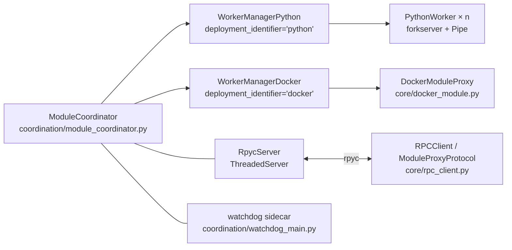

# 专题：运行时模型（Runtime Model）

> 与 [README § 3](/docs/architecture/README.md#-3-运行时模型) 配套深入：进程/Stream/Transport/Protocol/Config/日志的实现层细节。
> 目标读者：正在调试 stream 不通、transport 选型、daemon 停不下来、日志找不到等问题的工程师。

## 目录

- [1. 进程模型](#1-进程模型)
- [2. Stream 内部](#2-stream-内部)
- [3. 9 个 Transport 详细对比](#3-9-个-transport-详细对比)
- [4. Protocol 分层](#4-protocol-分层)
- [5. GlobalConfig cascade](#5-globalconfig-cascade)
- [6. Daemon 与 RunRegistry](#6-daemon-与-runregistry)
- [7. 日志结构](#7-日志结构)

---

## 1. 进程模型

DimOS 运行时 = **协调层（`dimos/core/coordination/`）+ 双 worker 轨（Python / Docker）+ rpyc IPC + watchdog sidecar + 动态 blueprint 装卸**。一个 `ModuleCoordinator` 同时管理 Python 进程池与 Docker 容器池，对外通过 rpyc 暴露发现与调用通道。旧版的 `multiprocessing.Pipe` 单一 IPC 已被 rpyc 整体替代，仅在 worker 内部短链路仍作为 worker_messages 传输协议使用。



### 1.1 协调层双轨

`ModuleCoordinator`（`dimos/core/coordination/module_coordinator.py:46`）继承自 `Resource`，是蓝图调用的入口。它持有 `_managers: dict[str, WorkerManager]`（`module_coordinator.py:47`），key 是 deployment 字面值；构造时（`module_coordinator.py:57`）以 `{cls.deployment_identifier: cls(g=g) for cls in manager_types}` 字典推导装填——`manager_types` 固定为 `[WorkerManagerDocker, WorkerManagerPython]`。

`WorkerManager` 是一个 Protocol（`dimos/core/coordination/worker_manager.py:29`），关键字段 `deployment_identifier: str`（`worker_manager.py:30`），方法面 `start` / `deploy` / `deploy_parallel` / `stop` / `health_check` / `suppress_console`。两份生产实现平行并存：`WorkerManagerPython`（`worker_manager_python.py:33`，`deployment_identifier: str = "python"` 在 `:34`）、`WorkerManagerDocker`（`worker_manager_docker.py:32`，`deployment_identifier: str = "docker"` 在 `:33`）。

职责分工：Python 轨维护一组 forkserver 子进程（`n_workers` 个，可通过 `add_workers(n)` 增量扩容）、按最小负载（`min by module_count`）挑选 worker；Docker 轨不管进程池，每次 `deploy` 直接新建一个 `DockerModuleProxy` 负责容器编排。单个 `ModuleBase.deployment` 类属性决定该模块走哪条轨。

### 1.2 Python 轨：forkserver 子进程 + 消息协议

`PythonWorker`（`coordination/python_worker.py:170`）代表一个被 `WorkerManagerPython` 持有的子进程句柄。`start_process()` 向全局 forkserver context（`python_worker.py:148-157` 的 `_forkserver_ctx`，惰性初始化）请求一对 `multiprocessing.Pipe` 并 `ctx.Process(...).start()` 生成子进程；`deploy_module(module_class, g, kwargs)` 通过 pipe 发送请求消息并收响应。每个 worker 进程可以托管多个 module，`_select_worker()` 按 `module_count` 最小的 worker 做负载分配；`deploy_parallel` 先顺序预占 slot（`reserve_slot()`，`worker_manager_python.py:156`）再用 `safe_thread_map` 并发提交，避免负载统计抖动。`add_workers(n)`（`:60`）允许在运行中扩容 worker 池——这是 blueprint 动态加载（§1.5）按需扩容的依据。

worker 消息协议集中在 `coordination/worker_messages.py`（PR #1767）：请求侧 `WorkerRequest`（`:70`）是 `DeployModuleRequest | SetRefRequest | GetAttrRequest | CallMethodRequest | UndeployModuleRequest | SuppressConsoleRequest | StartRpycRequest | ShutdownRequest` 的 union；响应侧统一为 `WorkerResponse(result, error)`（`:83`）。这套消息只在 parent → worker 的短链路内流通，不跨进程边界。forkserver 比默认 `fork` 的关键优势是：子进程从干净的 Python 状态启动，不继承父进程的 CUDA context、LCM socket、线程锁，代价是 `module_class` 与 kwargs 必须全部 picklable。

### 1.3 Docker 轨

`WorkerManagerDocker` 极为轻量：没有进程池概念，`start()` 为 no-op，`deploy()` / `deploy_parallel()` 直接把 `module_class` 包进一个新的 `DockerModuleProxy` 实例并记入 `_deployed` 列表。`DockerModuleProxy`（`dimos/core/docker_module.py:113`）**住在 `core/` 顶层而非 `coordination/` 子目录**——这是排查调用链时常见的混淆点，代码引用一定要写全前缀。`DockerModuleProxy` 实现 `ModuleProxyProtocol` 接口（`build` / `start` / `stop` / `set_transport`），`build()` 拉取或启动容器并等待容器内 RPC 就绪，`start()` 才调用远端 `start()` RPC。

### 1.4 rpyc IPC：服务端 + 客户端

rpyc 是当前运行时的主 IPC。服务端 `RpycServer`（`coordination/rpyc_server.py:33`）被 `ModuleCoordinator.__init__` 以 `self._rpyc = RpycServer(self)` 持有，`start()` 方法动态 `type(..., (CoordinatorService,), {"_coordinator": self._coordinator})` 构造一个绑定具体 coordinator 的 rpyc service 类，交给 `rpyc.utils.server.ThreadedServer` 监听 `global_config.listen_host:0`（由 OS 分配空闲端口）、放入一个 daemon 线程 `coordinator-rpyc` 启动，返回实际绑定的端口号——这个端口号会写进 `RunEntry.rpyc_port`（§6.2）。

`coordination/rpyc_services.py` 暴露两类服务接口：`CoordinatorService`（`:32`）提供 `exposed_list_modules` / `exposed_get_module_endpoint` / `exposed_load_blueprint_by_name` / `exposed_load_blueprint_pickled` / `exposed_restart_module_by_class_name`——即 daemon 对外的发现 + 动态加载 API；`WorkerRpycService`（`:78`）供 per-worker 惰性启动的 rpyc 端口使用，`exposed_get_module(module_id)` 直接返回 worker 进程内的 module 对象。这两种 service 都开启 `allow_all_attrs / allow_public_attrs / allow_pickle`，因此 proxy 可以做到穿透属性访问。

客户端在 `dimos/core/rpc_client.py`。`ModuleProxyProtocol`（`:88`）是 host 侧句柄的统一接口（`build` / `start` / `stop` / `set_transport`），Python 轨的 `RPCClient`（`:97`）与 Docker 轨的 `DockerModuleProxy` 都实现它。`RPCClient.__getattr__` 将 Module 类声明的 rpc 方法包装为 `RpcCall` 远程调用对象，非 rpc 属性则穿透到底层 `actor_instance` 走 pipe 抓取；当拿到 `RemoteStream` 时会把 owner 改写成 parent 侧代理，保证 `owner.set_transport(...)` 在远程 stream 上仍可用。`AsyncSpecProxy`（`:166`）把同步 RPC 调用封装成 awaitable，让 Spec 里声明 `async def` 的方法从事件循环角度保持非阻塞。

本地与远程走同一条 rpyc 管道，porcelain facade（后续批次会详述）就是靠 `CoordinatorService.exposed_*` + `WorkerRpycService.exposed_get_module` 把 out-of-process 客户端绑到一个运行中的 daemon。旧的 `multiprocessing.Pipe` 已经从 coordination 核心路径退回到单一 worker 的内部消息通道。

`dimos/protocol/rpc/pubsubrpc.py` 仍存在（`LCMRPC` / `ShmRPC` 等类供 `protocol/rpc/test_*.py`、`protocol/rpc/redisrpc.py` 引用）但已从 coordination 路径 de-link——PR 9d7806615 删除了 RpcCall 对 LCMRPC 的直接调用；当前启动路径不再触发 pubsubrpc 栈，只作为 reference 实现留在代码树里。

### 1.5 动态 blueprint 装卸

`ModuleCoordinator` 在启动后仍可热装卸（PR #1744）。三个 API 位于 `coordination/module_coordinator.py`：`load_blueprint(blueprint, blueprint_args=None)`（`:279`）把一份 blueprint 装进已经 `start()` 过的 coordinator，自动按 blueprint 的 `n_workers` global-config override 递增扩容 worker 池；`load_module(module_class, blueprint_args=None)`（`:341`）是单模块便捷封装，内部调用 `load_blueprint(module_class.blueprint(...))`；`unload_module(module_class)`（`:348`）停止模块、从 coordinator 状态剔除、worker 空了即回收进程——目前只支持 `deployment == "python"`（`:364-367`），Docker 模块不在 unload 范围。`CoordinatorService.exposed_load_blueprint_*` 把这组 API 通过 rpyc 暴露给 daemon 外客户端。

### 1.6 watchdog 生命周期

`coordination/watchdog_main.py` 是一个 sidecar 进程：`main(argv)` 收到 `<main_pid> <run_id>` 后，阻塞在 `wait_for_pid_exit(main_pid)`，主进程一旦消失先 `time.sleep(_GRACE_PERIOD_SECONDS=0.5)` 给主进程自身的优雅关停让路，再调用 `kill_run_processes(run_id)` 扫描全系统终结所有带匹配 `DIMOS_RUN_ID` 环境变量的后代进程，解决 SIGKILL 导致 worker 孤立的问题。

`coordination/process_lifecycle.py:93` 的 `spawn_watchdog(run_id, log_dir=None)` 是封装：剥掉父进程环境里的 `DIMOS_RUN_ID`、用 `subprocess.Popen(... start_new_session=True, stdin/stdout/stderr=DEVNULL)` 拉起 `python -m dimos.core.coordination.watchdog_main <pid> <run_id>`，让 sidecar 脱离父进程 session 独立运行。`core/run_registry.py` 负责跨 run 的注册，详见 §6.2。

### 1.7 Native 模块（C / C++ / Rust 子进程）

`core/native_module.py:129` 的 `NativeModule` 把一个本地可执行文件当作托管子进程处理：`start()` 根据 `NativeModuleConfig` 拼出 `<executable> --<port_name> <lcm_topic_string> ... <extra_args>` 命令行——In/Out 端口名作为 CLI flag、LCM topic 字符串作为值传给 native 进程，native 进程自己去 LCM pub/sub；`stop()` 发 SIGTERM。这是 Rust native modules（PR #1794）的宿主机制，DimOS 侧不需要感知语言，只负责端口契约与进程生命周期。

### 1.8 Async 模块

async modules（PR #1920）覆盖 5 条能力：async dispatch serialization、module handles、process observables、RPC、RPC sync-to-async。实现散在 `core/module.py` 的 dispatcher 与 `rpc_client.AsyncSpecProxy`，测试矩阵在 `core/test_async_module_*.py` 共 6 文件（`test_async_module_main.py` / `_dispatch_serialization.py` / `_handles.py` / `_process_observable.py` / `_rpc.py` / `_rpc_sync_to_async.py`）。典型用法是 patrol / navigation 类模块需要长时间调度而又不想阻塞事件循环——具体例子见后续 navigation / patrolling subsystem 章节。

### 1.9 `core/` 顶层其余成员

- **资源管控**：`introspection/`（blueprint + module + svg + utils 四块，内省与可视化工具）、`resource_monitor/`（`monitor.py` 的 `StatsMonitor` 按 `g.dtop` 开关启动）、`resource.py`（`Resource` 基类，`ModuleCoordinator` 继承于此）。
- **跨进程序列化**：`o3dpickle.py` 注册 Open3D 类型的自定义 pickler，在 `ModuleCoordinator.start()` 被 `register_picklers()` 调用。
- **库级启动副作用**：`library_config.py:25` 的 `apply_library_config()` 只做一件事——`cv2.setNumThreads(2)`，避免 OpenCV 内部线程争用；**它不是配置系统**，别与 `GlobalConfig` 混淆。
- **运行时入口与 daemon**：`core.py` 是 blueprint 的构建入口；`daemon.py`（`106` 行）封装 Unix double-fork `daemonize()`，详见 §6.1；`log_viewer.py` 是 CLI `dimos log` 的实现，`resolve_log_path` + `follow_log` 两个核心函数，详见 §6.3。

---

## 2. Stream 内部

### 2.1 Stream 的四种状态

```python
class State(enum.Enum):
    UNBOUND   = "unbound"    # 描述符已定义，尚未绑定到 owner
    READY     = "ready"      # 已绑定 owner，等待 Transport
    CONNECTED = "connected"  # 已连接（In 连到 Out）
    FLOWING   = "flowing"    # 运行时：已观测到数据
```

模块类的类型注解（`Out[Image]`、`In[Twist]`）在 `Module.__init__` 中被 `get_type_hints()` 扫描，自动实例化为 `Out(inner_type, name, self)` / `In(inner_type, name, self)`。这一步发生在模块被 Worker 实例化时，因此 Stream 对象始终和 Module 实例同生命周期。

### 2.2 autoconnect 的 (name, type) 匹配算法

`autoconnect(*blueprints)` 是 DimOS stream 连接的核心函数（`dimos/core/coordination/blueprints.py`）。其匹配算法分四步：

**Step 1 — 收集所有 stream 的 (remapped_name, type)**

遍历所有 blueprint 声明的 `streams`（即模块类型注解中的 `In`/`Out`），对每个连接先查询 `remapping_map` 得到最终名字，然后以 `(remapped_name, stream_type)` 为键分组：

```python
streams[(remapped_name, conn.type)].append((blueprint.module, original_name))
```

**Step 2 — 名字唯一性检查**

若同一个名字对应多种不同类型，则抛出 `ValueError`，告知冲突的模块和类型。名字重复但类型相同是合法的——这正是"发布-订阅"的语义（多个 In/Out 共享同一个 Transport Topic）。

**Step 3 — 选择 Transport**

对每组 `(name, type)` 调用 `_get_transport_for(name, stream_type)`：
- 若 `stream_type` 带有 `lcm_encode` 方法（LCM 结构化消息），选 `LCMTransport`；
- 否则（任意 Python 对象），选 `pLCMTransport`（Pickle over LCM）；
- 若名字在整个图中唯一，topic 用 `/{name}`；否则用 `/{short_id()}` 避免冲突。

**Step 4 — 批量注入 Transport**

遍历该组所有 `(module, original_name)` 对，通过 `ModuleProxy.set_transport(original_name, transport)` 将 Transport 对象注入到 Worker 进程中的 Module 实例，完成 Stream 连接。

### 2.3 Remapping 解析

Remapping 用于两种场景：

1. **Stream 改名**：`autoconnect(...).remappings([(ModuleA, "video_out", "camera_feed")])`，将 `ModuleA.video_out` 的发布 topic 改名为 `camera_feed`，使其与订阅同名 stream 的其他模块匹配。

2. **模块引用替换**：`autoconnect(...).remappings([(ModuleA, "nav_ref", ConcreteNavModule)])`，将 `ModuleA` 对导航模块的引用明确指定为 `ConcreteNavModule`，用于消歧（多个模块满足同一 Spec 时）。

Remapping 存储在 `Blueprint.remapping_map`（`MappingProxyType`，不可变），多个蓝图 merge 时通过 `dict.update` 合并。**先声明的 remapping 会被后声明的覆盖**，这是调试多蓝图连接问题时需要注意的行为。

### 2.4 ReactiveX 背压

`In.subscribe()` 返回的 Observable 默认经过 `backpressure()` 包装。背压策略是"丢弃过旧的消息，只保留最新一帧"（`ops.sample` 语义），防止高频传感器数据（摄像头 30fps）堵塞慢速消费者。需要原始不丢帧流时，使用 `In.pure_observable()`。

---

## 3. 9 个 Transport 详细对比

以下表格是 README §2 简表的扩展版，增加了消息大小限制、跨主机能力、零拷贝、典型适用场景和已知约束列。

| Transport | 底层实现 | 消息大小 | 频率上限 | 跨语言 | 跨主机 | 零拷贝 | 典型用途 | 主要约束 |
|---|---|---|---|---|---|---|---|---|
| **LCMTransport** | LCM UDP 组播 + LCM 结构化消息 | ~65 KB（UDP 限制） | ~1 kHz | 是（C/C++/Python/Java） | 是（同子网） | 否 | 与 C++ 节点互通；低延迟传感器数据 | 消息类型须有 `lcm_encode`；组播需路由支持 |
| **pLCMTransport** | LCM UDP 组播 + Pickle | ~65 KB | ~1 kHz | 否（Python only） | 是（同子网） | 否 | 任意 Python 对象跨进程/主机；快速原型 | Pickle 不安全；大对象效率低 |
| **SHMTransport** | 共享内存 + LCM 信令（字节帧） | 默认 3.6 MB（可配置） | 硬件限制 | 否 | 否（本机） | 是（同进程可用 mmap） | 高分辨率图像、点云等大帧数据 | 仅限同机；需手动配置 `default_capacity` |
| **pSHMTransport** | 共享内存 + Pickle | 同上 | 硬件限制 | 否 | 否（本机） | 否（Pickle 拷贝） | 大型 Python 对象本机共享 | Pickle 序列化开销；仅限同机 |
| **JpegLcmTransport** | `JpegLCM`（JPEG 压缩 + LCM） | 网络带宽决定 | ~30 fps | 有限（JPEG 字节流） | 是 | 否 | 跨网络传输摄像头图像 | 有损压缩（quality 参数）；解码延迟 |
| **JpegShmTransport** | `JpegSharedMemory`（JPEG + SHM） | 同 SHM | 硬件限制 | 否 | 否（本机） | 部分（SHM 读） | 本机 JPEG 压缩传图（节省带宽） | 有损压缩；仅限同机 |
| **ROSTransport** | `rclpy`（ROS2 DDS 中间件） | ROS QoS 决定 | ROS 节点频率 | 是（全 ROS 生态） | 是（ROS 域内） | 否 | 与 ROS2 机器人生态系统互通 | 需安装 ROS2；消息类型须为 DimosMsg |
| **DDSTransport** | CycloneDDS（条件编译） | DDS QoS 决定 | DDS 硬件极限 | 是（DDS 标准） | 是（DDS 域内） | 部分（DDS loan API） | 工业/车规 DDS 部署；多机器人系统 | 仅在 `DDS_AVAILABLE`（`cyclonedds` 可导入）时编译 |
| **ZenohTransport** | Zenoh 协议（占位符） | 待定 | 待定 | 是（Zenoh 生态） | 是 | 待定 | 未来：边缘-云协同通信 | 当前实现为空类体（`...`），尚不可用 |

**关于 DDSTransport 条件编译**：`transport.py` 顶部尝试 `import cyclonedds`，若失败则 `DDS_AVAILABLE = False`，`DDSTransport` 类的整个定义块被跳过。如果在未安装 cyclonedds 的环境中引用 `DDSTransport`，将得到 `NameError`。安装方式：`uv sync --all-extras`（默认不包含 `dds` extra）或单独 `pip install cyclonedds`。

**JpegLcmTransport 与 JpegShmTransport** 均继承自对应的基类（`LCMTransport` / `PubSubTransport`），区别仅在于底层 pub/sub 实现替换为 JPEG 编码版本（`JpegLCM` / `JpegSharedMemory`），对上层模块完全透明。quality 参数（默认 75）在 `JpegShmTransport.__init__` 中暴露，可通过 Transport 构造参数调整。

---

## 4. Protocol 分层

`dimos/protocol/` 按通信关注点划分为五个子包，每个子包有独立的 `spec.py`（接口定义）和若干 `impl/` 实现。

### 4.1 `protocol/encode`

编码/解码工具层。`encoders.py` 定义 mixin：`LCMEncoderMixin`（将 Python 对象序列化为 LCM 字节帧）、`PickleEncoderMixin`（Pickle 序列化）、`JpegEncoderMixin`（PIL/numpy 图像→JPEG 字节）。这些 mixin 被 `pubsub/impl/` 中的各种 PubSub 实现组合使用——例如 `LCMPubSubBase` 混入 `LCMEncoderMixin`，`PickleLCM` 混入 `PickleEncoderMixin`。`encode/spec.py` 定义抽象 Encoder 接口，供需要替换编码策略的高级用法使用。`patterns.py` 实现 Glob 模式订阅（`topic/*`），允许消费者订阅整个 topic 命名空间。

### 4.2 `protocol/pubsub`

发布-订阅层。`spec.py` 定义 `PubSub[TopicT, MsgT]` 协议（抽象基类），规范 `publish(topic, msg)`、`subscribe(topic, callback) → unsubscribe_fn` 接口，以及 `sub()` 上下文管理器、`aiter()` 异步迭代器等语法糖。`impl/` 目录包含六种实现：

- `lcmpubsub.py`：LCM over UDP，支持结构化消息和 Pickle
- `shmpubsub.py`：共享内存，支持字节帧和 Pickle，通过 `CpuShmChannel` 实现环形缓冲
- `jpeg_shm.py`：JPEG 压缩版共享内存
- `ddspubsub.py`：CycloneDDS，仅在 `cyclonedds` 可导入时激活
- `rospubsub.py`：`rclpy` 包装，含 `ROS_AVAILABLE` 守卫
- `redispubsub.py`：Redis pub/sub（用于测试和远程调试场景）

`bridge.py` 提供在不同 PubSub 实现之间转发消息的桥接器，可将 LCM topic 实时转发到 Redis。

### 4.3 `protocol/rpc`

远程过程调用层。`spec.py` 定义 `RPCSpec`（服务端）和 `RPCClient`（客户端）两个 Protocol 类，规范 `call(name, args, cb)`、`call_sync(name, args)`、`call_nowait(name, args)` 三种调用语义（异步回调 / 同步阻塞 / fire-and-forget）。默认实现 `pubsubrpc.py` 将 RPC 请求/响应编码为 LCM 消息，通过 `pLCMTransport` 发送（request topic = `/rpc/{module_id}/{method}`，response topic 含调用者 UUID 防止串扰）。`redisrpc.py` 是备用实现，用于测试时不依赖 LCM 环境。`rpc_utils.py` 处理跨进程的异常序列化（`serialize_exception` / `deserialize_exception`），确保 Worker 端抛出的异常能以友好形式传回父进程。

### 4.4 `protocol/service`

服务配置层。`spec.py` 定义 `Configurable[ConfigT]` 泛型基类——持有一个 `default_config: type[ConfigT]`，`__init__` 时以 kwargs 实例化配置对象。`Service` 继承 `Configurable`，提供 `start()`/`stop()` 生命周期钩子。LCM 服务实现 `lcmservice.py` 封装了底层 LCM socket 的配置（组播地址、TTL、日志通道过滤等）；DDS 服务实现 `ddsservice.py` 封装 CycloneDDS 域配置。`system_configurator/` 子目录实现开机检查（如 LCM 组播路由是否就绪），在蓝图 build 时通过 `_run_configurators()` 自动执行，失败则提示用户并退出。

### 4.5 `protocol/tf`

坐标变换层（Transform Frame）。`tf.py` 定义 `TFSpec`（抽象接口）：`publish(*transforms)`、`publish_static(*transforms)`、`get(parent, child, time_point)` 等方法，以及 `TFConfig`（`buffer_size: float = 10.0` 秒、`rate_limit: float = 10.0` Hz）。默认实现 `LCMTF`（`tflcmcpp.py`）通过 LCM 与 C++ tf2 后端通信，复用 ROS2 的 tf2 时间缓冲语义。`Module.tf` 属性是懒加载的——首次访问时才实例化 `LCMTF()`，避免不使用坐标变换的模块引入不必要的 LCM 连接。

---

## 5. GlobalConfig cascade

`GlobalConfig` 继承自 `pydantic_settings.BaseSettings`，配置值按以下优先级**从低到高**级联覆盖（cascade）：

```
层级  来源                        示例
 1    代码默认值（字段默认）       n_workers=2, viewer="rerun"
 2    default.env 文件             ROBOT_IP=192.168.12.1
 3    .env 文件（工作目录）        SIMULATION=true
 4    环境变量（shell export）     N_WORKERS=4
 5    Blueprint 代码显式调用       cfg.update(n_workers=8)
```

**重要**：环境变量名与 `GlobalConfig` 字段名**完全一致，不加任何前缀**（如 `N_WORKERS`，而非 `DIMOS_N_WORKERS`）。这是 pydantic-settings 的默认行为（`env_prefix=""`），与许多框架使用项目前缀的惯例不同，初次使用容易混淆。

`model_config = SettingsConfigDict(env_file=".env", env_file_encoding="utf-8", extra="ignore")` 声明的 `extra="ignore"` 意味着 `.env` 中存在但 `GlobalConfig` 没有定义的键会被静默忽略，不会报错——这有助于同一 `.env` 文件同时服务多个工具，但也意味着拼写错误的键名不会有任何警告。

`Configurable[ConfigT]`（`protocol/service/spec.py`）是面向各 Service/Transport 实现的**局部配置**模式：每个 Service 类声明自己的 `ConfigT` 数据类作为 `default_config`，调用方通过 kwargs 覆盖局部参数，与全局 `GlobalConfig` 正交。例如 `LCMService(ttl=4)` 只影响该 LCM 实例的 TTL，不影响全局配置。

**蓝图如何注入 GlobalConfig**：`_deploy_all_modules()` 检查每个 Module 的 `__init__` 签名，若存在 `cfg` 参数则自动传入当前 `global_config` 实例，使模块可读取全局设置（如 `robot_ip`、`simulation`）而无需手动传参。

---

## 6. Daemon 与 RunRegistry

守护进程功能由三个模块协作实现，职责清晰分离：

### 6.1 `daemon.py`——进程守护实现

`daemonize(log_dir: Path)` 实现经典的 **Unix double-fork**：

```
CLI 主进程
  ├─ fork() → 中间进程（os._exit(0) 立即退出）
  │    └─ os.setsid()  → 创建新会话，脱离控制终端
  │         └─ fork() → 守护孙进程（真正的 daemon）
  │              ├─ stdin/stdout/stderr → /dev/null
  │              └─ 继续运行 blueprint
  └─ os._exit(0)
```

第一次 fork 后调用 `setsid()` 使进程成为新会话领导者，从而脱离终端控制。第二次 fork 确保 daemon 永远不能重新获取控制终端（因为它不是会话领导者）。stdio 重定向到 `/dev/null` 后，所有日志输出均通过 structlog 的 `RotatingFileHandler` 写入 `main.jsonl`，不会丢失。

`install_signal_handlers()` 为守护进程注册 `SIGTERM`/`SIGINT` 处理器：收到信号后先调用 `coordinator.stop()`（优雅停止所有模块），再调用 `entry.remove()`（从注册表删除记录），最后 `sys.exit(0)`。这确保即使 daemon 被 `kill` 终止，注册表也能得到清理（只要信号是 SIGTERM 而非 SIGKILL）。

### 6.2 `run_registry.py`——运行实例追踪

`RunEntry` 是注册表的基本单元（dataclass），字段包括：

| 字段 | 类型 | 含义 |
|---|---|---|
| `run_id` | `str` | `YYYYMMDD-HHMMSS-<blueprint>` 格式，人类可读 |
| `pid` | `int` | daemon 进程的 PID |
| `blueprint` | `str` | 蓝图名称 |
| `started_at` | `str` | ISO 8601 启动时间 |
| `log_dir` | `str` | 日志目录绝对路径 |
| `cli_args` | `list[str]` | 启动时传入的 CLI 参数 |
| `config_overrides` | `dict` | Blueprint 级别的配置覆盖 |
| `grpc_port` | `int` | **legacy**——默认 9877；`check_port_conflicts()` 仍用它做端口冲突检测，但已不再是运行时 IPC |
| `rpyc_port` | `int` | **当前主 IPC 端口**，默认 `0`，daemon 启动时由 `ModuleCoordinator.start_rpyc_service()` 写入实际绑定值 |
| `original_argv` | `list[str]` | 完整的 `sys.argv` 快照 |

注册表文件保存路径遵循 XDG 规范：`~/.local/state/dimos/runs/<run-id>.json`（若设置了 `XDG_STATE_HOME` 则以它为根）。`list_runs(alive_only=True)` 遍历该目录，对每个 `.json` 文件调用 `is_pid_alive(pid)`（`os.kill(pid, 0)` 探针），自动清理僵尸记录。`get_most_recent_rpyc_port(run_id=None)`（`run_registry.py:194`）按 run registry 取最新存活 run 的 rpyc 端口——指定 `run_id` 则精确匹配，否则走 `get_most_recent(alive_only=True)`；若该 entry 的 `rpyc_port == 0` 会抛出 `"Was it started with an older version of dimos?"` 提示。这是 porcelain 客户端定位活动 daemon 的入口。

### 6.3 `log_viewer.py`——日志查阅

`resolve_log_path(run_id="")` 实现三级回退：

1. 若提供了 `run_id`，在注册表中精确匹配；
2. 否则，返回当前存活进程的日志；
3. 再否则，返回最近一次已停止进程的日志。

`follow_log(path, stop)` 实现 `tail -f` 语义：seek 到文件末尾后在循环中 `readline()`，有新行则 yield，无新行则 `time.sleep(0.1)` 轮询，`stop()` 返回 True 时退出。`format_line(raw)` 将 JSONL 行解析为人类可读格式 `HH:MM:SS [lvl] logger  event  k=v …`，标准键（`timestamp`、`level`、`logger`、`event`、`func_name`、`lineno`）固定位置展示，其余 key-value 追加在末尾。

---

## 7. 日志结构

### 7.1 文件位置

DimOS 的 JSONL 日志路径取决于运行模式：

- **Daemon 模式**：`~/.local/state/dimos/logs/<run-id>/main.jsonl`
- **非 Daemon 前台模式**：`~/.local/state/dimos/logs/dimos_<YYYYMMDD_HHMMSS>_<pid>.jsonl`（fallback 路径）

日志文件使用 `RotatingFileHandler`，单文件大小上限约 10 MB，避免长时间运行导致磁盘耗尽。

### 7.2 JSONL 行结构

每行是一个独立的 JSON 对象，由 structlog 的 processor 链生成：

```jsonl
{"timestamp": "2026-05-06T14:23:01.456789Z", "level": "info", "logger": "dimos.core.coordination.module_coordinator", "event": "Worker pool started.", "n_workers": 2, "func_name": "start", "lineno": 93}
{"timestamp": "2026-05-06T14:23:02.100Z", "level": "info", "logger": "dimos.core.coordination.blueprints", "event": "Transport", "name": "video_out", "original_name": "video_out", "topic": "/video_out", "type": "dimos.msgs.image.Image", "module": "CameraModule", "transport": "pLCMTransport", "func_name": "_connect_streams", "lineno": 304}
{"timestamp": "2026-05-06T14:23:05.201Z", "level": "error", "logger": "dimos.core.worker", "event": "Worker error", "error": "RuntimeError: ...", "func_name": "deploy_module", "lineno": 220}
```

**固定字段**（`_STANDARD_KEYS`）：

| 字段 | 来源 | 说明 |
|---|---|---|
| `timestamp` | `structlog.processors.TimeStamper(fmt="iso")` | ISO 8601 UTC 时间戳 |
| `level` | `structlog.stdlib.add_log_level` | `debug`/`info`/`warning`/`error`/`critical` |
| `logger` | `structlog.stdlib.add_logger_name` | 调用 `setup_logger()` 的模块路径 |
| `event` | 日志调用第一个位置参数 | 人类可读的事件描述 |
| `func_name` | `CallsiteParameterAdder` | 调用日志的函数名 |
| `lineno` | `CallsiteParameterAdder` | 调用日志的行号 |

**附加字段**（key=value 键值对）：调用日志时传入的所有额外 kwargs，例如 `logger.info("Transport", name="video_out", module="CameraModule")`。这些字段可用于 `jq` 过滤、Loki 查询等结构化日志检索。

**异常记录**：`structlog.processors.format_exc_info` 将 `exc_info=True` 引用的异常格式化为字符串，写入 `exception` 字段（包含完整 traceback），不再是多行文本，便于结构化解析。

### 7.3 常用查询

```bash
# 查看最近 50 条日志（默认）
dimos log

# 实时追踪
dimos log -f

# 原始 JSONL（可管道给 jq）
dimos log --json | jq 'select(.level == "error")'

# 按模块过滤
dimos log --json | jq 'select(.logger | contains("camera"))'

# 查看指定 run 的日志
dimos log --run 20260506-142300-unitree-go2-agentic
```

---

## 扩展阅读

- 总览：[README](/docs/architecture/README.md)
- CLI：[`docs/usage/cli.md`](/docs/usage/cli.md)
- 配置：[`docs/usage/configuration.md`](/docs/usage/configuration.md)
- Agent 系统深入：[agent-stack.md](/docs/architecture/agent-stack.md)
- 数据流端到端：[data-flow.md](/docs/architecture/data-flow.md)
