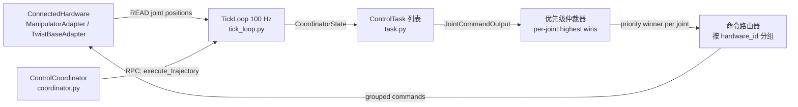
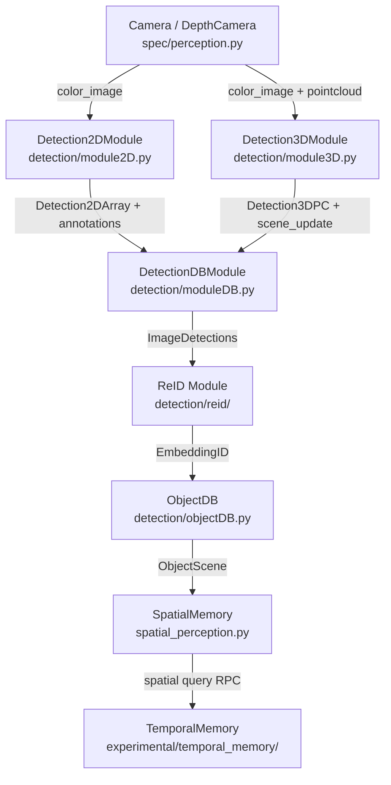
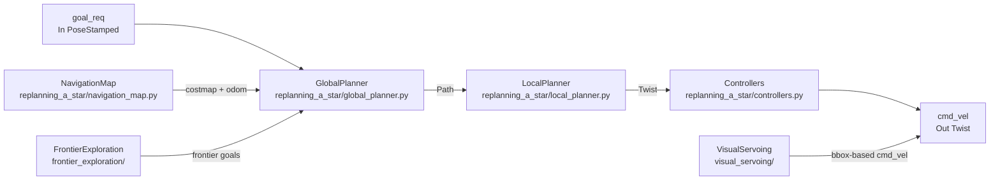
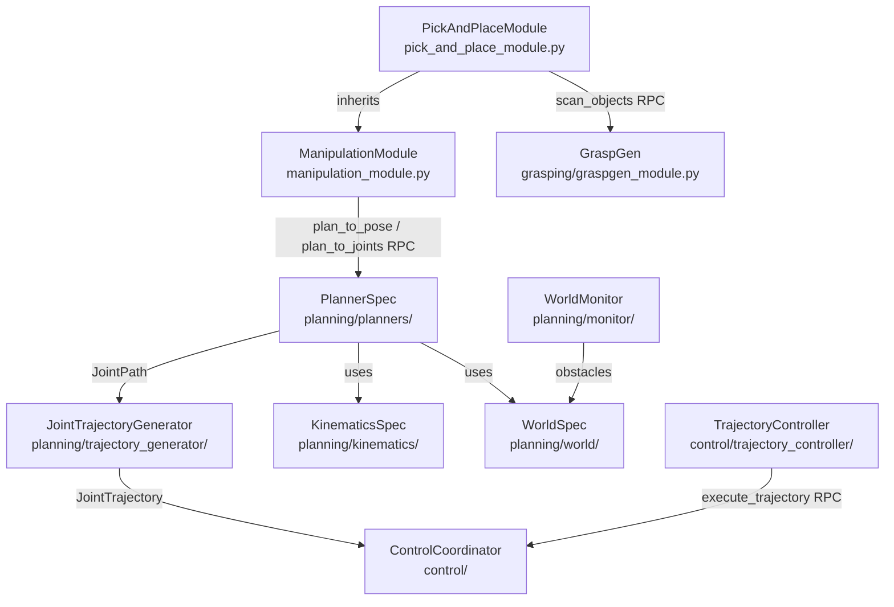
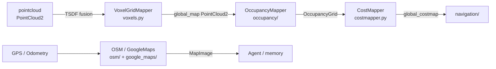
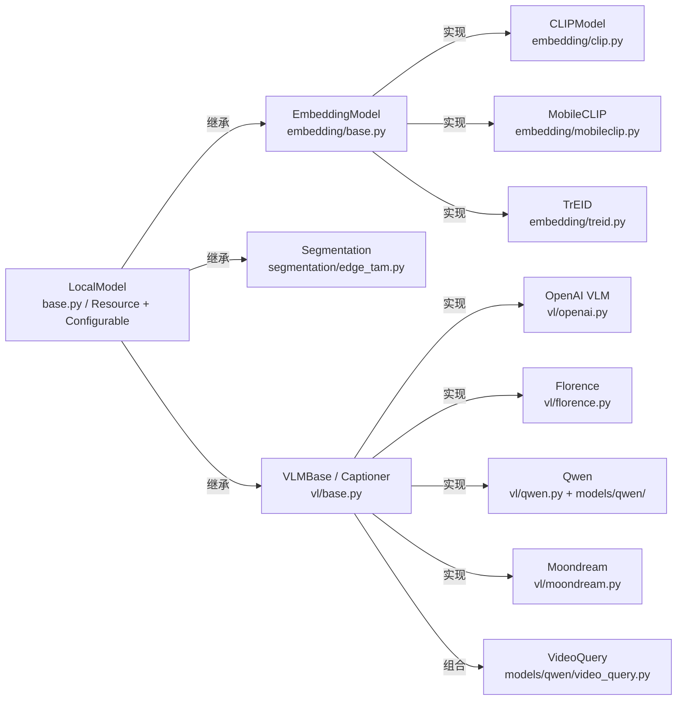
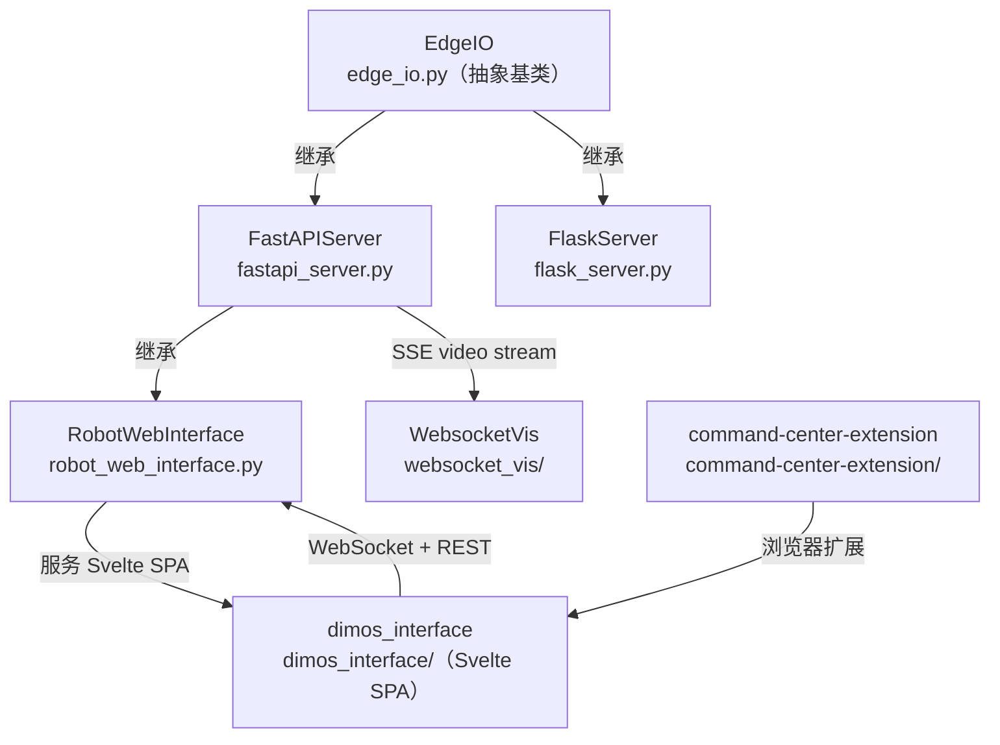

# 专题：子系统内部架构（Subsystems）

> 与 [README § 6](/docs/architecture/README.md#-6-能力子系统全景) 互补：README §6 讲"做什么"；本文档讲"内部如何协作 + 依赖 + 扩展点"。**不重复** README §6 的"做什么"叙述。

## 目录

- [1. control/](#1-control)
- [2. perception/](#2-perception)
- [3. navigation/](#3-navigation)
- [4. manipulation/](#4-manipulation)
- [5. mapping/](#5-mapping)
- [6. memory/](#6-memory)
- [7. models/](#7-models)
- [8. web/](#8-web)
- [9. visualization/rerun/](#9-visualizationrerun)
- [10. teleop/](#10-teleop)
- [11. msgs/](#11-msgs)
- [12. types/](#12-types)
- [13. rxpy_backpressure/](#13-rxpy_backpressure)

---

## 1. control/

> 做什么见 [README § 6.1](/docs/architecture/README.md#-6-能力子系统全景)。本节聚焦内部架构、依赖、扩展点。

### 内部架构



`ControlCoordinator` 是整个控制子系统的入口 Module。它在初始化阶段把所有 `HardwareComponent` 配置包装为 `ConnectedHardware`（操作臂）或 `ConnectedTwistBase`（底盘），并实例化对应的 `HardwareAdapter`。

`TickLoop`（`tick_loop.py`）以固定频率（默认 100 Hz）运行 **READ → COMPUTE → ARBITRATE → ROUTE → WRITE** 五步流水线。每轮 tick 首先向所有已连接硬件读取关节位置，形成 `CoordinatorState`；然后对每个活跃 `ControlTask` 调用 `compute(state)` 得到期望的关节命令；仲裁阶段对每个关节只保留优先级最高的命令，低优先级的任务收到 `on_preempted` 通知；最终按 hardware_id 分组，写入对应 Adapter。

`task.py` 定义了 `ControlTask` Protocol，要求实现 `name`、`claim()`、`is_active()`、`compute()` 四个接口。内置实现为 `tasks/trajectory_task.py`（关节轨迹跟踪），其余控制律（PID、阻抗、视觉伺服力控）均可外部注入。

`components.py` 集中管理 `HardwareComponent` 配置（类型别名 `HardwareId`、`JointName` 等），以及底盘方向映射 `TWIST_SUFFIX_MAP`。`blueprints.py` 提供若干预配置的开箱即用蓝图（单臂 mock、双臂 mock、Piper+xArm 真机等）。

### 依赖

- **上游（输入）**：`dimos/hardware/manipulators/`（ManipulatorAdapter）和 `dimos/hardware/drive_trains/`（TwistBaseAdapter）提供低层驱动；`teleop/` 的 Quest 手柄按键通过 `Buttons` Stream 送入 coordinator 触发 engage/disengage 逻辑。
- **下游（输出）**：发布 `/coordinator/joint_state`（`JointState`）供 `manipulation/` 的轨迹控制器和 `visualization/rerun/` 订阅；`cmd_vel`（`Twist`）驱动底盘运动，被 `navigation/` 依赖。
- **共享 Spec**：`dimos/spec/control.py` — `LocalPlanner` Protocol 声明 `cmd_vel: Out[Twist]`，`navigation/` 中的局部规划器实现此接口后可被 coordinator 直接订阅，无需改动 coordinator 代码。
- **共享 Stream**：`/coordinator/joint_state`（JointState）；`cmd_vel`（Twist）；`Buttons`（来自 teleop）。

### 扩展点

| 想加什么 | 改哪里 | 模式 |
|---|---|---|
| 新控制律（阻抗/力矩/视觉伺服） | 实现 `ControlTask` Protocol，注入 `TaskConfig` | Protocol 实现 + 配置注入 |
| 新硬件驱动（新型机械臂） | 在 `hardware/manipulators/` 新增 Adapter，`components.py` 注册 `adapter_type` | Adapter 模式 |
| 新底盘类型 | 在 `hardware/drive_trains/` 新增 TwistBaseAdapter | 同上 |
| 调整 tick 频率 | `tick_rate` 参数传给 `control_coordinator()` | 配置参数 |
| 安全监控任务（紧急停止） | 实现高优先级 `ControlTask`（priority=100），注册即可抢占一切低优先级任务 | 优先级仲裁 |

详见：[`docs/capabilities/manipulation/`](../capabilities/manipulation/)。

---

## 2. perception/

> 做什么见 [README § 6.2](/docs/architecture/README.md#-6-能力子系统全景)。本节聚焦内部架构、依赖、扩展点。**安装注意**：`perception` 子系统自 PR #1888 起从基础安装移出为 pip extra，按需 `uv sync --extra perception` 装入；详细硬依赖子系统清单见本文档"跨子系统硬依赖"小节（§2 末尾）。

### 内部架构



感知子系统呈现清晰的**三层堆叠**结构：

**第一层——检测层**：`Detection2DModule`（`detection/module2D.py`）接收 `color_image` Stream，经可插拔 `Detector`（默认 YOLO）输出 `Detection2DArray` 和 Foxglove `ImageAnnotations`。`Detection3DModule`（`detection/module3D.py`）继承自 `Detection2DModule`，同时订阅 `pointcloud`，将 2D 边界框反投影到点云，产生 `Detection3DPC` 和 `SceneUpdate`。`DetectionDBModule`（`detection/moduleDB.py`）是聚合层，管理 `ObjectDB` 数据库，对检测到的每个对象保留历史帧。

**第二层——跟踪层**：`detection/reid/` 下的 ReID 模块为每个检测对象计算嵌入向量（CLIP、TrEID 等），实现跨帧身份绑定（`EmbeddingIDSystem`）。`object_tracker_2d.py` 和 `object_tracker_3d.py` 提供基于边界框 IoU 和嵌入相似度的跨帧关联。

**第三层——空间层**：`spatial_perception.py`（`SpatialMemory` Module）在 `ObjectScene` 基础上维护一个空间向量数据库（ChromaDB），提供 `find_object(query)` 等 RPC。实验性的 `experimental/temporal_memory/` 在此之上加入了时间维度的帧窗口分析（`FrameWindowAccumulator`）、实体图谱（`EntityGraphDB`）和 CLIP 语义过滤。

`perceive_loop_skill.py` 把感知查询封装为 `@skill`，供 Agent 通过自然语言触发目标搜索。

各层之间的数据流通过 RxPY 算子链串联，背压策略（`BackPressure.LATEST`）在检测层入口处节流，确保慢速 GPU 推理不会因图像积压造成延迟雪崩。`Config.max_freq`（默认 10 Hz）进一步限制检测频率，与相机帧率（通常 30 fps）解耦。`DetectionDB` 模块维护每个 `object_id` 的时间窗口历史帧，支持对象消失后的短时记忆（通常几百毫秒），避免单帧遮挡导致抓取目标丢失。

### 依赖

- **上游**：`dimos/spec/perception.py` 中的 `Camera`、`DepthCamera`、`Pointcloud` Protocol；实际数据来自硬件驱动模块（Go2 相机、RealSense 等）。图像帧在进入检测层之前可经 `sharpness_barrier` 滤除模糊帧（来自 `msgs/sensor_msgs/Image.py`）。
- **下游**：`navigation/` 订阅 `Detection2DArray` 驱动目标跟踪导航；`mapping/` 消费 `PointCloud2` 构建占用栅格；`memory2/` 的 `SemanticSearch`（以及 `Recorder` 子类）订阅 `color_image` 做嵌入 / 录制；`manipulation/PickAndPlaceModule` 通过 RPC 查询 `ObjectDB` 获取抓取目标位姿。
- **共享 Spec**：`dimos/spec/perception.py`（`Image`、`Camera`、`DepthCamera`、`Pointcloud`、`IMU`、`Odometry`、`Lidar`）。
- **共享 Stream**：`color_image`（Image）；`depth_image`（Image）；`pointcloud`（PointCloud2）；`detections`（Detection2DArray）；`annotations`（ImageAnnotations）；`scene_update`（SceneUpdate）。

### 扩展点

| 想加什么 | 改哪里 | 模式 |
|---|---|---|
| 新 2D 检测器（SAM、YOLOE、自定义） | 在 `detection/detectors/` 新建文件，实现 `Detector` Protocol 的 `process_image()` 方法 | Protocol 实现 |
| 新 ReID 嵌入模型 | 在 `models/embedding/` 新增子类，传入 `detection/reid/` 配置 | 模型替换 |
| 新传感器类型（热成像、雷达） | 在 `spec/perception.py` 新增 Protocol；Detection 模块订阅新 Stream | Spec 扩展 |
| 时序语义分析（场景描述、事件检测） | 扩展 `experimental/temporal_memory/` 中的 `WindowAnalyzer` | 实验层扩展 |

详见：[`docs/capabilities/perception/`](../capabilities/perception/)。

---

## 3. navigation/

> 做什么见 [README § 6.3](/docs/architecture/README.md#-6-能力子系统全景)。本节聚焦内部架构、依赖、扩展点。

### 内部架构



导航子系统以**全局规划 + 局部控制**两层架构为核心，并行支持三种规划策略：

**自主重规划 A\***（`replanning_a_star/`）是当前主要实现。`NavigationMap` 融合 costmap（来自 `mapping/`）和里程计（来自感知/底盘）构建代价地图。`GlobalPlanner`（`min_cost_astar.py` 提供 C++ 加速核心，`min_cost_astar_ext.so` 预编译 .so）在代价地图上做全局路径规划，`ReplanLimiter`（`replan_limiter.py`）节流重规划频率防止振荡。`LocalPlanner` 和 `Controllers` 将全局路径转化为实时 `cmd_vel`，内置路径清洁度检查（`path_clearance.py`）。`GoalValidator` 确认目标可达性，`PositionTracker` 跟踪机器人实时位置。

**边界探索**（`frontier_exploration/`）：`WavefrontFrontierGoalSelector` 在未知区域地图上计算边界点，作为自主探索的目标序列注入全局规划器。

**视觉导航**（`visual_servoing/`）：`VisualServoing2D` 直接基于 2D 目标检测框的中心偏差输出 `cmd_vel`，无需显式地图，用于短距离目标追踪；`DetectionNavigation` 结合检测结果和边界框导航（`bbox_navigation.py`）实现目标接近。

**ROS Nav Bridge**（`rosnav.py`）：为已有 ROS 2 Nav2 栈的机器人提供适配层，通过 `NavigationInterface`（`base.py` 定义的 ABC：`set_goal`、`get_state`、`is_goal_reached`、`cancel_goal`）抽象，使上层代码无感知底层规划器差异。`NavigationState` 枚举（IDLE / FOLLOWING_PATH / RECOVERY）让 Agent Skill 可以查询导航状态而不依赖具体实现。

C++ 加速内核 `min_cost_astar_ext.so` 是预编译二进制，在 `replanning_a_star/` 目录下。如需在新平台（arm64、RISC-V）重新编译，运行 `min_cost_astar.py` 中的构建脚本。`PathDistancer`（`path_distancer.py`）和 `PathClearance`（`path_clearance.py`）是独立的路径质量评估工具，可在不重建完整导航栈的情况下进行单元测试。

### 依赖

- **上游**：`mapping/` 提供 `global_costmap`（OccupancyGrid）；`spec/perception.py` 中 `Odometry` 提供里程计；`perception/` 的 `Detection2DArray` 驱动视觉伺服导航；`control/` 消费 `cmd_vel`（通过 `spec/control.py` `LocalPlanner` Protocol）。
- **下游**：`cmd_vel`（Twist）送往 `control/` 底盘驱动；`goal_active`（PoseStamped）、`path_active`（Path）供 `web/` 和 `visualization/` 展示。
- **共享 Spec**：`dimos/spec/nav.py`（`Nav` Protocol：`goal_req`、`goal_active`、`path_active`、`cmd_vel`）；`dimos/spec/control.py`（`LocalPlanner`）；`dimos/spec/mapping.py`（`GlobalCostmap`）。
- **共享 Stream**：`goal_req`（PoseStamped）；`cmd_vel`（Twist）；`path_active`（Path）；`global_costmap`（OccupancyGrid）。

### 扩展点

| 想加什么 | 改哪里 | 模式 |
|---|---|---|
| 新全局规划算法（RRT\*、Dijkstra） | 在 `replanning_a_star/` 新建 planner，实现 `GlobalPlanner` 接口 | 接口替换 |
| 新局部控制器（DWA、TEB） | 替换 `replanning_a_star/local_planner.py`，实现 `LocalPlanner` Spec | Spec 替换 |
| 新探索策略 | 在 `frontier_exploration/` 扩展 `WavefrontFrontierGoalSelector` | 子类扩展 |
| 接入 ROS 2 Nav2 | 使用 `rosnav.py` 的 `NavigationInterface` 适配层 | 适配器模式 |

详见：[`docs/capabilities/navigation/`](../capabilities/navigation/)。

### 自主巡逻 — navigation/patrolling/

`dimos/navigation/patrolling/` 是 navigation 下的**任务层**子包，也是 DimOS 当前生产级 **async Module** 范式的代表示例（**async Module 运行时机制见 runtime-model §1.8**）。`PatrollingModule` 通过 `asyncio` 协程并发监听 `odom` / `global_costmap` / `goal_reached` 三条 stream，驱动"选下一个巡逻点 → 调用规划器 → 等待到达 → 更新访问历史"的主循环；其 e2e 行为覆盖于 `dimos/e2e_tests/test_patrol_and_follow.py`。

```
dimos/navigation/patrolling/
├── module.py                        # PatrollingModule(Module) — async 巡逻主循环
├── patrolling_module_spec.py        # PatrollingModuleSpec(Spec, Protocol) — RPC 契约
├── create_patrol_router.py          # Router factory（按名称装配 router）
└── routers/
    ├── patrol_router.py             # PatrolRouter(Protocol) — 下一目标选择器契约
    ├── base_patrol_router.py        # BasePatrolRouter(ABC) — 访问历史集成基类
    ├── coverage_patrol_router.py    # CoveragePatrolRouter — 栅格覆盖策略
    ├── frontier_patrol_router.py    # FrontierPatrolRouter — 前沿探索策略
    ├── random_patrol_router.py      # RandomPatrolRouter — 随机游走基线
    └── visitation_history.py        # VisitationHistory — 访问栅格记账
```

**Router 插拔体系**：`PatrolRouter` Protocol 约定单一方法"给定当前 pose + costmap + 访问历史 → 返回下一个 goal"。`BasePatrolRouter` 负责装配 `VisitationHistory`，三个子类仅实现选点策略——`Coverage` 扫未访问栅格中心、`Frontier` 去前沿边界、`Random` 采样空闲栅格；新策略只需继承 `BasePatrolRouter` 并实现 `next_goal()`，通过 `create_patrol_router` 工厂按字符串选型。

**与其他 navigation 子节的关系**：`patrolling/` 位于**任务层**，其规划下调 `replanning_a_star/` + `frontier_exploration/` 生成路径，与 `visual_servoing/`、`bbox_navigation/` 是平级的任务模式——共享 `Nav` Spec（`goal_req` / `goal_active`），不同点只在"如何选下一个 goal"。

---

## 4. manipulation/

> 做什么见 [README § 6.4](/docs/architecture/README.md#-6-能力子系统全景)。本节聚焦内部架构、依赖、扩展点。

### 内部架构



操控子系统采用**后端无关 + 三层抽象**的设计：

**上层——Module 层**（`manipulation_module.py`、`pick_and_place_module.py`）：`ManipulationModule` 是基础 Module，通过 `@rpc` 暴露 `plan_to_pose`、`plan_to_joints`、`preview_path`、`execute` 等底层积木，以及通过 `@skill` 暴露 `move_to_pose`、`open_gripper`、`go_home` 等短时程技能。`PickAndPlaceModule` 继承并新增感知集成（`scan_objects`、`get_scene_info`）和长时程技能（`pick`、`place`、`pick_and_place`）。两者都持有状态机（`ManipulationState` enum）防止并发规划。

**中层——规划层**（`planning/`）：后端无关设计的核心。`PlannerSpec`（`planning/spec/`）是 Protocol，`RRTConnectPlanner`（`planning/planners/rrt_planner.py`）是实现之一，只依赖 `WorldSpec` 接口做碰撞检测和 FK，不直接依赖 Drake。`KinematicsSpec` 同理：`JacobianIK`（迭代/微分两种实现）和 `drake_optimization_ik.py` 都实现此接口。`JointTrajectoryGenerator`（`planning/trajectory_generator/`）将关节路径插值为时间参数化轨迹。`WorldMonitor`（`planning/monitor/`）监控实时世界状态并向 World 注入动态障碍物。

**下层——控制层**（`control/`）：`TrajectoryController`（`control/trajectory_controller/`）通过 RPC 调用 `ControlCoordinator.execute_trajectory` 将规划好的轨迹下发给 `control/` 子系统执行。`TargetSetter` 和 `DualTrajectorySetter` 用于多臂同步控制。

**抓取层**（`grasping/`）：`GraspGenModule` 封装抓取姿态生成（支持 Docker 化部署），输出候选抓取位姿供 `PickAndPlaceModule` 消费。

### 依赖

- **上游**：`control/` 的 `ControlCoordinator`（通过 RPC 执行轨迹）；`perception/` 的 `ObjectDB`（通过 RPC 查询物体位姿）；`msgs/sensor_msgs.JointState`（当前关节状态输入）。
- **下游**：轨迹执行结果反馈给 Agent `@skill`；`visualization/rerun/` 消费 Meshcat 预览。
- **共享 Spec**：`manipulation/planning/spec/`（`PlannerSpec`、`KinematicsSpec`、`WorldSpec`）；`dimos/spec/`（无直接公共 Spec，通过 RPC 调用 control Spec）。
- **共享 Stream**：`joint_state`（In，来自 control）；`JointTrajectory`（Out，送往 control）。

### 扩展点

| 想加什么 | 改哪里 | 模式 |
|---|---|---|
| 新运动规划算法（BiRRT、CHOMP） | 在 `planning/planners/` 新建类，实现 `PlannerSpec` Protocol | Protocol 实现 |
| 新求逆运动学后端（MoveIt 2） | 在 `planning/kinematics/` 新建类，实现 `KinematicsSpec` | Protocol 实现 |
| 新机器人 URDF 模型 | 在 `planning/world/` 新增 `RobotModelConfig` 配置 | 配置扩展 |
| 新高层技能（码垛、螺丝拧紧） | 在 `PickAndPlaceModule` 子类中加 `@skill`，调用已有 RPC 积木 | Skill 注册 |
| 新夹爪类型 | 在 `planning/` 的 `WorldSpec` 中添加 end-effector 接口 | 接口扩展 |

详见：[`docs/capabilities/manipulation/`](../capabilities/manipulation/)。

---

## 5. mapping/

> 做什么见 [README § 6.5](/docs/architecture/README.md#-6-能力子系统全景)。本节聚焦内部架构、依赖、扩展点。

### 内部架构



建图子系统有三条并行流水线，服务不同精度和用途：

**体素地图流水线**（`voxels.py`：`VoxelGridMapper`）：以 TSDF（截断符号距离函数）在 GPU（Open3D CUDA 后端）上进行增量式点云融合，以可配置间隔（`publish_interval`）发布 `global_map`（PointCloud2）。`block_count` 参数控制 GPU 哈希表大小，`carve_columns` 开启则对动态遮挡区域实施 free-space 雕刻。

**占用栅格流水线**（`occupancy/`）：包含多个独立算子：`extrude_occupancy.py` 将 3D 点云切片投影到 2D；`inflation.py` 膨胀障碍物为机器人轮廓；`gradient.py` 计算导航势场；`path_mask.py` 和 `path_map.py` 提供路径可行性掩码；`visualizations.py` 辅助调试。所有算子均接受 numpy 数组，可单独测试。

**代价地图整合**（`costmapper.py`）：`CostMapper` Module 订阅若干 Stream，合并原始占用栅格、安全膨胀和语义障碍物，发布 `global_costmap`（OccupancyGrid）供 `navigation/` 消费。

**地理地图**（`osm/`、`google_maps/`）：`osm.py` 拉取 OSM 瓦片，`CurrentLocationMap` 用 VLM（Qwen）对地图图像进行语义查询，返回 `LatLon` 坐标。`GoogleMaps` 提供类似接口。`mapping/models.py` 定义共享的 `LatLon`、`PixelCoord` 等类型，像素坐标与地理坐标之间的互转（`pixel_to_latlon` / `latlon_to_pixel`）封装在 `MapImage` 对象中，避免坐标系混乱。`CurrentLocationMap.update_position()` 在机器人偏离中心超过阈值时自动拉取新瓦片，保持地图覆盖的实时性。`utils/distance.py` 提供哈弗辛公式用于 GPS 坐标间的球面距离计算。

### 依赖

- **上游**：`spec/perception.py` 的 `Pointcloud` Protocol（点云来源）；`spec/perception.py` 的 `Odometry`（位姿融合）；`models/vl/`（OSM 地理查询的 VLM）。
- **下游**：`navigation/` 通过 `spec/mapping.py` 的 `GlobalCostmap` 消费占用栅格；`memory2/` 的 `VoxelGridMapper` 消费 `lidar` 点云做体素融合（`VoxelMapTransformer` 住在 `mapping/`，走 memory2 `StreamModule` 部署）；`visualization/rerun/` 订阅 `global_map` 和 `global_costmap` 可视化。
- **共享 Spec**：`dimos/spec/mapping.py`（`GlobalPointcloud`、`GlobalCostmap`）。
- **共享 Stream**：`global_map`（PointCloud2）；`global_costmap`（OccupancyGrid）；`pointcloud`（In，PointCloud2）。

### 扩展点

| 想加什么 | 改哪里 | 模式 |
|---|---|---|
| 新体素融合策略（ESDF、TSDF 变体） | 继承 `VoxelGridMapper`，重写 TSDF 积分参数 | 子类/配置扩展 |
| 新地图图层（语义标签） | 在 `occupancy/operations.py` 添加新算子；更新 `CostMapper` 订阅 | 算子链扩展 |
| 新地理地图源（Bing Maps） | 仿照 `google_maps.py` 实现新模块，共享 `mapping/models.py` 类型 | 同接口实现 |
| CPU-only 点云融合 | 改 `VoxelGridMapper` 的 `device` 配置为 `CPU:0` | 配置参数 |

---

## 6. memory/

> 做什么见 [README § 6.6](/docs/architecture/README.md#-6-能力子系统全景)。本节聚焦内部架构、依赖、扩展点。

memory/ 子系统由两块组成：**`memory2/`（主）** 是以 `Stream[T]` / `Transformer[T,R]` / `StreamModule` 为核心的通用存储抽象栈，承接图像、点云、嵌入、体素地图等所有持久化与流式处理需求；**`memory/timeseries/`（辅）** 是通用时序 KV 后端（5 实现），主要被 `--replay` 数据集加载与老代码路径使用。历史遗留的 `memory/embedding.py` 是未完成原型、**零非测试调用**，职责已被 `memory2.SemanticSearch` 吸收——详见 §6.5。

```mermaid
flowchart LR
  SRC[Backend / Stream 源] --> S[Stream&#91;T&#93;<br/>memory2/stream.py]
  S -->|transform()| TX[Transformer chain]
  TX --> SM[StreamModule&#91;TIn, TOut&#93;<br/>memory2/module.py]
  SM -->|In/Out port| DS[下游 Module]
  S -.->|live/save/drain| STORE[Backend]
```

`Stream[T, O]`（`memory2/stream.py:58`，`CompositeResource, Generic[T, O]`）是**惰性拉式**迭代链：任何 `.after()` / `.before()` / `.time_range()` / `.at()` / `.near()` / `.tags()` / `.filter()` / `.search()` / `.search_text()` / `.order_by()` / `.limit()` / `.offset()` / `.map()` / `.map_data()` / `.scan_data()` / `.tap()` / `.transform()` 都返回新 `Stream`，直到 `for obs in s` 或 `.drain()` / `.drain_thread()` / `.to_list()` / `.first()` / `.last()` / `.count()` / `.materialize()` / `.observable()` / `.subscribe()` 才真正计算。`.live(buffer=None)` 切换到"回填 + 实时尾"模式（默认 `KeepLast()` 背压），必须在 `.transform()` 之前调用。`.save(target)` 是惰性 pass-through，把每个观测 append 到目标流的 backend。`.chain(unbound)` 把 `Stream()`（无 source 的管道模板）应用到已绑 backend 的流上，这是 `StreamModule` 静态 pipeline 的底层机制。

`Transformer[T, R]`（`memory2/transform.py:36`）是 `Iterator[Observation[T]] → Iterator[Observation[R]]` 的抽象基类。实现矩阵：`FnTransformer`（单 obs 映射，`transform.py:61`）、`FnIterTransformer`（生成器 wrap，`transform.py:75`）、`Batch`（批处理，`transform.py:85`）、`QualityWindow`（时间窗内挑质量峰值，`transform.py:416`）；还有**函数式便捷 helper**（均返回 `FnIterTransformer`）：`downsample(n)` / `throttle(interval)` / `measure_time(out)` / `measure_gpu_mem(out)` / `speed()` / `smooth(window)` / `smooth_time(seconds)` / `peaks(...)` / `significant(method)` / `normalize()`。

`StreamModule(Module, Generic[TIn, TOut])`（`memory2/module.py:69`）是把 memory2 pipeline 部署为 dimos Module 的基类：子类声明 `pipeline`（静态 `Stream()` 无绑模板 / `Transformer` 实例 / `def pipeline(self, stream)` 方法三选一）+ 恰好 1 个 `In[TIn]` + 1 个 `Out[TOut]`；`start()` 自动建一个 `NullStore` 桥接 push-based `In` → pull-based Stream → `Out`。

### 6.2 成品 module / embed 三件套

全部在 `memory2/module.py` 与 `memory2/embed.py`：

- **`MemoryModule`**（`memory2/module.py:170`）：`Module` 基类，`config.db_path` 默认 `recording.db`（相对路径自动解析到 `DIMOS_PROJECT_ROOT`），延迟构造 `SqliteStore` 并注册为 disposable——所有需要 SQLite 后端的 memory 模块都继承它。
- **`SemanticSearch`**（`memory2/module.py:196`，继承 `MemoryModule`）：`start()` 串一条 live pipeline——`color_image → .filter(brightness>0.1) → QualityWindow(sharpness) → EmbedImages(model, batch=2) → .save(embeddings)`；`@skill search(query: str) -> PoseStamped` 把文本向量喂给 `embeddings.search(vec).transform(peaks(...)).last().pose_stamped`。**这就是 `memory/embedding.py` 那份老原型的事实替代品**。
- **`Recorder`**（`memory2/module.py:247`）：记录所有 `In` port 到 SQLite；子类声明要录哪些 topic（`color_image: In[Image]` / `lidar: In[PointCloud2]` 等），`_port_to_stream` 自动接 `tf` 加 world-frame pose；`--replay` 模式下自动禁用。
- **`EmbedImages` / `EmbedText`**（`memory2/embed.py:40` / `:61`）：`Transformer[Any, Any]`，批量调用 `model.embed(...)` / `model.embed_text(...)`，把 `Observation` 派生为 `EmbeddedObservation`（多一个 `.embedding` 字段）。

### 6.3 存储层七件套 + Backend + RegistryStore

memory2 把存储拆成 7 个独立职责的子目录：

| 子目录 | 职责 | 关键实现 |
|---|---|---|
| `memory2/store/` | `Store` ABC（`base.py`）+ 具体后端（`memory.py` / `null.py` / `sqlite.py`）；`stream(name, type)` 返回绑好 Backend 的 `Stream[T]` | `MemoryStore`（测试 / `materialize()` / `StreamModule` 桥）、`SqliteStore`（生产 / replay / dtop / demo）、`NullStore`（`StreamModule` 内部零开销桥） |
| `memory2/observationstore/` | `ObservationStore[T]` ABC：只存元数据（id / ts / pose / tags / 向量指针），不碰 blob；`insert` / `query(StreamQuery)` / `fetch_by_ids` | `ListObservationStore`（内存）、`SqliteObservationStore`（带 FTS5 待办） |
| `memory2/blobstore/` | 大 payload 二进制存储，key 是 `(stream_name, row_id)` | `FileBlobStore`（目录即 key space）、`SqliteBlobStore`（单文件） |
| `memory2/codecs/` | `Codec(Protocol[T])`：`.encode(obj) -> bytes` / `.decode(bytes) -> obj`；blob 编解码分层 | `JpegCodec`（`codecs/jpeg.py:23`，turbojpeg 比 PIL 快 10–20×）、`LcmCodec`（`:23`，ROS 消息直通 LCM 串化）、`Lz4Codec`（`:25`）、`PickleCodec`（`:21`） |
| `memory2/vectorstore/` | 向量索引；`.put` / `.search(name, vec, k) -> [(id, sim)]` | `MemoryVectorStore`（numpy 暴力搜）、`SqliteVectorStore`（`vectorstore/sqlite.py:70` 建表 `USING vec0(embedding float[{dim}] distance_metric=cosine)`，依赖 `sqlite-vec` 扩展） |
| `memory2/notifier/` | "新观测到" 广播；`.subscribe(buffer)` / `.notify(obs)` 驱动 `Stream.live()` | `SubjectNotifier`（RxPY `Subject` 实现，`notifier/subject.py`） |
| `memory2/vis/` | 观测流可视化；`plot/` 出图（elements / plot / rerun / svg），`space/` 出空间渲染（同 4 份） | `plot.py` / `rerun.py` / `svg.py` 分前端 |

`Backend[T]`（`memory2/backend.py:43`，`CompositeResource, Generic[T]`）把上面 4 件套组合成一个流：`metadata_store + codec + blob_store? + vector_store? + notifier`。`.append(obs)` 流水线是 encode → insert → put blob → put vector → commit → notify；`.iterate(query)` 根据 `StreamQuery` 走 snapshot / vector_search / live tail 三种路径。`RegistryStore`（`memory2/registry.py:46`）把每个流的 backend 组合序列化到 SQLite `_streams` 表，用于**跨 run 保留配置**——`SqliteStore.stream(name, type)` 首次建流时写注册表，后续 run 同名流自动复原 codec / blob_store / vector_store 配置。

### 6.4 集成示例

memory2 抽象在仓库内已有 4 类典型用法：

- **`VoxelGridMapper`**（`dimos/mapping/voxels.py:253`，继承 `StreamModule[PointCloud2, PointCloud2]`）：`pipeline(stream) = stream.transform(VoxelMap(**config))`，承接 `lidar: In[PointCloud2]` 并输出融合后的 `global_map: Out[PointCloud2]`。**配套的 `VoxelMapTransformer`（`dimos/mapping/voxels.py:192`）住在 `mapping/`，不在 `memory2/`**——领域特定变换按"就近放置"原则落在业务子系统里，这是 memory2 提倡的分工。
- **`Recorder`**（go2 blueprint 的录制管线）：在 `unitree_go2_agentic` / `unitree_go2_recording` 等 blueprint 里子类化，声明 `color_image` / `lidar` / `odom` 等 `In` port，数据自动落到 SQLite 供 `--replay` 加载。
- **`SqliteStore`**：`--replay` 数据集加载、`dimos dtop` 流监控、以及 `memory2/` 自带的 `demo_*` 脚本都以它为主存储；开箱支持 codec 压缩 + `vec0` 向量索引 + live `.subscribe` 广播三合一。
- **`RegistryStore`**：`SqliteStore` 内部用它把每个流的 backend 组合（codec / blob_store / vector_store 的类名 + config）序列化保存——**同一个 SQLite 文件在不同 run 打开时配置自动复原**，新代码无需重新声明。

### 6.5 `memory/`（legacy 短注）

`memory/timeseries/` 是历史留下的通用时序 KV 层，基类 `TimeSeriesStore[T]`（`memory/timeseries/base.py:35`）定义 `_save` / `_load` / `_delete` / `timestamps` 四抽象方法 + `save()` / `stream()` / `seek_stream()` 高级接口。5 后端并存：`InMemoryStore`（`inmemory.py:23`）、`SqliteStore`（`sqlite.py:40`）、`PickleDirStore`（`pickledir.py:27`）、`PostgresStore`（`postgres.py:41`）、`LegacyPickleStore`（`legacy.py:33`，即 go2 `TimedSensorReplay` 用的老 pickle 格式）。新代码优先用 `memory2.SqliteStore`，这里仅做 `--replay` 数据集与老路径的兼容层。

`memory/embedding.py` 的 `EmbeddingMemory`（`:49`）是未完成原型——目前仅 `test_embedding.py` 引用，生产代码零调用；职责已被 `memory2.SemanticSearch`（§6.2）完整吸收，不再推荐使用，后续版本会删除。注意 `dimos/perception/spatial_perception.py` 的 `SpatialMemory`（`:71`）是**感知侧**的空间记忆 Module，与本 `memory/` 子系统无继承关系——见 data-flow.md § 1 perception trace。

### 依赖

- **上游**：`perception/` 的 `color_image` / `lidar` / `odom` 等 In port；`models/embedding/`（`CLIPModel` 等）喂给 `EmbedImages` / `EmbedText`；`mapping/` 提供 `VoxelMapTransformer` 这类领域变换。
- **下游**：`--replay` 通过 `memory/timeseries/` 读取历史帧；`dimos dtop` 通过 `memory2` live subscribe 做流监控；Agent 通过 `SemanticSearch.search` skill 触发视觉问答。
- **共享 Stream**：所有 `StreamModule` 子类与 `Recorder` 子类的 `In` / `Out` 都是 dimos 标准 typed stream（见 §2）。

### 扩展点

| 想加什么 | 改哪里 | 模式 |
|---|---|---|
| 新 `Transformer` 变换 | 继承 `memory2/transform.py:Transformer[T, R]`，实现 `__call__(upstream)`；业务特定的放对应子系统（如 `VoxelMapTransformer` 在 `mapping/`） | ABC 实现 |
| 新 codec（zstd / avro / ProtoBuf） | 新增 `memory2/codecs/<name>.py`，实现 `Codec(Protocol[T])`；`codec_for(type)` 通过注册表查 | Protocol 实现 |
| 新 vector store（Milvus / Qdrant） | 继承 `memory2/vectorstore/base.py:VectorStore`，实现 `put` / `search` / `serialize` | ABC 实现 |
| 新 embedding skill | 子类化 `MemoryModule`，组合 `EmbedText` + `.search()`；参考 `SemanticSearch` | 模板复用 |
| 录制新 topic | 子类化 `Recorder`，加 `<name>: In[<MsgType>]` 字段 | 声明即注册 |
| 跨 run 保留新配置 | 用 `RegistryStore` 已有机制；或在 `Backend.serialize()` 增扩新字段 | 配置驱动 |

---

## 7. models/

> 做什么见 [README § 6.7](/docs/architecture/README.md#-6-能力子系统全景)。本节聚焦内部架构、依赖、扩展点。

### 内部架构



模型子系统是所有 AI 推理的**纯计算层**，遵循三个设计原则：

1. **Resource 生命周期**：所有 `LocalModel` 实现 `Resource` 接口（`start()` / `stop()`），模型权重懒加载（`@cached_property _model`），避免在导入时占用 GPU 内存。`autostart=False` 为默认值，只有在首次调用时才真正加载。

2. **Configurable[Config] 泛型**：每个模型类通过 `LocalModelConfig` 子类声明设备（`cuda`/`cpu`/`cuda:0`）、精度（`float32`/`float16`）和预热选项，与模型逻辑完全解耦。

3. **接口分层**：`EmbeddingModel` 约定 `embed(image) -> Embedding`（固定维度浮点向量）；`Captioner` 约定 `caption(image) -> str`；`VLMBase` 在 `Captioner` 之上增加 `query(image, prompt) -> str` 和检测接口。`VideoQuery`（`models/qwen/video_query.py`）在 VLM 上封装视频帧采样和聚合逻辑，用于长时序场景理解。

**嵌入模型**（`embedding/`）：`CLIPModel` 和 `MobileCLIPModel` 用于语义检索（`memory/` 和 `perception/reid/`）；`TrEIDModel`（TransReID）专用于人员重识别，产生区分个体的嵌入向量。

**分割模型**（`segmentation/`）：`EdgeTAM`（Efficient SAM 变体）提供目标分割掩码，被 `perception/` 的高级流水线使用。

**视觉语言模型**（`vl/`）：`QwenVlModel` 和 `QwenModel`（`models/qwen/`）是本地 GPU 推理实现；`OpenAIVLM` 调用远程 API（GPT-4o、GPT-4V）；`Florence2`、`Moondream` 提供轻量检测/描述选项。

### 依赖

- **上游**：硬件（GPU/CPU）；`msgs/sensor_msgs.Image`（输入图像格式）；`types/` 的 `Sample` 序列化工具（部分模型用于序列化嵌入）。
- **下游**：`perception/detection/detectors/`（Detector 调用嵌入/VLM）；`memory/embedding.py`（EmbeddingModel）；`mapping/osm/`（VLM 用于地理查询）；`perception/experimental/temporal_memory/`（VLM 语义分析）；`navigation/visual/`（VLM 驱动视觉导航）。
- **共享 Spec**：无直接 `dimos/spec/` 定义；接口通过各 `base.py` 的 ABC/Protocol 约定。
- **共享 Stream**：纯计算层，不直接订阅 Stream；由上层 Module 封装调用。

### 扩展点

| 想加什么 | 改哪里 | 模式 |
|---|---|---|
| 新嵌入模型 | 在 `embedding/` 新建类，继承 `EmbeddingModel` | ABC 实现 |
| 新 VLM（Llava、Gemini Vision） | 在 `vl/` 新建类，实现 `Captioner` + `VLMBase` 接口 | ABC 实现 |
| 新分割模型（SAM 2） | 在 `segmentation/` 新建类，继承 `LocalModel` | 继承模式 |
| 切换设备/精度 | 修改 `LocalModelConfig.device` / `dtype` | 配置参数 |
| 模型批量推理优化 | 重写 `caption_batch()` / `embed_batch()` | 方法覆盖 |

---

## 8. web/

> 做什么见 [README § 6.8](/docs/architecture/README.md#-6-能力子系统全景)。本节聚焦内部架构、依赖、扩展点。

### 内部架构



Web 子系统的核心抽象是 `EdgeIO`（`edge_io.py`），定义了双向流式边缘 I/O 接口。两个并行实现：

**`FastAPIServer`**（`fastapi_server.py`）：基于 FastAPI + uvicorn，支持 SSE（Server-Sent Events）视频流和 REST JSON API。在内部通过 `Queue` 和 `threading.Lock` 将 RxPY Observable（来自 Module Stream）桥接到 HTTP 响应。**注意**：不能与 Flask 同进程混用（uvicorn event loop 与 Werkzeug 不兼容）。Chrome 同时最多维持 6 个 SSE 连接，多路视频流时建议 Safari 测试。

**`FlaskServer`**（`flask_server.py`）：轻量替代，适合简单场景（Werkzeug 开发服务器），不支持 asyncio。

**`RobotWebInterface`**（`robot_web_interface.py`）：对 `dimos_interface/` 的 FastAPI 服务器（`dimos_interface/api/server.py`）的薄封装，传入视频 Stream、文本 Stream 和音频 Subject，暴露统一端口（默认 5555）。

**`dimos_interface/`**：Svelte + TailwindCSS SPA，构建产物静态托管在 FastAPI 下。通过 WebSocket 接收 robot Stream（视频帧、状态、代价地图）、通过 REST 发送 Agent 指令。`command-center-extension/` 是配套浏览器扩展，嵌入命令中心面板。

**`websocket_vis/`**（`WebsocketVisModule`）：基于 WebSocket 的轻量代价地图实时可视化（`costmap_viz.py`、`optimized_costmap.py`、`path_history.py`），独立于主 SPA，适合嵌入其他页面。

### 依赖

- **上游**：所有 Module 的 `Out[Image]`、`Out[OccupancyGrid]`、`Out[Path]` 等 Stream，通过配置注入 `**streams` 参数送入 EdgeIO。
- **下游**：`teleop/` 模块内嵌 `RobotWebInterface` 提供 WebXR 服务；`agents/` 通过 `web/` 接收用户指令。
- **共享 Spec**：无直接公共 Spec；web 层以任意 Observable 为输入，类型不强约束。
- **共享 Stream**：接收方（Subscriber），不发布 Robot Stream；发布 WebSocket 帧给浏览器。

### 扩展点

| 想加什么 | 改哪里 | 模式 |
|---|---|---|
| 新 REST API 端点 | 在 `dimos_interface/api/` 添加路由；Svelte 前端对应更新 | FastAPI 路由 |
| 新视频流通道 | 以 `Out[Image]` 参数注入 `RobotWebInterface` / `FastAPIServer` | 参数注入 |
| 新 UI 面板（3D 可视化） | 在 `dimos_interface/src/` 添加 Svelte 组件 | 前端扩展 |
| gRPC / MQTT 边缘 I/O | 继承 `EdgeIO`，实现新传输后端 | ABC 实现 |
| 代价地图压缩传输 | 扩展 `websocket_vis/optimized_costmap.py` 压缩策略 | 方法扩展 |

---

## 9. visualization/rerun/

> 做什么见 [README § 6.9](/docs/architecture/README.md#-6-能力子系统全景)。本节聚焦内部架构、依赖、扩展点。

### 内部架构

```
visualization/rerun/
├── bridge.py        ← RerunBridgeModule（RPC 接口 + LCM 订阅 + 节流）
└── test_viewer_integration.py
```

`RerunBridgeModule`（`bridge.py`）是本子系统的唯一 Module。它通过 LCM pubsub 层订阅 glob 模式的消息频道（如 `/**`），对每个到达的消息调用 `to_rerun()` 方法将其转换为 Rerun SDK 的 archetypes（`rr.Image`、`rr.Points3D` 等），再调用 `rr.log()` 写入 Rerun gRPC 服务（端口 9876）或 Web 服务（端口 9090）。

**节流机制**：`_HEAVY_MSG_TYPES`（Image、PointCloud2）在高帧率下会导致 Viewer OOM。Bridge 对重负载消息类型实施速率限制，轻量消息（Path、PointStamped、Twist、TF、EntityMarkers 等）直通，保证导航叠加层和用户输入不丢帧。

**消息路由**：`RerunBridgeModule` 通过 `Glob`/`pattern_matches`（来自 `dimos/protocol/pubsub/patterns.py`）实现灵活的订阅过滤，无需修改源 Module 即可选择性可视化任意 Stream。

`to_rerun()` 方法按约定部署在各 `dimos/msgs/` 消息类型中（如 `Image.to_rerun()`、`PointCloud2.to_rerun()`），遵循 `RerunConvertible` Protocol 进行鸭子类型检查。

### 依赖

- **上游**：所有通过 LCM pubsub 发布的 Module Stream（Image、PointCloud2、Path、OccupancyGrid、JointState、TF 等）。
- **下游**：Rerun Viewer（gRPC 9876 / Web 9090）；不产生任何 DimOS Stream 输出。
- **共享 Spec**：无；通过 LCM 频道名称和 glob 模式解耦。
- **共享 Stream**：消费方（Subscriber），不发布 Stream。

### 扩展点

| 想加什么 | 改哪里 | 模式 |
|---|---|---|
| 新消息类型可视化 | 在对应 `msgs/` 类中实现 `to_rerun()` 方法 | Protocol 扩展 |
| 新订阅模式（只看特定传感器） | 修改 `RerunBridgeModule` glob 配置 | 配置驱动 |
| 自定义 Rerun Entity 路径命名 | 重写 `to_rerun()` 返回的 entity_path | 方法覆盖 |
| 接入 Foxglove Studio | 替换 Bridge 实现，复用 `msgs/foxglove_msgs/` 格式 | 适配器模式 |

---

## 10. teleop/

> 做什么见 [README § 6.10](/docs/architecture/README.md#-6-能力子系统全景)。本节聚焦内部架构、依赖、扩展点。

### 内部架构

```
teleop/
├── quest/
│   ├── quest_teleop_module.py   ← 基类（持帧循环 + WebSocket 解码）
│   ├── quest_extensions.py      ← Arm / Twist / Visualizing 子类
│   └── quest_types.py           ← QuestControllerState, Buttons
├── phone/
│   ├── phone_teleop_module.py   ← 基类（IMU 速度计算）
│   └── phone_extensions.py      ← SimplePhoneTeleop
├── utils/
│   ├── teleop_transforms.py     ← WebXR → 机器人帧变换
│   └── teleop_visualization.py  ← Rerun 调试辅助
└── blueprints.py
```

Teleop 子系统核心是**嵌入式 Web 服务器 + 控制循环**的组合：

每个 Teleop Module 内嵌一个 `RobotWebInterface`（FastAPI + uvicorn），生成自签名 SSL 证书（移动传感器 API 要求 HTTPS），在 `/teleop` 服务控制器 WebXR 页面，在 `/ws` 接收 LCM 编码的控制器状态。控制循环（`control_loop_hz`）从 WebSocket 解码数据、调用子类方法处理，输出 `PoseStamped`（手臂位姿）或 `TwistStamped`（底盘速度）Stream。

`QuestTeleopModule` 是 Quest 系列的基类：锁（`self._lock`）保护控制器状态，所有子类覆盖方法在锁内执行，**严禁在覆盖方法内再次获取锁**。`teleop_transforms.py` 封装 WebXR 坐标系（Y-up right-hand）到机器人坐标系（Z-up）的 SE(3) 变换。

`PhoneTeleopModule` 从手机陀螺仪和加速度计推算方向增量，`SimplePhoneTeleop` 过滤为底盘平面速度（`linear.x/y`、`angular.z`）。

### 依赖

- **上游**：Meta Quest 3 WebXR 客户端（浏览器）；手机浏览器（Motion Sensor API）。
- **下游**：`control/` 的 `ControlCoordinator` 消费 `PoseStamped`（手臂伺服目标）和 `Twist/TwistStamped`（底盘速度）；`Buttons` Stream 直接注入 `ControlCoordinator`（engage/disengage 逻辑）。
- **共享 Spec**：间接依赖 `spec/control.py` `LocalPlanner.cmd_vel`（teleop 输出的 cmd_vel 格式与 nav 相同）。
- **共享 Stream**：`PoseStamped`（Out）；`TwistStamped` / `Twist`（Out）；`Buttons`（Out）。

### 扩展点

| 想加什么 | 改哪里 | 模式 |
|---|---|---|
| 新 VR 控制器（HoloLens、Vive） | 继承 `QuestTeleopModule`，覆盖 `_get_output_pose()` 和帧变换 | 子类扩展 |
| 新手机端自由度（双手、手势） | 继承 `PhoneTeleopModule` 扩展传感器融合 | 子类扩展 |
| 力反馈触觉回环 | 在 `RobotWebInterface` 添加反向 WebSocket 输出通道 | 接口扩展 |
| 自定义 engage 条件 | 覆盖 `_handle_engage()` / `_should_publish()` | 方法覆盖 |

---

## 11. msgs/

> 做什么见 [README § 6.11](/docs/architecture/README.md#-6-能力子系统全景)。本节聚焦内部架构、依赖、扩展点。

### 内部架构

```
msgs/
├── geometry_msgs/   ← PoseStamped, Twist, Transform, Quaternion, Vector3…
├── sensor_msgs/     ← Image, PointCloud2, JointState, CameraInfo, Imu, Joy…
├── nav_msgs/        ← OccupancyGrid, Path, Odometry
├── std_msgs/        ← Header, String, Bool, Float64…
├── trajectory_msgs/ ← JointTrajectory, JointTrajectoryPoint
├── vision_msgs/     ← Detection2DArray, BoundingBox2D…
├── tf2_msgs/        ← TFMessage
├── foxglove_msgs/   ← ImageAnnotations, SceneUpdate…
├── visualization_msgs/ ← MarkerArray…
├── helpers.py       ← 时间戳工具、帧 ID 工具
└── protocol.py      ← DimosMsg Protocol（msg_name / lcm_encode / lcm_decode）
```

`msgs/` 是整个系统的**消息类型注册表**，采用**LCM 编码 + Python dataclass** 的双重身份：每个消息类既是 Python 数据容器（字段直接访问），又实现 `DimosMsg` Protocol（`lcm_encode()` / `lcm_decode()`），可无缝通过 LCM pubsub 层跨进程传输。

`protocol.py` 中 `DimosMsg` 是 `runtime_checkable` Protocol，允许 `isinstance(msg, DimosMsg)` 动态检查，用于 `RerunBridgeModule` 的消息路由和 `web/` 的 Stream 类型过滤。

**`to_rerun()` 约定**：凡需要可视化的消息类型（`Image`、`PointCloud2`、`Path` 等）均实现 `to_rerun() -> list[rr.AnyComponentBatch]` 方法，`RerunBridgeModule` 通过 `RerunConvertible` Protocol 鸭子类型检测是否可以直接 log。

**`sensor_msgs/Image.py`** 包含 `sharpness_barrier(threshold)` 等图像质量过滤函数，直接在 Stream 算子链中使用（如 `ops.filter(sharpness_barrier(50))`），属于消息类型的领域扩展方法。

### 依赖

- **上游**：无（底层基础设施，不依赖其他 DimOS 子系统）。唯一外部依赖是 `dimos_lcm`（LCM 编解码生成代码）和 `numpy`/`cv2`（图像数据处理）。
- **下游**：所有其他子系统均依赖 `msgs/`；是全局类型系统的核心节点。
- **共享 Spec**：`msgs/` 本身是 Spec 的数据载体，不持有 Spec。
- **共享 Stream**：定义所有 Stream 的数据类型，不直接发布 Stream。

### 扩展点

| 想加什么 | 改哪里 | 模式 |
|---|---|---|
| 新消息类型（自定义传感器格式） | 在对应命名空间子目录新建类，实现 `DimosMsg` Protocol | Protocol 实现 |
| 为消息添加 Rerun 可视化 | 实现 `to_rerun()` 方法 | 方法添加 |
| 新图像质量过滤算子 | 在 `sensor_msgs/Image.py` 添加过滤函数 | 函数扩展 |
| 与 ROS 2 互操作 | 利用 `types/ros_polyfill.py` 做字段映射 | 转换层 |

---

## 12. types/

> 做什么见 [README § 6.12](/docs/architecture/README.md#-6-能力子系统全景)。本节聚焦内部架构、依赖、扩展点。

### 内部架构

```
types/
├── timestamped.py      ← Timestamped 基类 + align_timestamped()
├── sample.py           ← Sample（Pydantic）序列化基类
├── vector.py           ← Vector 类型
├── weaklist.py         ← WeakList 弱引用列表
├── robot_location.py   ← RobotLocation
├── robot_capabilities.py ← RobotCapabilities 枚举
├── manipulation.py     ← 操控相关领域类型
├── constants.py        ← 全局常量
└── ros_polyfill.py     ← ROS 2 类型兼容层
```

`types/` 是**领域类型库**，与 `msgs/`（协议消息）正交：`msgs/` 是跨进程传输格式，`types/` 是进程内领域模型。

**`Timestamped[T]`**（`timestamped.py`）：是所有携带时间戳数据的基类约束（Generic TypeVar `T`），强制 `.ts` 属性存在。`align_timestamped(a, b)` 函数对两路时间戳不同的 Stream 做最近邻对齐（如 `color_image` 和 `pointcloud` 的异步到达），被 `perception/detection/module3D.py` 使用。`Timestamped` 同时是 `memory/timeseries/` 的泛型约束 `T`。

**`Sample`**（`sample.py`）：继承 Pydantic `BaseModel`，为任意数据提供统一的 JSON 序列化/反序列化、Gym Space 转换（`to_features()`）和 numpy/PyTorch 张量互转（`Flattenable`），用于数据集录制和模型训练。

**`WeakList`**（`weaklist.py`）：弱引用列表，防止 Module 间相互持有强引用造成循环引用和内存泄漏，在 `types/timestamped.py` 的 subscriber 管理中使用。

**`ros_polyfill.py`**：为无 ROS 2 环境提供 `rclpy` 关键类型的 stub 实现，使 `msgs/` 和 `navigation/rosnav.py` 中的 ROS 2 类型标注在纯 DimOS 环境下不报 ImportError。

### 依赖

- **上游**：无（基础设施层，不依赖其他 DimOS 子系统）。外部依赖：`pydantic`、`numpy`、`torch`、`gymnasium`。
- **下游**：几乎所有子系统都使用 `Timestamped`（perception、memory、msgs）；`Sample` 被数据录制层和模型训练流水线使用；`WeakList` 被 `timestamped.py` 内部使用。
- **共享 Spec**：无（是 Spec 的类型基础，不持有 Spec）。

### 扩展点

| 想加什么 | 改哪里 | 模式 |
|---|---|---|
| 新领域类型（关节空间轨迹点） | 在 `types/` 新建文件；必要时继承 `Timestamped` | 类扩展 |
| 新序列化格式（MessagePack） | 继承 `Sample`，覆盖序列化方法 | 方法覆盖 |
| 时间戳对齐策略（插值对齐） | 扩展 `align_timestamped()` 策略参数 | 函数扩展 |

---

## 13. rxpy_backpressure/

> 做什么见 [README § 6.13](/docs/architecture/README.md#-6-能力子系统全景)。本节聚焦内部架构、依赖、扩展点。

### 内部架构

```
rxpy_backpressure/
├── backpressure.py    ← BackPressure 门面类（LATEST / DROP / BUFFER）
├── drop.py            ← wrap_observer_with_drop_strategy
│                         wrap_observer_with_buffer_strategy
├── latest.py          ← wrap_observer_with_latest_strategy
├── locks.py           ← 线程安全锁工具
├── function_runner.py ← 在独立线程执行 observer 回调
└── observer.py        ← Observer 包装基础设施
```

`rxpy_backpressure/` 是**背压策略库**，解决 RxPY `Observable` 的生产者与消费者速度不匹配问题——DimOS 中摄像头 Stream（30 fps）远快于 YOLO 推理（10 fps）就是典型场景。

三种策略通过 `BackPressure` 门面类暴露：

- **`LATEST`**（`wrap_observer_with_latest_strategy`）：消费者忙时只保留最新消息，旧消息直接丢弃。适合实时性优先场景（感知检测、控制反馈）。`function_runner.py` 在独立工作线程运行 observer，避免阻塞 scheduler 线程。

- **`DROP`**（`wrap_observer_with_drop_strategy`）：有界缓存（默认 cache_size=10），缓存满时丢弃最旧消息，保证不无限积压。适合允许短暂延迟但不能完全跳帧的场景（地图更新、状态记录）。`wrap_observer_with_buffer_strategy` 提供无界版本（谨慎使用，有内存泄漏风险）。

- **`BUFFER`**（`wrap_observer_with_buffer_strategy`）：无界 FIFO 缓冲，保证消息全部处理。仅适合消费者速度与生产者接近或可以暂时落后的场景（数据录制、离线分析）。

`locks.py` 和 `observer.py` 提供线程安全的 Observer 包装基础设施，确保多线程环境下 `on_next`/`on_error`/`on_completed` 不竞态。

在 DimOS 中，背压策略通过 `dimos/utils/reactive.py` 的 `backpressure()` 工具函数在 Module 的 Stream 管道中插入：

```python
self.detector_stream = (
    self.color_image
    .pipe(backpressure(BackPressure.LATEST))
    .pipe(ops.map(self.process_image_frame))
)
```

### 依赖

- **上游**：RxPY（`reactivex`）核心 Observable/Observer 接口；Python 标准库 `threading`。
- **下游**：`dimos/utils/reactive.py` 封装为 `backpressure()` 工具函数；被 `perception/detection/`（图像处理节流）、`mapping/voxels.py`（点云融合节流）、`memory/embedding.py`（嵌入计算节流）等高计算量 Module 广泛使用。
- **共享 Spec**：无；纯基础设施库，不依赖任何 DimOS 域类型。
- **共享 Stream**：无；是 Stream 管道的算子，不产生或消费业务 Stream。

### 扩展点

| 想加什么 | 改哪里 | 模式 |
|---|---|---|
| 新背压策略（令牌桶限流） | 在 `rxpy_backpressure/` 新建策略函数，在 `BackPressure` 门面类注册 | 策略模式 |
| 动态调整缓冲区大小 | 扩展 `drop.py` 支持动态 `cache_size` 回调 | 参数扩展 |
| 背压监控（队列深度指标） | 在 `observer.py` 包装层插入 Prometheus 计数器 | 装饰器模式 |

---

## 扩展阅读

- 总览：[README](/docs/architecture/README.md)
- 能力：[`docs/capabilities/`](../capabilities/)
- 运行时模型：[`docs/architecture/runtime-model.md`](/docs/architecture/runtime-model.md)
- 数据流：[`docs/architecture/data-flow.md`](/docs/architecture/data-flow.md)
- Agent 系统：[`docs/architecture/agent-stack.md`](/docs/architecture/agent-stack.md)
