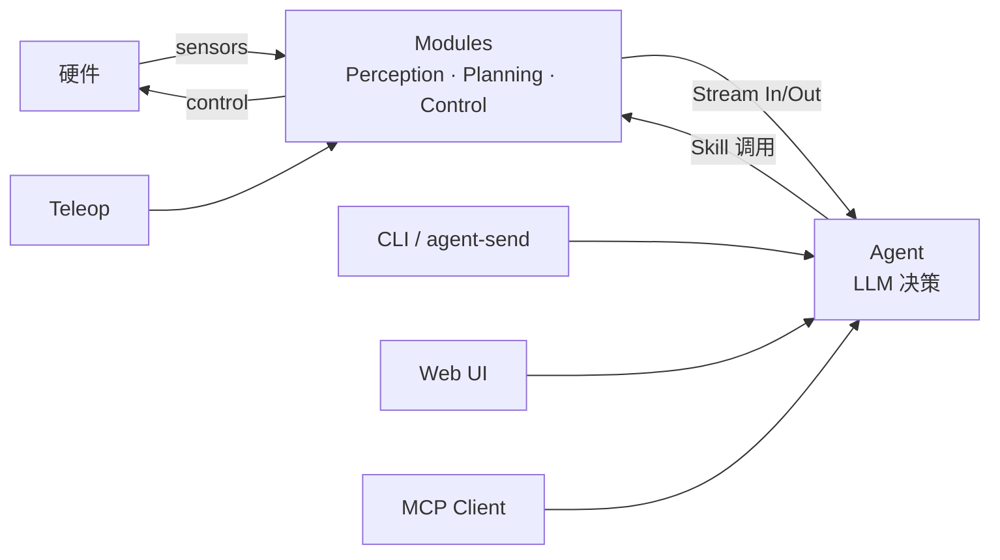
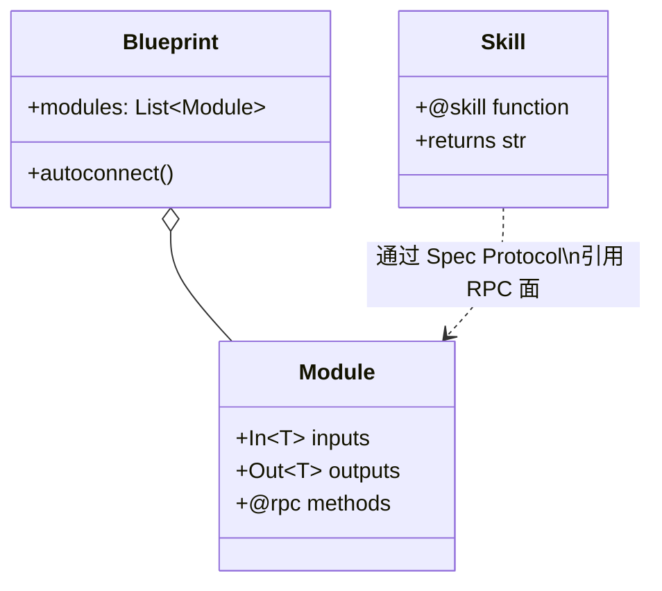
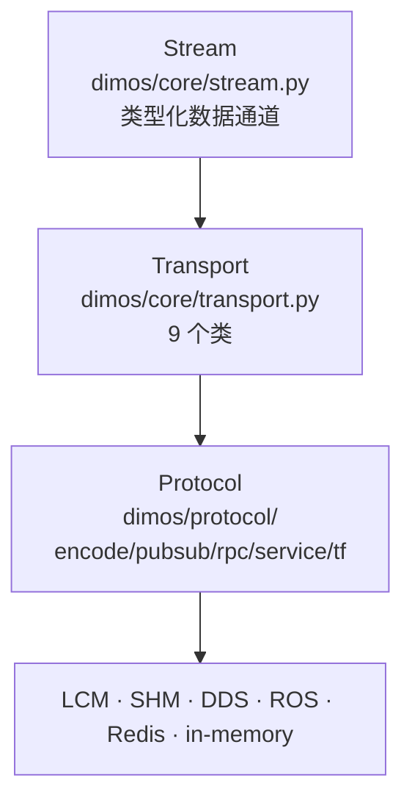
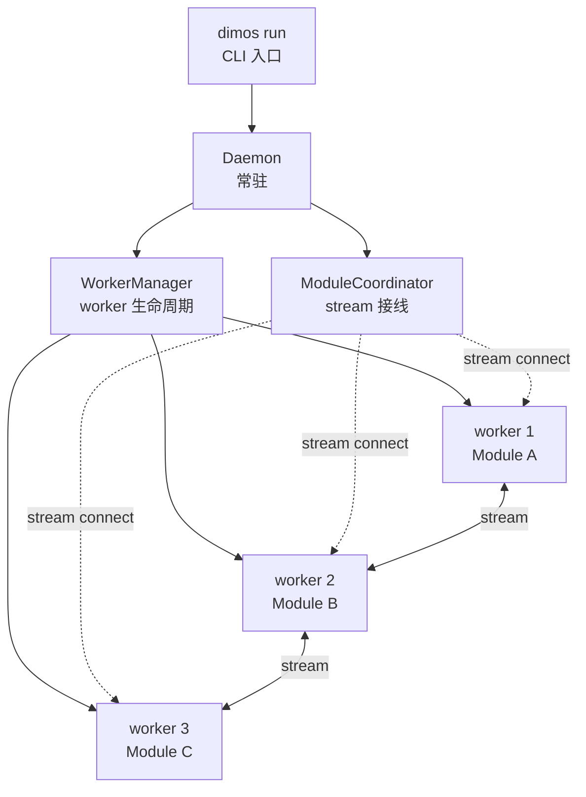
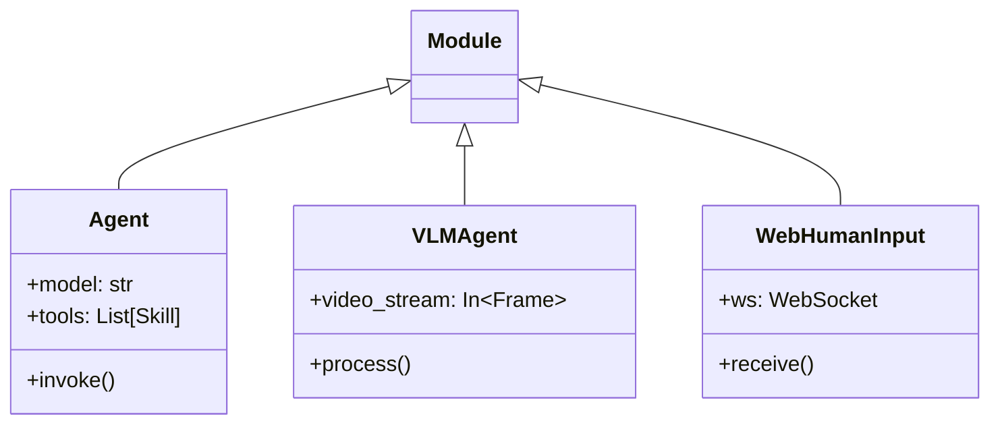
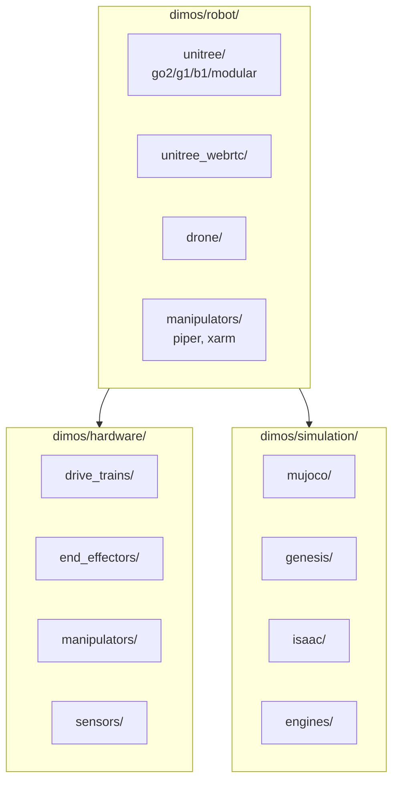
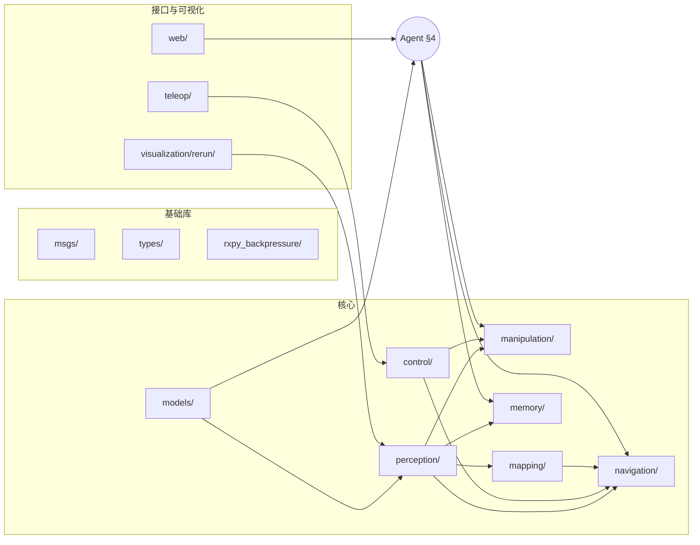
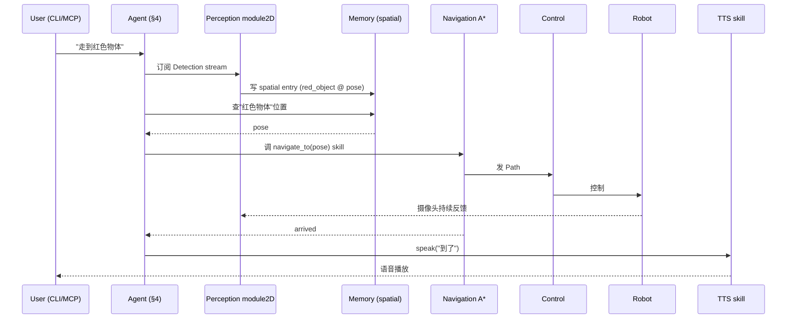
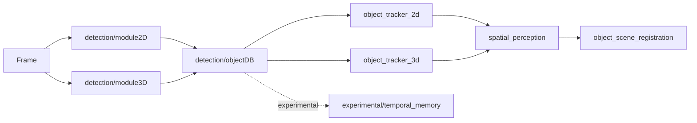

# DimOS 系统架构文档 — 实施计划

> **For agentic workers:** REQUIRED SUB-SKILL: Use superpowers:subagent-driven-development (recommended) or superpowers:executing-plans to implement this plan task-by-task. Steps use checkbox (`- [ ]`) syntax for tracking.

**Goal:** 在 `docs/architecture/` 下落地一份自包含、新人 1.5 小时即可建立完整心智模型的 DimOS 架构文档（主 README + 5 份专题）。

**Architecture:** 单一信息源 README（10000-14000 字，覆盖 §0-§8 全章节），辅以 5 份深入专题文档（runtime-model / agent-stack / robot-platforms / subsystems / data-flow）。所有事实从 spec `2026-05-06-dimos-architecture-design.md` 与代码核实而来；不重复 `AGENTS.md` 与 `docs/usage/` 已有内容。

**Tech Stack:** Markdown + Mermaid（全景/类图/时序/进程关系）+ ASCII（段落内小图）。中文。

**Spec 引用：** `docs/superpowers/specs/2026-05-06-dimos-architecture-design.md`（必读，是事实来源）。

---

## 文件结构

```
docs/architecture/
├── README.md            # 主文档：10000-14000 字
├── runtime-model.md     # 专题：进程/Stream/Transport/Protocol/Config/日志（≥2000 字）
├── agent-stack.md       # 专题：Agent/Skill/MCP/Spec/系统提示词（≥2000 字）
├── robot-platforms.md   # 专题：robot/ + hardware/ + simulation/（≥2000 字）
├── subsystems.md        # 专题：13 个子系统内部架构 + 依赖 + 扩展点（≥5200 字）
└── data-flow.md         # 专题：端到端数据流 trace（≥2000 字）
```

`docs/architecture/README.md` 是核心；专题文档是它的纵向延伸，不是入门必读。

## 通用约定

- **分支**：`docs/architecture`（从 `main` 起分；最终 PR 目标 `dev`，依据 `CLAUDE.md`）
- **commit 节奏**：每完成一个 task 提交一次；不批量延后；不 push 直至全部完成（CI 一次约 1 小时）
- **commit message 格式**：`docs(architecture): <chapter or scope>`（追随仓库 `docs:` 前缀惯例）
- **路径引用**：相对路径从 `docs/architecture/` 出发，例如 `../../dimos/core/module.py`、`../usage/blueprints.md`
- **Mermaid 围栏**：````mermaid` ... ````，中文标签直接写
- **不**写"详见 X"作为占位（违反 spec § 8 反向条目）；任一章必须实质性介绍内容

## 中文字数测量命令

中文 wc 不能用 `wc -w`。统一用以下命令测 CJK 字符数（不计英文/标点/代码）：

```bash
# 单文件 CJK 字符数
grep -oP '[\x{4e00}-\x{9fff}]' <file> | wc -l

# 限定章节字数（例：§ 0 到 § 0.5 之间）
awk '/^### § 0\./,/^### § 0\.5\./' docs/architecture/README.md | grep -oP '[\x{4e00}-\x{9fff}]' | wc -l
```

字数为目标量，spec § 3 注明允许 ±20% 浮动。

---

## Task 1: 分支 + 文件夹脚手架

**Files:**
- Create branch: `docs/architecture`（基于 `main`）
- Create dir: `docs/architecture/`
- Create: `docs/architecture/README.md`（仅章节骨架）
- Create: `docs/architecture/runtime-model.md`（仅章节骨架）
- Create: `docs/architecture/agent-stack.md`（仅章节骨架）
- Create: `docs/architecture/robot-platforms.md`（仅章节骨架）
- Create: `docs/architecture/subsystems.md`（仅章节骨架）
- Create: `docs/architecture/data-flow.md`（仅章节骨架）
- Stage: `docs/superpowers/specs/2026-05-06-dimos-architecture-design.md`、`docs/superpowers/plans/2026-05-06-dimos-architecture-docs.md`

- [ ] **Step 1: 切到 docs/architecture 分支**

```bash
git checkout -b docs/architecture
git status
```

预期：分支切换成功；`docs/superpowers/` 仍 untracked。

- [ ] **Step 2: 建目录与 README 骨架**

写入 `docs/architecture/README.md`：

```markdown
# DimOS 系统架构（System Architecture）

> 给新工程师的全景文档：通读后无需跳转即可建立完整心智模型（约 1.5 小时）。
> 想深入某个细节再翻同目录 5 份专题：[runtime-model](/docs/architecture/runtime-model.md) /
> [agent-stack](/docs/architecture/agent-stack.md) / [robot-platforms](/docs/architecture/robot-platforms.md) /
> [subsystems](/docs/architecture/subsystems.md) / [data-flow](/docs/architecture/data-flow.md)。

## 目录

- [§ 0. DimOS 是什么](#-0-dimos-是什么)
- [§ 0.5. 仓库布局总览](#-05-仓库布局总览)
- [§ 1. 三个核心抽象](#-1-三个核心抽象)
- [§ 2. 通信骨架](#-2-通信骨架)
- [§ 3. 运行时模型](#-3-运行时模型)
- [§ 4. Agent 系统](#-4-agent-系统)
- [§ 5. 机器人平台层](#-5-机器人平台层)
- [§ 6. 能力子系统全景](#-6-能力子系统全景)
- [§ 7. 端到端数据流](#-7-端到端数据流)
- [§ 8. 怎么继续读 + 常见踩坑](#-8-怎么继续读--常见踩坑)

---

### § 0. DimOS 是什么

<!-- TODO: Task 2 -->

### § 0.5. 仓库布局总览

<!-- TODO: Task 2 -->

### § 1. 三个核心抽象

<!-- TODO: Task 3 -->

### § 2. 通信骨架

<!-- TODO: Task 4 -->

### § 3. 运行时模型

<!-- TODO: Task 5 -->

### § 4. Agent 系统

<!-- TODO: Task 6 -->

### § 5. 机器人平台层

<!-- TODO: Task 7 -->

### § 6. 能力子系统全景

<!-- TODO: Tasks 8-10 -->

### § 7. 端到端数据流

<!-- TODO: Task 11 -->

### § 8. 怎么继续读 + 常见踩坑

<!-- TODO: Task 11 -->

---

## 扩展阅读

- 仓库速查与必踩坑：[`AGENTS.md`](/AGENTS.md)
- 使用教程：[`docs/usage/`](../usage/)
- 能力深度文档：[`docs/capabilities/`](../capabilities/)
- 平台配置：[`docs/platforms/`](../platforms/)
- 安装：[`docs/installation/`](../installation/)
- 开发与测试：[`docs/development/`](../development/)
```

写入 5 份专题骨架（每份起首相同结构）：

`docs/architecture/runtime-model.md`：
```markdown
# 专题：运行时模型（Runtime Model）

> 与 [README § 3](README.md#-3-运行时模型) 配套深入：进程/Stream/Transport/Protocol/Config/日志的实现层细节。

## 目录

- [1. 进程模型](#1-进程模型)
- [2. Stream 内部](#2-stream-内部)
- [3. 9 个 Transport 详细对比](#3-9-个-transport-详细对比)
- [4. Protocol 分层](#4-protocol-分层)
- [5. GlobalConfig cascade](#5-globalconfig-cascade)
- [6. Daemon 与 RunRegistry](#6-daemon-与-runregistry)
- [7. 日志结构](#7-日志结构)

<!-- TODO: Task 13 -->

---

## 扩展阅读

- 总览：[README](README.md)
- CLI：[`docs/usage/cli.md`](/docs/usage/cli.md)
- 配置：[`docs/usage/configuration.md`](/docs/usage/configuration.md)
```

类似为 `agent-stack.md` / `robot-platforms.md` / `subsystems.md` / `data-flow.md` 写入"标题 + 目录占位 + 扩展阅读"骨架。每份目录条目：

- `agent-stack.md`：1. Agent 内部循环 / 2. @skill schema 生成 / 3. 双 skills 对比与决策树 / 4. Spec Protocol 与 RPC / 5. MCP 三件套 / 6. Agent 变种清单
- `robot-platforms.md`：1. unitree / 2. unitree_webrtc / 3. drone / 4. manipulators / 5. hardware/ / 6. simulation/ / 7. 蓝图示例 / 8. 添加新平台
- `subsystems.md`：13 个子系统逐一编号
- `data-flow.md`：1. 完整 perception 路径 trace / 2. manipulation 路径 trace / 3. --replay 模式差异

- [ ] **Step 3: 验证骨架建立**

```bash
ls -la docs/architecture/
wc -l docs/architecture/*.md
```

预期：6 个 .md 文件；每个 30-80 行（标题+目录+占位+扩展阅读）。

- [ ] **Step 4: Commit**

```bash
git add docs/architecture/ docs/superpowers/specs/ docs/superpowers/plans/
git commit -m "$(cat <<'EOF'
docs(architecture): scaffold architecture docs folder

Create skeleton for README + 5 specialty docs (runtime-model,
agent-stack, robot-platforms, subsystems, data-flow). Also stage
brainstorming spec and plan into superpowers tracking dirs.

Subsequent commits fill in chapters per implementation plan.
EOF
)"
git log --oneline -1
```

---

## Task 2: README § 0（DimOS 是什么）+ § 0.5（仓库布局总览）

**Files:**
- Modify: `docs/architecture/README.md`（替换 § 0 与 § 0.5 占位）

**Background reading（写之前先 skim）:**
- `README.md`（仓库根）：项目定位措辞
- `AGENTS.md`：第 1-50 行，对照"分工小框"避免重复
- `dimos/__init__.py`、`dimos/cli/__init__.py`：包入口
- `ls /Users/perry/workspace/dimos/`：顶层目录与文件清单

- [ ] **Step 1: 列 § 0 必含事实**

§ 0 必含：
1. 一句话定位："面向通用机器人的智能体操作系统"（与 README 根仓库措辞一致）
2. 解决问题陈述：机器人系统耦合（感知/规划/控制/IO 紧耦合）→ DimOS 用模块化（Module）+ 智能体（Agent）拆分；自然语言驱动行为
3. 顶层 Mermaid 全景图（必须）：硬件 ↔ Modules（Perception/Planning/Control 流水线） ↔ Stream（数据通道） ↔ Agent（决策） ↔ User 入口（自然语言/MCP/Web/Teleop）
4. **本文档与 AGENTS.md / CLAUDE.md 分工**小框（高亮 box）：
   - `AGENTS.md` = quick-start cheat-sheet 与必踩坑清单（命令速查、blueprint 表）
   - `CLAUDE.md` = AI 代理工作护栏（指向 `AGENTS.md`，加少量 Claude 专用规则）
   - 本架构文档 = 系统全景与设计取舍
   - 三者交叉引用，不重复

- [ ] **Step 2: 列 § 0.5 必含事实**

§ 0.5 必含：
1. ASCII 目录树：仓库根一级目录
2. 顶级目录速查表（**完整**，不漏一项）：`dimos/`（主包） / `bin/` / `scripts/` / `data/` / `docker/` / `examples/` / `assets/` / `docs/`
3. 顶级文件速查表（**完整**）：`pyproject.toml` / `setup.py` / `uv.lock` / `flake.nix` / `flake.lock` / `default.env` / `MANIFEST.in` / `LICENSE` / `CLA.md` / `README.md` / `CLAUDE.md` / `AGENTS.md`
4. 一句话提示：`dimos/utils/` 是 30+ 个横切工具（logging_config / llm_utils / transform_utils / gpu_utils / threadpool / urdf 等），被几乎所有子系统依赖；本文档不展开

- [ ] **Step 3: 用 Edit 替换 § 0 占位**

参考结构：

```markdown
### § 0. DimOS 是什么

DimOS 是<一句话定位>。

<段落 1：解决什么问题>

<段落 2：核心思路 — Module + Agent 拆分>



> **本文档与 AGENTS.md / CLAUDE.md 的分工**
>
> - `AGENTS.md` = quick-start cheat-sheet 与必踩坑清单
> - `CLAUDE.md` = AI 代理工作护栏
> - 本架构文档 = 系统全景与设计取舍
>
> 三者交叉引用，不重复。
```

字数目标：400-600 字（不含 Mermaid 与表格）。

- [ ] **Step 4: 用 Edit 替换 § 0.5 占位**

参考结构：

```markdown
### § 0.5. 仓库布局总览

```text
dimos/                    # 仓库根
├── dimos/                # 主 Python 包
├── bin/                  # 安装/启动脚本
├── scripts/              # 仓库级运维脚本
├── data/                 # 示例 / replay 数据集
├── docker/               # 容器构建上下文
├── examples/             # 示例代码
├── assets/               # 静态资源
├── docs/                 # 文档
├── pyproject.toml        # 项目元数据 + 依赖
├── setup.py              # 兼容 setuptools 入口
├── uv.lock               # uv 锁定文件
├── flake.nix / flake.lock # Nix 构建定义
├── default.env           # 默认环境变量
├── MANIFEST.in           # 打包清单
├── LICENSE / CLA.md      # 许可与贡献协议
├── README.md             # 仓库主 README
├── CLAUDE.md             # Claude Code 工作护栏
└── AGENTS.md             # AI agent onboarding（事实之源）
```

| 顶级目录/文件 | 用途 |
|---|---|
| `dimos/` | 主 Python 包：所有运行时代码 |
| `bin/` | shell 包装（如 `bin/pytest-slow` 跑全套测试） |
| `scripts/` | 运维脚本：发布、CI 辅助等 |
| `data/` | 示例数据、replay 数据集 |
| `docker/` | Docker 构建文件 |
| `examples/` | 跑得起来的示例 |
| `assets/` | 图标、静态资源 |
| `docs/` | 文档：本文件所在 |
| `pyproject.toml` | uv/Poetry 元数据 + 依赖声明 |
| `setup.py` | 旧式 setuptools 入口（保留兼容） |
| `uv.lock` | uv 锁定 |
| `flake.nix` / `flake.lock` | Nix 复现构建 |
| `default.env` | 默认环境变量 |
| `MANIFEST.in` | 打包清单 |
| `LICENSE` | 许可证 |
| `CLA.md` | 贡献者许可协议 |
| `README.md` | 仓库主 README |
| `CLAUDE.md` | Claude Code 工作护栏 |
| `AGENTS.md` | AI agent onboarding |

> `dimos/utils/` 是 30+ 个横切工具（`logging_config` / `llm_utils` /
> `transform_utils` / `gpu_utils` / `threadpool` / `urdf` 等），被几乎所有
> 子系统依赖。本文档不展开；需要时直接读源码。
```

字数目标：250-350 字（不含表格）。

- [ ] **Step 5: 验证**

```bash
# § 0 字数（CJK 字符）
awk '/^### § 0\. /,/^### § 0\.5/' docs/architecture/README.md | grep -oP '[\x{4e00}-\x{9fff}]' | wc -l
# 预期：≥400

# § 0.5 字数
awk '/^### § 0\.5/,/^### § 1/' docs/architecture/README.md | grep -oP '[\x{4e00}-\x{9fff}]' | wc -l
# 预期：≥250

# Mermaid 图存在
grep -c '^```mermaid' docs/architecture/README.md
# 预期：≥1（§ 0 全景图）

# AGENTS.md/CLAUDE.md 分工框存在
grep -c 'AGENTS.md.*CLAUDE.md\|本文档与 \`AGENTS\|分工' docs/architecture/README.md
# 预期：≥1
```

- [ ] **Step 6: Commit**

```bash
git add docs/architecture/README.md
git commit -m "docs(architecture): README §0 §0.5 — DimOS 定位 + 仓库布局"
```

---

## Task 3: README § 1（三个核心抽象）

**Files:**
- Modify: `docs/architecture/README.md`（替换 § 1 占位）

**Background reading:**
- `dimos/core/module.py`（Module 基类）
- `dimos/core/blueprints.py`（Blueprint + autoconnect）
- `dimos/core/skill_decorator.py` 或 `dimos/skills/__init__.py`（@skill 装饰器位置）— grep `def skill\(` 定位
- `dimos/core/stream.py`（In/Out 类型）
- `AGENTS.md`：Module / Blueprint / Skill 章节（对照不重复）

- [ ] **Step 1: 列 § 1 必含事实**

1. **Module 定义**：自治子系统；运行在独立 forkserver worker 进程；声明 `In[T]` / `Out[T]` 类型化流；`@rpc` 暴露调用面
2. **Blueprint 定义**：`autoconnect()` 把 Module 拼成可运行栈；流按 `(name, type)` 自动连接；`remappings` 解决冲突
3. **Skill 定义**：智能体可调用的物理动作；`@skill` 装饰器自动生成 LLM tool schema
4. Mermaid 类图：三者关系（Blueprint 包含多个 Module；Module 暴露 @rpc；Agent 调用 Skill；Skill 通过 Spec Protocol 引用 Module 的 RPC 面）
5. 最小可运行 Blueprint 片段（≤15 行代码）
6. 设计取舍解释：
   - 为什么类型化 stream（编译期错误、避免运行时 schema 漂移）
   - 为什么 forkserver（fork 的 GIL/CUDA/资源继承问题）
   - 为什么 @skill 与 @rpc 分层（一个是 LLM 面，一个是 Module 面；前者必须返回 str 给 LLM 读，后者保留原类型）

- [ ] **Step 2: 撰写章节，参考结构**

```markdown
### § 1. 三个核心抽象

DimOS 的所有运行代码都围绕三个抽象组装：**Module / Blueprint / Skill**。
读懂这三者，整个仓库的 80% 代码读起来就有定位感。

#### Module —— 自治子系统

<段落：Module 是什么 + 运行进程模型 + 类型化流声明>

#### Blueprint —— 用 autoconnect 拼装

<段落：Blueprint 与 autoconnect + (name, type) 匹配规则 + remappings>

#### Skill —— 智能体可调用的动作

<段落：@skill 与 @rpc 关系 + 4 条硬规则一句话归纳，详细规则留给 § 4>

#### 三者关系（类图）



#### 最小可运行 Blueprint 片段

<≤15 行代码，展示 Module class + Blueprint 组合 + 一个 @skill>

#### 为什么这样分层

<段落：3 条设计取舍说明>
```

字数目标：1000-1200 字（不含代码与图）。

- [ ] **Step 3: 验证**

```bash
awk '/^### § 1\./,/^### § 2/' docs/architecture/README.md | grep -oP '[\x{4e00}-\x{9fff}]' | wc -l
# 预期：≥1000

# 类图存在
awk '/^### § 1\./,/^### § 2/' docs/architecture/README.md | grep -c 'classDiagram'
# 预期：1

# 设计取舍三条都涉及
awk '/^### § 1\./,/^### § 2/' docs/architecture/README.md | grep -c 'forkserver\|类型化\|@skill.*@rpc\|@rpc.*@skill'
# 预期：≥3 行命中（forkserver + 类型化 stream + skill/rpc 分层）
```

- [ ] **Step 4: Commit**

```bash
git add docs/architecture/README.md
git commit -m "docs(architecture): README §1 — Module/Blueprint/Skill 三大抽象"
```

---

## Task 4: README § 2（通信骨架）

**Files:**
- Modify: `docs/architecture/README.md`（替换 § 2 占位）

**Background reading:**
- `dimos/core/stream.py`（架构骨架的 Stream）
- `dimos/core/transport.py`（数 Transport 类，确认 9 个）
- `dimos/protocol/encode/`、`pubsub/`、`rpc/`、`service/`、`tf/`：列子目录
- `dimos/protocol/pubsub/impl/`（确认 lcmpubsub / shmpubsub / jpeg_shm / ddspubsub / rospubsub / redispubsub / memory）
- `dimos/stream/`（视频/音频，与 core/stream 同名不同概念）

```bash
# 数 Transport 类
grep -c '^class.*Transport' /Users/perry/workspace/dimos/dimos/core/transport.py
```

- [ ] **Step 1: 列 § 2 必含事实**

1. **Stream**（`dimos/core/stream.py`）：`In[T]/Out[T]` 类型化数据通道——架构骨架
2. **Transport**（`dimos/core/transport.py`）：**实际有 9 个类**
   - 主用 6 个：`LCMTransport` / `pLCMTransport` / `SHMTransport` / `pSHMTransport` / `ROSTransport` / `DDSTransport`
   - JPEG 编码视频专用 2 个：`JpegLcmTransport` / `JpegShmTransport`（专为视频流降低 CPU 拷贝代价）
   - 占位 1 个：`ZenohTransport`（尚未投入使用）
3. **Transport 选型对比表**（必须包含列）：
   - 名称 / 跨语言（C++/Python 互通） / 跨主机 / 零拷贝 / 适用场景 / 备注
   - 主用 6 个详写一行；JPEG 变体合并一行说明；Zenoh 一行标"占位"
4. **Protocol**（`dimos/protocol/`）：比 transport 更底层的封装层
   - 子模块：`encode/` / `pubsub/`（含 `impl/{lcmpubsub,shmpubsub,jpeg_shm,ddspubsub,rospubsub,redispubsub,memory}.py`）/ `rpc/`（含 `pubsubrpc.py`、`redisrpc.py`、`spec.py`、`rpc_utils.py`）/ `service/` / `tf/`
   - 解释：`core/transport.py` 是 stream-facing 抽象；`protocol/pubsub/impl/*` 是真正的 pub/sub 实现层
5. **三层 Mermaid 分层图**：上层 Stream → 中层 Transport → 底层 Protocol/IPC（LCM/SHM/DDS/ROS/Redis）
6. **关键避坑（命名重叠 1）**：明确两种 Stream
   - `dimos/core/stream.py`：模块间数据通道（架构骨架）
   - `dimos/stream/`：视频/音频 data provider（RTSP、ROS video、frame_processor、video_operators、audio）
   - **只是名字相同，不是同一概念**

- [ ] **Step 2: 撰写章节**

参考结构：

```markdown
### § 2. 通信骨架

DimOS 模块间通信用三层栈：上层 **Stream**（架构语义） → 中层 **Transport**
（IPC 选型） → 底层 **Protocol**（编码与 pub/sub 实现）。三者解耦让同一个
Module 不改代码就能切换 LCM、共享内存、ROS、DDS 等多种后端。

#### Stream — 类型化的数据通道

<段落：In[T]/Out[T] 是什么、(name, type) 自动连接、autoconnect 的角色>

#### Transport — 9 个类，主用 6 个

<段落：transport.py 实际有 9 个类，本节先详写主用 6，JPEG 变体一段，Zenoh
一句>

| Transport | 跨语言 | 跨主机 | 零拷贝 | 典型用途 |
|---|---|---|---|---|
| `LCMTransport` | ✓ | ✓（UDP 多播） | ✗ | 通用消息总线 |
| `pLCMTransport` | ✓ | ✓ | ✗ | LCM + 持久订阅 |
| `SHMTransport` | ✗（同机） | ✗ | ✓ | 同机大对象 |
| `pSHMTransport` | ✗ | ✗ | ✓ | SHM + 持久订阅 |
| `ROSTransport` | ✓ | ✓ | ✗ | 与 ROS 生态互通 |
| `DDSTransport` | ✓ | ✓ | ✗（QoS 可控） | 真机产线（Unitree） |

视频专用变体：`JpegLcmTransport` / `JpegShmTransport`（对视频帧做 JPEG 编码，
降低跨进程/网络拷贝代价）。占位：`ZenohTransport`（尚未投入使用）。

#### Protocol — 比 Transport 更底层的封装层

<段落：dimos/protocol/{encode,pubsub,rpc,service,tf} 角色与文件清单>

#### 三层关系图



#### 关键避坑（命名重叠 1）：两种 Stream

DimOS 里有**两个** "stream" 命名空间，**名字一样、用途完全不同**：

| 路径 | 用途 |
|---|---|
| `dimos/core/stream.py` | 模块间数据通道（架构骨架） |
| `dimos/stream/` | 视频/音频 data provider（RTSP、ROS video、frame_processor、video_operators、audio） |

读代码时按 import 路径区分。
```

字数目标：1000-1200 字（不含表格与图）。

- [ ] **Step 3: 验证**

```bash
# § 2 字数
awk '/^### § 2\./,/^### § 3/' docs/architecture/README.md | grep -oP '[\x{4e00}-\x{9fff}]' | wc -l
# 预期：≥1000

# 数到 9 个 Transport
awk '/^### § 2\./,/^### § 3/' docs/architecture/README.md | grep -c '9 个\|九个'
# 预期：≥1（明确陈述 9）

# 三层图存在
awk '/^### § 2\./,/^### § 3/' docs/architecture/README.md | grep -c 'flowchart'
# 预期：≥1

# 命名重叠 1 包含
awk '/^### § 2\./,/^### § 3/' docs/architecture/README.md | grep -c '命名重叠 1\|命名重叠1\|两种 Stream\|dimos/core/stream\.py.*dimos/stream/'
# 预期：≥1
```

- [ ] **Step 4: Commit**

```bash
git add docs/architecture/README.md
git commit -m "docs(architecture): README §2 — Stream/Transport/Protocol 通信三层"
```

---

## Task 5: README § 3（运行时模型）

**Files:**
- Modify: `docs/architecture/README.md`（替换 § 3 占位）

**Background reading:**
- `dimos/core/module_coordinator.py`、`worker_manager.py`、`worker.py`、`daemon.py`、`run_registry.py`、`log_viewer.py`、`global_config.py`
- `AGENTS.md`：CLI、配置、日志相关章节（对照不重复）
- `dimos/cli/` 目录：列出所有 CLI 子命令

```bash
ls /Users/perry/workspace/dimos/dimos/cli/
```

- [ ] **Step 1: 列 § 3 必含事实**

1. **forkserver 模型**：为什么不用 fork（CUDA/GIL/socket 继承的坑）；worker 隔离的实际效果
2. **WorkerManager / ModuleCoordinator**：谁负责什么 — WorkerManager 管 worker 进程生命周期，ModuleCoordinator 管 stream 接线
3. **GlobalConfig cascade**：默认 → `.env` → 环境变量（`DIMOS_*`） → Blueprint 覆写 → CLI 标志（5 层从下到上）
4. **Daemon / RunRegistry**：
   - `~/.local/state/dimos/runs/<run-id>.json`
   - 日志路径 `~/.local/state/dimos/logs/<run-id>/main.jsonl`
5. **CLI 命令族总览**（一段简介 + 表格）：run / status / log / stop / restart / list / show-config / mcp / agent-send / topic echo / topic send / lcmspy / agentspy / humancli / top / rerun-bridge
6. **进程关系 Mermaid 图**：dimos run（用户 CLI） → daemon → WorkerManager → N 个 worker（每个跑一个 Module） → 通过 ModuleCoordinator 接线 stream
7. **关键避坑（命名重叠 2）**：`agent-send`（CLI 命令名，连字符）与 `agent_send`（底层 MCP 工具名，下划线）是同一动作的两层入口

- [ ] **Step 2: 撰写章节**

参考结构：

```markdown
### § 3. 运行时模型

#### forkserver 进程模型

<段落：forkserver vs fork 的取舍；为什么 DimOS 选 forkserver>

#### WorkerManager 与 ModuleCoordinator 的分工

<段落：两个 coordinator 各司其职>

#### 进程关系图



#### GlobalConfig 配置级联

<段落：5 层覆盖顺序与每层例子>

```text
默认值 (代码内 dataclass)
  ↓ 被覆盖
.env 文件
  ↓ 被覆盖
环境变量 DIMOS_*
  ↓ 被覆盖
Blueprint 显式覆写
  ↓ 被覆盖
CLI --foo bar 标志（最高优先级）
```

#### Daemon 与 RunRegistry

<段落：RunRegistry 的作用、run-id、状态文件路径、日志路径>

```text
~/.local/state/dimos/
├── runs/<run-id>.json        # 运行注册表条目
└── logs/<run-id>/main.jsonl  # 单次运行的结构化日志
```

#### CLI 命令族

| 命令 | 作用 |
|---|---|
| `dimos run <blueprint>` | 启动一次蓝图运行（前台或 `--daemon`） |
| `dimos status` | 列当前活动 run |
| `dimos log [-f]` | 看日志（可 follow） |
| `dimos stop` / `restart` | 停 / 重启 |
| `dimos list` | 列出可运行 blueprint |
| `dimos show-config` | 输出生效配置 |
| `dimos mcp` | MCP server / client |
| `dimos agent-send` | 给 agent 发消息（CLI 入口） |
| `dimos topic echo` / `topic send` | 调试 stream |
| `dimos lcmspy` / `agentspy` | LCM/Agent 调试嗅探 |
| `dimos humancli` | 人工介入 CLI |
| `dimos top` | 类 top 监控 |
| `dimos rerun-bridge` | Rerun 可视化桥 |

详细参考：[`AGENTS.md`](/AGENTS.md) 的 CLI Reference 段。

#### 关键避坑（命名重叠 2）：agent-send vs agent_send

`agent-send`（连字符）是 CLI 命令名；`agent_send`（下划线）是底层 MCP 工具
名。**同一个动作的两层入口**：CLI 在 shell 用，MCP 在 LLM tool 调用图里用。
写文档/代码时按上下文区分。
```

字数目标：800-1000 字（不含表格、代码块、图）。

- [ ] **Step 3: 验证**

```bash
awk '/^### § 3\./,/^### § 4/' docs/architecture/README.md | grep -oP '[\x{4e00}-\x{9fff}]' | wc -l
# 预期：≥800

# 进程图
awk '/^### § 3\./,/^### § 4/' docs/architecture/README.md | grep -c 'flowchart\|graph TB\|graph LR'
# 预期：≥1

# 命名重叠 2
awk '/^### § 3\./,/^### § 4/' docs/architecture/README.md | grep -c '命名重叠 2\|命名重叠2\|agent-send.*agent_send\|agent_send.*agent-send'
# 预期：≥1
```

- [ ] **Step 4: Commit**

```bash
git add docs/architecture/README.md
git commit -m "docs(architecture): README §3 — 运行时模型 + CLI 命令族"
```

---

## Task 6: README § 4（Agent 系统）

**Files:**
- Modify: `docs/architecture/README.md`（替换 § 4 占位）

**Background reading:**
- `dimos/agents/agent.py`（核心 Agent 类，确认 `model="gpt-4o"` 默认与 `ollama:` 路由）
- `dimos/agents/vlm_agent.py`（VLMAgent 是独立 Module）
- `dimos/agents/web_human_input.py`（WebHumanInput）
- `dimos/agents/ollama_agent.py`（仅工具函数，不是 Agent 类）
- `dimos/agents_deprecated/`（legacy 包）
- `dimos/skills/`（kill_skill / speak / visual_navigation_skills / manipulation/ / rest/ / unitree/）
- `dimos/agents/skills/`（person_follow / gps_nav_skill / navigation / speak_skill / google_maps_skill_container / osm）
- `dimos/spec/`（control / mapping / nav / perception / utils）
- `dimos/protocol/rpc/spec.py`（同名但作用不同）
- `AGENTS.md`：@skill 4 条硬规则、Spec/RPC、MCP、系统提示词章节（对照不重复）

```bash
# 确认 ollama 路由
grep -n 'ollama:' /Users/perry/workspace/dimos/dimos/agents/agent.py
# 确认 default model
grep -n 'model.*=.*"gpt-4o\|model: str = ' /Users/perry/workspace/dimos/dimos/agents/agent.py
# 确认 deprecated 包内容
ls /Users/perry/workspace/dimos/dimos/agents_deprecated/
# 列 agents/skills/
ls /Users/perry/workspace/dimos/dimos/agents/skills/
# 列 skills/
ls /Users/perry/workspace/dimos/dimos/skills/
```

- [ ] **Step 1: 列 § 4 必含事实**

1. **Agent 体系实际形态**（按代码核实）：
   - `Agent`（`dimos/agents/agent.py`）：LangGraph + LangChain `create_agent`；默认 `model="gpt-4o"`；通过 `model.startswith("ollama:")` 路由到本地 Ollama，**Ollama 不是独立子类，是模型选择**
   - `VLMAgent`（`dimos/agents/vlm_agent.py`）：独立 Module 类，专为视频流推理；与 Agent 平级
   - `WebHumanInput`（`dimos/agents/web_human_input.py`）：人类介入输入面，独立 Module
   - `dimos/agents/ollama_agent.py`：仅暴露 `ensure_ollama_model` / `ollama_installed` 工具函数，不是 Agent 类
2. **Mermaid 类图**：Agent / VLMAgent / WebHumanInput / Module（基类）的关系
3. **关键避坑（命名重叠 3）**：legacy 包 `dimos/agents_deprecated/`
   - 是上一代 OpenAI/Claude agent 实现（`agent.py`、`claude_agent.py`、`memory/`、`modules/`、`prompt_builder/`、`tokenizer/`）
   - 当前 `dimos/web/dimos_interface/api/README.md` 仍有 `from dimos.agents_deprecated.agent import OpenAIAgent` 过渡引用
   - **不要在新代码引用**；新人 grep `class Agent` 会撞两个包，要分清
4. **关键避坑（命名重叠 4）**：两套 Skills 体系（必须有对比表 + "诚实结论"）
   - `dimos/skills/`：kill_skill、speak、visual_navigation_skills、manipulation/、rest/、unitree/（含 unitree_speak.py）
   - `dimos/agents/skills/`：person_follow、gps_nav_skill、navigation、speak_skill、google_maps_skill_container、osm
   - 诚实结论：两处分布是历史演进结果，不存在干净的"通用 vs 特化"对仗。加新 skill 时贴近其依赖位置即可；详细判断决策树留给 `agent-stack.md`
5. **关键避坑（命名重叠 5）**：`dimos/skills/manipulation/` ≠ `dimos/manipulation/`
   - 前者是 LLM 调用面（`@skill` 装饰过的 6 个 `*_skill.py`：abstract / force_constraint / manipulate / pick_and_place / rotation_constraint / translation_constraint）
   - 后者是模块/算法层（subsystem）
   - 两者通过 RPC `Spec` 串联
6. **关键避坑（命名重叠 6）**：speak 在 3 个位置出现
   - `dimos/skills/speak.py`、`dimos/skills/unitree/unitree_speak.py`、`dimos/agents/skills/speak_skill.py`
7. **`@skill` 4 条硬规则**：docstring 必填、参数全注解、返回 `str`、不与 `@rpc` 叠加；破坏后的失败模式（启动时 schema 生成失败 / silent skip）
8. **RPC Wiring**：
   - 推荐：`Spec` Protocol 类型注入（`dimos/spec/`：`control.py`、`mapping.py`、`nav.py`、`perception.py`、`utils.py`）
   - Legacy：`rpc_calls: list[str]` + `get_rpc_calls(...)`（运行时静默失败）
9. **关键避坑（命名重叠 7）**：`dimos/spec/` ≠ `dimos/protocol/rpc/spec.py`
10. **MCP 三件套**：`McpServer` + `McpClient` + `McpAdapter`，与 in-process Agent **互斥**；当前唯一 ship 的 MCP-enabled blueprint 是 `unitree-go2-agentic-mcp`
11. **系统提示词**：Go2 默认 vs `G1_SYSTEM_PROMPT`；用错会导致 LLM 幻觉技能

- [ ] **Step 2: 撰写章节**

参考结构：

```markdown
### § 4. Agent 系统

#### Agent 体系实际形态

DimOS 的 agent 不是单一类，而是几个**不同形态**的 Module：

| 类型 | 文件 | 说明 |
|---|---|---|
| `Agent` | `dimos/agents/agent.py` | LangGraph + LangChain `create_agent`；默认 `model="gpt-4o"`；`model.startswith("ollama:")` 路由本地 Ollama |
| `VLMAgent` | `dimos/agents/vlm_agent.py` | 独立 Module，视频流推理 |
| `WebHumanInput` | `dimos/agents/web_human_input.py` | 人工介入输入面 |
| 工具集 | `dimos/agents/ollama_agent.py` | 仅 `ensure_ollama_model` / `ollama_installed` 工具函数，**不是** Agent 类 |

> **Ollama 不是独立子类**：是 `Agent` 接受 `model="ollama:llama3"` 这样的前缀选择本地模型。



#### 关键避坑（命名重叠 3）：legacy 包 dimos/agents_deprecated/

<段落：legacy 包的内容、过渡引用、勿用立场>

#### 关键避坑（命名重叠 4）：两套 Skills 体系

| 路径 | 实际内容 | 结论 |
|---|---|---|
| `dimos/skills/` | kill_skill、speak、visual_navigation_skills、manipulation/、rest/、unitree/（含 unitree_speak.py） | 历史 / 平台无关 / 平台特化都有 |
| `dimos/agents/skills/` | person_follow、gps_nav_skill、navigation、speak_skill、google_maps_skill_container、osm | 历史 / 第三方集成 / 通用都有 |

**诚实结论**：两处分布是历史演进结果，不存在干净的"通用 vs 特化"对仗。
加新 skill 时贴近其依赖位置即可；详细判断决策树留给 [agent-stack.md](/docs/architecture/agent-stack.md)。

#### 关键避坑（命名重叠 5）：dimos/skills/manipulation/ ≠ dimos/manipulation/

<段落：前者是 LLM 调用面，后者是模块层；通过 RPC Spec 串联>

#### 关键避坑（命名重叠 6）：speak 在 3 个位置

<段落：列三个 speak 实现，使用前确认意图>

#### @skill 装饰器 — 4 条硬规则

1. **docstring 必填**：LLM 通过 docstring 理解 skill 用途
2. **参数全注解**：用于自动生成 JSON schema
3. **返回 `str`**：LLM 只能消费字符串
4. **不与 `@rpc` 叠加**：两者目的不同，叠加会导致 schema 二次生成出错

破坏任一规则的失败模式：启动时 schema 生成失败、Module 注册失败、或更隐
蔽地 silent skip。详见 [`AGENTS.md`](/AGENTS.md) "Schema generation
rules"。

#### RPC Wiring：Spec Protocol（推荐）vs rpc_calls list（legacy）

<段落：推荐用 dimos/spec/ 下的 Protocol 类型；legacy 用 rpc_calls list 在运行时静默失败>

#### 关键避坑（命名重叠 7）：dimos/spec/ ≠ dimos/protocol/rpc/spec.py

| 路径 | 用途 |
|---|---|
| `dimos/spec/` | 用户面 Protocol 定义（写新 skill 时声明依赖） |
| `dimos/protocol/rpc/spec.py` | RPC 实现层内部辅助 |

#### MCP 三件套

<段落：McpServer / McpClient / McpAdapter；与 in-process Agent 互斥；唯一 ship 的 unitree-go2-agentic-mcp blueprint>

#### 系统提示词：Go2 vs G1

<段落：用错会幻觉，必须 system_prompt=G1_SYSTEM_PROMPT 处理 G1>
```

字数目标：1500-1800 字（不含表格、代码、图）。

- [ ] **Step 3: 验证**

```bash
awk '/^### § 4\./,/^### § 5/' docs/architecture/README.md | grep -oP '[\x{4e00}-\x{9fff}]' | wc -l
# 预期：≥1500

# 类图
awk '/^### § 4\./,/^### § 5/' docs/architecture/README.md | grep -c 'classDiagram'
# 预期：≥1

# 5 个命名重叠（3、4、5、6、7）
awk '/^### § 4\./,/^### § 5/' docs/architecture/README.md | grep -cE '命名重叠 [3-7]'
# 预期：≥5

# legacy 立场表述
awk '/^### § 4\./,/^### § 5/' docs/architecture/README.md | grep -c 'agents_deprecated\|勿用\|不要在新代码引用\|legacy'
# 预期：≥1

# 4 条硬规则
awk '/^### § 4\./,/^### § 5/' docs/architecture/README.md | grep -cE 'docstring|注解|返回.*str|@rpc'
# 预期：≥4
```

- [ ] **Step 4: Commit**

```bash
git add docs/architecture/README.md
git commit -m "docs(architecture): README §4 — Agent/Skill/MCP/Spec 全景"
```

---

## Task 7: README § 5（机器人平台层）

**Files:**
- Modify: `docs/architecture/README.md`（替换 § 5 占位）

**Background reading:**
- `dimos/robot/`：列出层级
- `dimos/robot/unitree/`、`dimos/robot/unitree_webrtc/`（确认是兄弟目录）
- `dimos/robot/drone/`、`dimos/robot/manipulators/{piper,xarm}/`
- `dimos/robot/cli/`
- `dimos/hardware/`
- `dimos/simulation/`
- 最近 git log 看成熟度：`git log --oneline -20 dimos/robot/drone/` 等

```bash
ls /Users/perry/workspace/dimos/dimos/robot/
ls /Users/perry/workspace/dimos/dimos/robot/unitree/
ls /Users/perry/workspace/dimos/dimos/hardware/
ls /Users/perry/workspace/dimos/dimos/simulation/
git -C /Users/perry/workspace/dimos log --oneline -10 dimos/robot/unitree/modular/
```

- [ ] **Step 1: 列 § 5 必含事实**

1. **`dimos/robot/` 树**（按层级精确写）：
   - `dimos/robot/unitree/{go2,g1,b1,modular}/`、`dimos/robot/unitree/{connection,mujoco_connection,keyboard_teleop,rosnav,demo_error_on_name_conflicts}.py`、`dimos/robot/unitree/{params,modular,testing,type}/`、`dimos/robot/unitree/unitree_skill_container.py`
   - `dimos/robot/unitree_webrtc/`（**注意**：是 `unitree/` 的兄弟目录，不是子目录）
   - `dimos/robot/drone/`：MAVLink + DJI 视频流 + 视觉伺服 + tracking + camera/connection 模块
   - `dimos/robot/manipulators/{piper,xarm}/`
   - `dimos/robot/cli/`：CLI 入口（`dimos.py`）
   - `dimos/robot/{foxglove_bridge,ros_command_queue,position_stream,robot,get_all_blueprints}.py`、`all_blueprints.py`（**自动生成**，不要手改）
2. **`dimos/hardware/`**：`drive_trains/` / `end_effectors/` / `manipulators/` / `sensors/`
3. **`dimos/simulation/`**：`mujoco/` / `genesis/` / `isaac/` / `engines/` / `base/` / `manipulators/` / `utils/` / `sim_blueprints.py`
4. **仿真 vs 真机切换**：`--simulation` / `--replay` / `--robot-ip` 三个标志的语义
5. **添加新平台入口**：robot / 末端执行器 / 传感器分别去哪个目录
6. **平台拓扑 Mermaid 图**
7. **成熟度标注**：
   - 稳定主线：Go2、G1、xArm
   - 活跃演进：drone（PR #1520 重构）
   - 探针级别 / 未投入使用：`dimos/robot/unitree/modular/`（仅 `detect.py`，git log 仅 2 commit，最近 #1365 是 remove dask）
   - 不展开演进路线，避免文档与代码脱节

- [ ] **Step 2: 撰写章节**

参考结构：

```markdown
### § 5. 机器人平台层

DimOS 把"机器人"拆成三层：`dimos/robot/`（具体平台胶水代码）、
`dimos/hardware/`（硬件抽象）、`dimos/simulation/`（仿真后端）。

#### dimos/robot/ — 平台胶水

```text
dimos/robot/
├── unitree/                    # Unitree 主线
│   ├── go2/  g1/  b1/  modular/
│   ├── connection.py  mujoco_connection.py  keyboard_teleop.py  rosnav.py
│   ├── params/  testing/  type/
│   └── unitree_skill_container.py
├── unitree_webrtc/             # ⚠️ unitree 的兄弟目录，不是子目录
├── drone/                      # MAVLink + DJI + 视觉伺服 + tracking
├── manipulators/
│   ├── piper/
│   └── xarm/
├── cli/                        # CLI 入口
├── foxglove_bridge.py
├── ros_command_queue.py
├── position_stream.py
├── robot.py
├── get_all_blueprints.py
└── all_blueprints.py           # ⚠️ 自动生成，勿手改
```

#### 平台拓扑



#### dimos/hardware/ — 硬件抽象

| 子目录 | 内容 |
|---|---|
| `drive_trains/` | 底盘驱动抽象 |
| `end_effectors/` | 末端执行器（夹爪等） |
| `manipulators/` | 机械臂抽象 |
| `sensors/` | 传感器抽象 |

#### dimos/simulation/ — 多引擎仿真

| 子目录 | 内容 |
|---|---|
| `mujoco/` | MuJoCo 后端 |
| `genesis/` | Genesis 后端 |
| `isaac/` | Isaac 后端 |
| `engines/` | 引擎适配层 |
| `base/` | 通用基类 |
| `manipulators/` | 仿真机械臂 |
| `utils/` | 仿真工具（含 `xml_parser.py`） |
| `sim_blueprints.py` | 仿真蓝图集合 |

#### 仿真 vs 真机切换

| 标志 | 语义 |
|---|---|
| `--simulation` | 用仿真后端跑（不连真机） |
| `--replay` | 用 `data/` 下的 replay 数据集跑 |
| `--robot-ip <ip>` | 连指定 IP 的真机 |

#### 添加新平台 / 末端 / 传感器

- 新机器人（如新 humanoid）：`dimos/robot/<vendor>/<model>/` + 注册 blueprint（让 `all_blueprints.py` 重新生成）
- 新末端执行器：`dimos/hardware/end_effectors/`
- 新传感器：`dimos/hardware/sensors/`

#### 成熟度提示

| 平台 | 状态 |
|---|---|
| Go2 / G1 / xArm | 稳定主线 |
| drone | 活跃演进（PR #1520 CLI/Rerun/Replay 重构） |
| `unitree/modular/` | **探针级别**：仅 `detect.py`，未投入使用 |

不展开演进路线，避免文档与代码脱节。
```

字数目标：1000-1200 字（不含表格、代码、图）。

- [ ] **Step 3: 验证**

```bash
awk '/^### § 5\./,/^### § 6/' docs/architecture/README.md | grep -oP '[\x{4e00}-\x{9fff}]' | wc -l
# 预期：≥1000

# 平台拓扑图
awk '/^### § 5\./,/^### § 6/' docs/architecture/README.md | grep -c 'flowchart\|graph TB'
# 预期：≥1

# unitree_webrtc 标注为兄弟
awk '/^### § 5\./,/^### § 6/' docs/architecture/README.md | grep -c '兄弟目录\|unitree_webrtc.*unitree.*兄弟\|不是子目录'
# 预期：≥1

# 成熟度三档
awk '/^### § 5\./,/^### § 6/' docs/architecture/README.md | grep -cE '稳定主线|活跃演进|探针'
# 预期：≥3

# all_blueprints.py 自动生成警告
awk '/^### § 5\./,/^### § 6/' docs/architecture/README.md | grep -c '自动生成\|勿手改'
# 预期：≥1
```

- [ ] **Step 4: Commit**

```bash
git add docs/architecture/README.md
git commit -m "docs(architecture): README §5 — robot/hardware/simulation 平台层"
```

---

## Task 8: README § 6 part A — 子系统拓扑图 + 核心 1-4

**Files:**
- Modify: `docs/architecture/README.md`（替换 § 6 占位的前半部分）

**Background reading:**
- `dimos/control/`：tick_loop / coordinator / components / tasks/ / hardware_interface / blueprints.py
- `dimos/perception/`：detection/、object_tracker_*、spatial_perception、experimental/temporal_memory/
- `dimos/navigation/`：replanning_a_star / frontier_exploration / visual_servoing / bbox_navigation / rosnav / visual
- `dimos/manipulation/`：manipulation_module / pick_and_place_module / grasping/ / planning/ / control/

```bash
ls /Users/perry/workspace/dimos/dimos/control/
ls /Users/perry/workspace/dimos/dimos/perception/
ls /Users/perry/workspace/dimos/dimos/perception/detection/
ls /Users/perry/workspace/dimos/dimos/perception/experimental/
ls /Users/perry/workspace/dimos/dimos/navigation/
ls /Users/perry/workspace/dimos/dimos/manipulation/
```

- [ ] **Step 1: 列 § 6 起首必含事实**

1. § 6 起首 Mermaid 子系统拓扑图：13 个子系统的依赖与数据流向（perception → memory / navigation / manipulation；control 横跨；models 被 perception/agents 共用；web/visualization/teleop 是外向接口；msgs/types/rxpy_backpressure 是基础库）
2. 核心子系统每个 350-500 字结构：**职责一段** + **关键文件路径** + **发布/订阅的主要 stream** + **设计取舍** + **链到现有详细文档**

- [ ] **Step 2: 撰写起首 + 子系统 1-4**

参考结构：

```markdown
### § 6. 能力子系统全景

DimOS 现有 13 个一级子系统。以下按职责拓扑排序，**核心 8 项每项详写**，
**辅助 5 项每项简介**。每项末尾给"链到现有 docs/"，让读者按需深入。



#### 1. control/ — 低层控制循环

**职责**：实现高频控制循环（tick_loop）、组件协调、任务调度的框架。

**关键文件**：

```text
dimos/control/
├── tick_loop.py              # 高频循环
├── coordinator.py            # 组件协调
├── components/               # 控制组件
├── tasks/                    # 任务实现
├── hardware_interface/       # 硬件接入
└── blueprints.py             # 控制相关 blueprint
```

**主要 stream**：消费 `RobotState`、`Command`；发布 `ControlOutput`。

**设计取舍**：与上层 Module 解耦——上层（Module）跑在 forkserver worker，
**control 自己负责实时循环节拍**；上层只通过 stream 投递目标，control 把
目标转成硬件指令。

**详细参考**：[`docs/capabilities/`](../capabilities/)。

#### 2. perception/ — 感知（拆为三层）

**职责**：摄像头帧到检测/跟踪结果的全栈，含实验性 spatio-temporal 记忆。

**关键文件**（按三层组织）：

```text
dimos/perception/
├── detection/                # ① 检测核心
│   ├── module2D.py
│   ├── module3D.py
│   ├── moduleDB.py
│   ├── objectDB.py
│   ├── person_tracker.py
│   ├── detectors/
│   ├── reid/
│   └── type/
├── object_tracker.py         # ② 上层封装
├── object_tracker_2d.py
├── object_tracker_3d.py
├── spatial_perception.py
├── object_scene_registration.py
├── perceive_loop_skill.py
└── experimental/
    └── temporal_memory/      # ③ 实验性（PR #1511 引入）
```

**主要 stream**：订阅 `Frame`；发布 `Detection`、`Track`、`SpatialEntry`。

**设计取舍**：检测核心保持纯算法；上层封装把多帧时序、ReID、空间配准合
进易用的 tracker；实验性 `temporal_memory` 走 spatio-temporal RAG 路线，
**不在** `dimos/memory/`（命名重叠 8，详见 § 6.6）。

**详细参考**：[`docs/capabilities/perception/`](../capabilities/perception/)、
PR #1511。

#### 3. navigation/ — 导航与重规划

**职责**：A* 重规划、前沿探索、视觉伺服、bbox 导航、ROS Nav 集成。

**关键文件**：

```text
dimos/navigation/
├── replanning_a_star/
├── frontier_exploration/
├── visual_servoing/
├── bbox_navigation/
├── rosnav/
└── visual/
```

**主要 stream**：订阅 `RobotPose`、`Map`、`Goal`；发布 `Path`、`Velocity`。

**设计取舍**：多种导航策略**并存**而非合并到单一规划器——视觉伺服适合短
距追踪；A* 重规划适合已知地图；前沿探索适合未知环境；上层 skill 按场景
选。

**详细参考**：[`docs/capabilities/navigation/`](../capabilities/navigation/)。

#### 4. manipulation/ — 抓取与操作

**职责**：抓取、规划、pick & place、力约束。

**关键文件**：

```text
dimos/manipulation/
├── manipulation_module.py
├── pick_and_place_module.py
├── grasping/
├── planning/
├── control/
├── manipulation_interface.py
└── blueprints/
```

**主要 stream**：订阅 `ObjectPose`、`Goal`；发布 `JointTrajectory`、
`GripperCmd`。

**设计取舍**：本目录是**模块/算法层**；与 `dimos/skills/manipulation/` 是
"算法 vs LLM 调用面"的分工（命名重叠 5，§ 4 已详述）。

**详细参考**：[`docs/capabilities/manipulation/`](../capabilities/manipulation/)。
```

字数目标：每个核心子系统 350-500 字，本任务总计 ≥ 1700 字（不含 Mermaid、表、代码块）。

- [ ] **Step 3: 验证**

```bash
# § 6 起首到 § 6.5 之间字数（4 项 + 拓扑图）
awk '/^### § 6\./,/^#### 5\./' docs/architecture/README.md | grep -oP '[\x{4e00}-\x{9fff}]' | wc -l
# 预期：≥1700（即 4 项均 ≥350）

# 子系统拓扑图
awk '/^### § 6\./,/^#### 1\./' docs/architecture/README.md | grep -c 'flowchart\|graph LR'
# 预期：≥1
```

- [ ] **Step 4: Commit**

```bash
git add docs/architecture/README.md
git commit -m "docs(architecture): README §6 — 子系统拓扑 + control/perception/navigation/manipulation"
```

---

## Task 9: README § 6 part B — 核心 5-8

**Files:**
- Modify: `docs/architecture/README.md`（追加 5-8）

**Background reading:**
- `dimos/mapping/`：occupancy grid、voxels、costmapper、osm、google_maps、pointclouds
- `dimos/memory/`：embedding.py、timeseries/（确认 5 个 backend）
- `dimos/perception/experimental/temporal_memory/`（确认 PR #1511）
- `dimos/models/`：qwen / vl / segmentation / embedding / base.py
- `dimos/web/`：command-center-extension / dimos_interface / websocket_vis / edge_io / fastapi_server / flask_server / robot_web_interface

```bash
ls /Users/perry/workspace/dimos/dimos/mapping/
ls /Users/perry/workspace/dimos/dimos/memory/
ls /Users/perry/workspace/dimos/dimos/memory/timeseries/
ls /Users/perry/workspace/dimos/dimos/models/
ls /Users/perry/workspace/dimos/dimos/web/
```

- [ ] **Step 1: 列必含事实**

5. **mapping/**：occupancy grid、voxels、costmapper、osm/google_maps、pointclouds
6. **memory/**：**只含** `embedding.py`（spatial entries） + `timeseries/`（pluggable backends：inmemory / pickledir / sqlite / postgres / legacy）。**关键避坑（命名重叠 8）**：temporal memory **不在**这里，在 `dimos/perception/experimental/temporal_memory/`（PR #1511 引入）；不要混淆
7. **models/**：ML 模型封装（qwen / vl / segmentation / embedding / base.py）；被 perception/agents 共用
8. **web/**：FastAPI + Flask + WebSocket + 命令中心扩展

- [ ] **Step 2: 撰写**

参考 part A 的格式（每项：职责 / 关键文件 / 主要 stream / 设计取舍 / 详细参考）。**memory/ 必须明示命名重叠 8**。每项 350-500 字。

样例段落（memory）：

```markdown
#### 6. memory/ — 空间嵌入与时序数据

**职责**：跨模块共享的"事实记忆"。

**关键文件**：

```text
dimos/memory/
├── embedding.py              # spatial entries（带 embedding 的语义条目）
└── timeseries/               # pluggable timeseries backends
    ├── inmemory.py
    ├── pickledir.py
    ├── sqlite.py
    ├── postgres.py
    └── legacy/
```

**主要 stream**：被 agents、skills 通过 RPC 调用读写；不直接订阅 stream。

**设计取舍**：spatial vs timeseries 分两套——前者解决"我刚才看到什么"，
后者解决"过去 30 秒发生了什么"；timeseries 用 backend 插件式让单机/集群
都能跑。

> **关键避坑（命名重叠 8）**：DimOS 的 **temporal memory** 不在
> `dimos/memory/`，而在 `dimos/perception/experimental/temporal_memory/`
> （PR #1511 引入）。两者不要混淆：`memory/` 是稳定的存储底层，
> `temporal_memory/` 是感知侧的 spatio-temporal RAG 实验。

**详细参考**：[`docs/capabilities/`](../capabilities/) + PR #1511。
```

- [ ] **Step 3: 验证**

```bash
awk '/^#### 5\./,/^#### 9\./' docs/architecture/README.md | grep -oP '[\x{4e00}-\x{9fff}]' | wc -l
# 预期：≥1700

# 命名重叠 8 出现
awk '/^#### 6\./,/^#### 7\./' docs/architecture/README.md | grep -c '命名重叠 8\|命名重叠8\|temporal_memory.*不在\|不在.*memory\|temporal memory.*感知\|temporal_memory'
# 预期：≥2（要点出现 + 强调不在 memory/）
```

- [ ] **Step 4: Commit**

```bash
git add docs/architecture/README.md
git commit -m "docs(architecture): README §6 — mapping/memory/models/web 子系统"
```

---

## Task 10: README § 6 part C — 辅助 9-13

**Files:**
- Modify: `docs/architecture/README.md`（追加 9-13）

**Background reading:**
- `dimos/visualization/rerun/`、`dimos/robot/foxglove_bridge.py`
- `dimos/teleop/keyboard/keyboard_teleop_module.py`、`dimos/robot/unitree/keyboard_teleop.py`
- `dimos/teleop/`：keyboard / phone / quest 子目录
- `dimos/msgs/`：geometry / sensor / nav / vision / tf2 / std / trajectory / visualization / foxglove
- `dimos/types/`：Vector / Timestamped / RobotLocation / RobotCapabilities / ros_polyfill
- `dimos/rxpy_backpressure/`：drop / latest / function_runner / locks / observer

```bash
ls /Users/perry/workspace/dimos/dimos/teleop/
ls /Users/perry/workspace/dimos/dimos/msgs/
ls /Users/perry/workspace/dimos/dimos/types/
ls /Users/perry/workspace/dimos/dimos/rxpy_backpressure/
```

- [ ] **Step 1: 列必含事实**

9. **visualization/rerun/**：Rerun bridge；与 `dimos/robot/foxglove_bridge.py` 的对比（Rerun 走时序流；Foxglove 走 ROS bag/topic）
10. **teleop/**：keyboard / phone / quest VR；**一句话提醒**：`dimos/teleop/keyboard/keyboard_teleop_module.py`（通用）与 `dimos/robot/unitree/keyboard_teleop.py`（unitree 专用）是两份不同实现
11. **msgs/**：ROS 兼容消息类型（geometry / sensor / nav / vision / tf2 / std / trajectory / visualization / foxglove）
12. **types/**：跨模块共享类型（Vector / Timestamped / RobotLocation / RobotCapabilities 等；含 ros_polyfill 用于无 ROS 环境）
13. **rxpy_backpressure/**：反应式背压（drop / latest / function_runner / locks / observer）；调试 stream 卡顿绕不开

- [ ] **Step 2: 撰写（每项 150-250 字，结构同核心子系统但简化）**

样例段落（teleop）：

```markdown
#### 10. teleop/ — 远程操控

**职责**：人工远程控制机器人。

**关键文件**：

```text
dimos/teleop/
├── keyboard/      # 通用键盘
│   └── keyboard_teleop_module.py
├── phone/         # 手机端
└── quest/         # Quest VR
```

**设计取舍**：三种输入设备（键盘 / 手机 / VR）各一个 Module，按硬件能力
互斥使用。

> **小心**：`dimos/teleop/keyboard/keyboard_teleop_module.py`（通用）与
> `dimos/robot/unitree/keyboard_teleop.py`（unitree 专用）是**两份不同
> 实现**——前者是通用 Module，后者绑定 Unitree SDK。

**详细参考**：[`docs/capabilities/`](../capabilities/)。
```

- [ ] **Step 3: 验证**

```bash
awk '/^#### 9\./,/^### § 7/' docs/architecture/README.md | grep -oP '[\x{4e00}-\x{9fff}]' | wc -l
# 预期：≥750（5 项 × 150）

# § 6 总字数（含拓扑 + 全部 13 项）
awk '/^### § 6\./,/^### § 7/' docs/architecture/README.md | grep -oP '[\x{4e00}-\x{9fff}]' | wc -l
# 预期：3500-5500

# teleop 重叠提醒
awk '/^#### 10\./,/^#### 11\./' docs/architecture/README.md | grep -c 'keyboard_teleop\|两份不同'
# 预期：≥1
```

- [ ] **Step 4: Commit**

```bash
git add docs/architecture/README.md
git commit -m "docs(architecture): README §6 — visualization/teleop/msgs/types/rxpy 辅助子系统"
```

---

## Task 11: README § 7（端到端数据流）+ § 8（怎么继续读）

**Files:**
- Modify: `docs/architecture/README.md`（替换 § 7 与 § 8 占位）

**Background reading:**
- `dimos/perception/detection/module2D.py`：检测路径起点
- `dimos/navigation/replanning_a_star/`：导航路径
- `dimos/skills/`、`dimos/agents/skills/`：找到"导航类"和"speak"两个 skill 入口
- `dimos/agents/agent.py`：LLM 决策中枢

- [ ] **Step 1: 列 § 7 必含事实**

1. 一条具体例子："说出'走到红色物体'"（明确选 perception.detection.module2D + replanning_a_star 这条最短路径）
2. 简化时序：摄像头 → Perception（物体检测） → Memory（短时记忆） → Agent（LLM 决策） → Skill（导航） → Robot 控制 → 反馈 → TTS
3. Mermaid `sequenceDiagram` 时序图
4. 涉及的关键 stream 名 / 类型 / transport（**只列锚点**）：详细字段、Replay 模式差异、第二个 manipulation trace 全部留给 `data-flow.md`
5. § 7 末尾明示："详细字段级 trace、`--replay` 模式差异、manipulation trace 见 [`data-flow.md`](/docs/architecture/data-flow.md#L3)"

- [ ] **Step 2: 列 § 8 必含事实**

1. 五个专题文档何时翻：
   - `runtime-model.md`：调试进程/transport/日志时
   - `agent-stack.md`：写新 skill / 集成 LLM 时
   - `robot-platforms.md`：上新机器人/末端时
   - `subsystems.md`：进入某个子系统改代码时
   - `data-flow.md`：跟 stream 卡顿/类型不匹配时
2. 交叉引用（不重复）：
   - `AGENTS.md`：cheat sheet 与"必踩的坑"
   - `docs/usage/`：使用教程
   - `docs/capabilities/`：能力深度文档
   - `docs/platforms/`：具体硬件平台
   - `docs/installation/`：安装指引
   - `docs/development/`：开发与测试

- [ ] **Step 3: 撰写 § 7**

参考：

```markdown
### § 7. 端到端数据流

举一条具体路径：用户说"走到红色物体"。



#### 关键锚点

| 阶段 | Module | 主要 stream | Transport |
|---|---|---|---|
| 检测 | `perception.detection.module2D` | `Detection` | LCM |
| 记忆 | `memory.embedding` | RPC 读写 | SHM |
| 决策 | `agents.agent` | LLM 内部循环 | n/a |
| 导航 | `navigation.replanning_a_star` | `Path`、`Velocity` | DDS |
| 控制 | `control.tick_loop` | `JointCmd` | DDS / SHM |
| TTS | `skills.speak` | RPC | LCM |

> **更深入**：详细字段级 trace、`--replay` 模式差异、manipulation 路径
> 见 [`data-flow.md`](/docs/architecture/data-flow.md)。
```

字数目标：§ 7 800-1000 字（不含图表）。

- [ ] **Step 4: 撰写 § 8**

参考：

```markdown
### § 8. 怎么继续读 + 常见踩坑

#### 五个专题文档何时翻

| 文档 | 适用场景 |
|---|---|
| [`runtime-model.md`](/docs/architecture/runtime-model.md) | 调试进程/transport/日志 |
| [`agent-stack.md`](/docs/architecture/agent-stack.md) | 写新 skill / 集成 LLM |
| [`robot-platforms.md`](/docs/architecture/robot-platforms.md) | 上新机器人/末端 |
| [`subsystems.md`](/docs/architecture/subsystems.md) | 进入某个子系统改代码 |
| [`data-flow.md`](/docs/architecture/data-flow.md) | 跟 stream 卡顿/类型不匹配 |

#### 仓库其他文档

| 文档 | 用途 |
|---|---|
| [`AGENTS.md`](/AGENTS.md) | quick-start cheat sheet 与"必踩的坑"（不在本文档重复） |
| [`docs/usage/`](../usage/) | 使用教程 |
| [`docs/capabilities/`](../capabilities/) | 能力深度文档 |
| [`docs/platforms/`](../platforms/) | 具体硬件平台 |
| [`docs/installation/`](../installation/) | 安装指引 |
| [`docs/development/`](../development/) | 开发与测试 |
```

字数目标：§ 8 200-300 字。

- [ ] **Step 5: 验证**

```bash
awk '/^### § 7\./,/^### § 8/' docs/architecture/README.md | grep -oP '[\x{4e00}-\x{9fff}]' | wc -l
# 预期：≥800

# 时序图
awk '/^### § 7\./,/^### § 8/' docs/architecture/README.md | grep -c 'sequenceDiagram'
# 预期：≥1

# 留 data-flow 锚点
awk '/^### § 7\./,/^### § 8/' docs/architecture/README.md | grep -c 'data-flow.md'
# 预期：≥1

awk '/^### § 8\./,/^---|^## 扩展阅读/' docs/architecture/README.md | grep -oP '[\x{4e00}-\x{9fff}]' | wc -l
# 预期：≥200
```

- [ ] **Step 6: Commit**

```bash
git add docs/architecture/README.md
git commit -m "docs(architecture): README §7 §8 — E2E 数据流 + 怎么继续读"
```

---

## Task 12: README 全文校验 + 修补

**Files:**
- Modify: `docs/architecture/README.md`（按校验结果修补）

- [ ] **Step 1: 跑全部正向验收清单（spec § 8）**

```bash
README=docs/architecture/README.md

echo "=== 1. 总字数（CJK） ==="
grep -oP '[\x{4e00}-\x{9fff}]' $README | wc -l
# 预期：10000-14000

echo "=== 2. § 6 总字数 ==="
awk '/^### § 6\./,/^### § 7/' $README | grep -oP '[\x{4e00}-\x{9fff}]' | wc -l
# 预期：3500-5500

echo "=== 3. Mermaid 图数 ==="
grep -c '^```mermaid' $README
# 预期：≥8

echo "=== 4. 命名重叠 8 组都在 ==="
for i in 1 2 3 4 5 6 7 8; do
  count=$(grep -c "命名重叠 $i\|命名重叠$i" $README)
  echo "  命名重叠 $i: $count 处"
  test $count -ge 1 || echo "    !!! MISSING"
done

echo "=== 5. transport = 9 ==="
grep -c '9 个\|九个' $README
# 预期：≥1

echo "=== 6. agents_deprecated 立场 ==="
grep -c 'agents_deprecated' $README
# 预期：≥1

echo "=== 7. § 0.5 顶级文件清单完整 ==="
for f in 'pyproject\.toml' 'setup\.py' 'uv\.lock' 'flake\.lock' 'LICENSE' 'CLA\.md' 'CLAUDE\.md' 'AGENTS\.md'; do
  c=$(awk '/^### § 0\.5/,/^### § 1/' $README | grep -c "$f")
  echo "  $f: $c"
done
# 每个 ≥1

echo "=== 8. AGENTS.md/CLAUDE.md 分工框 ==="
awk '/^### § 0\. /,/^### § 0\.5/' $README | grep -cE 'AGENTS\.md|CLAUDE\.md'
# 预期：≥2

echo "=== 9. 跳转链接可达性（相对路径） ==="
grep -oE '\[[^]]+\]\(([^)]+\.md|\#[^)]+)\)' $README | sort -u

echo "=== 10. 各章字数最小阈值 ==="
for sec in '0\. ' '0\.5' '1\.' '2\.' '3\.' '4\.' '5\.' '6\.' '7\.' '8\.'; do
  c=$(awk "/^### § ${sec}/,/^### § /" $README | head -n -1 | grep -oP '[\x{4e00}-\x{9fff}]' | wc -l)
  echo "  § $sec: $c 字"
done
```

- [ ] **Step 2: 跑反向验收（spec § 8 反向条目）**

```bash
echo "=== 1. § 6 不出现"详见 X 文档"占位 ==="
awk '/^### § 6\./,/^### § 7/' $README | grep -E '详见.*文档|详见 \[|详见这里|详见后文' | head
# 预期：无输出（命中说明在偷懒）

echo "=== 2. 不复制 AGENTS.md quick-start 命令 ==="
# AGENTS.md 起首"quick start"段是 uv sync / dimos run 等命令；本文档应只引用不抄
grep -c 'uv sync --all-extras\|cp default\.env' $README
# 预期：0（直接抄会触发）

echo "=== 3. 不复制 docs/usage/configuration.md 样例 ==="
# 大块代码样例不应在本文档
grep -c '^```python$\|^```yaml$' $README
# 预期：≤1（仅 § 1 最小可运行片段）
```

- [ ] **Step 3: 修补任何不达标项**

针对每个不达标项（字数低 / 图缺 / 命名重叠未提 / 链接坏 / 占位句残留），用 Edit 工具修补。**不达标项必须在本任务内全部修复**，不留到后续任务。

- [ ] **Step 4: 重跑 Step 1 + 2 全部命令，确保全绿**

- [ ] **Step 5: Commit**

```bash
git add docs/architecture/README.md
git commit -m "docs(architecture): README — 全文 §8 验收修补"
```

---

## Task 13: runtime-model.md（专题 1）

**Files:**
- Modify: `docs/architecture/runtime-model.md`（替换骨架）

**Background reading:**
- `dimos/core/module_coordinator.py`、`worker_manager.py`、`worker.py`
- `dimos/core/stream.py`：`autoconnect` 实现
- `dimos/core/transport.py`：9 个 Transport 类
- `dimos/protocol/encode/`、`pubsub/`、`rpc/`、`service/`、`tf/`
- `dimos/core/global_config.py`、`Configurable` 装饰器
- `dimos/core/daemon.py`、`run_registry.py`、`log_viewer.py`
- 一次实跑：`dimos run <small-bp> --daemon` 然后看 `~/.local/state/dimos/runs/<run-id>.json` 与 `~/.local/state/dimos/logs/<run-id>/main.jsonl` 的 schema

- [ ] **Step 1: 列必含事实**

1. **进程模型**：fork vs forkserver 取舍；worker 隔离的实际效果；`module_coordinator.py` / `worker_manager.py` / `worker.py` 三者关系
2. **Stream 内部**：`autoconnect` 的 `(name, type)` 匹配算法；remappings 解决冲突的实现细节
3. **9 个 Transport 详细对比**：消息大小上限 / 频率上限 / 跨语言 / 跨主机 / 零拷贝 / 适用场景；主用 6 + JPEG 变体 2 + Zenoh 占位 1
4. **Protocol 详解**：`dimos/protocol/{encode,pubsub,rpc,service,tf}` 与 transport 的分层关系
5. **GlobalConfig cascade 完整链路** + `Configurable` 装饰器
6. **Daemon 实现**：`dimos/core/daemon.py`（守护进程）+ `run_registry.py`（运行注册表）+ `log_viewer.py`（`dimos log` CLI 后端：按 run-id 解析 JSONL 日志并彩色输出）
7. **每运行日志结构**：JSONL schema（字段、嵌套、典型条目）

- [ ] **Step 2: 撰写**

按章节顺序填入。每个 Transport 一行表格 + 一段适用场景说明。

- [ ] **Step 3: 验证**

```bash
F=docs/architecture/runtime-model.md
echo "字数: $(grep -oP '[\x{4e00}-\x{9fff}]' $F | wc -l)"
# 预期：≥2000

echo "9 个 transport 详写: $(grep -cE 'LCMTransport|pLCMTransport|SHMTransport|pSHMTransport|ROSTransport|DDSTransport|JpegLcmTransport|JpegShmTransport|ZenohTransport' $F)"
# 预期：≥9

echo "JSONL schema 出现: $(grep -c 'jsonl\|JSONL' $F)"
# 预期：≥1
```

- [ ] **Step 4: Commit**

```bash
git add docs/architecture/runtime-model.md
git commit -m "docs(architecture): runtime-model — 进程/Stream/Transport/Protocol/Config/Daemon"
```

---

## Task 14: agent-stack.md（专题 2）

**Files:**
- Modify: `docs/architecture/agent-stack.md`（替换骨架）

**Background reading:**
- `dimos/agents/agent.py`：LangGraph + create_agent 内部循环、tools 装载、决策步
- `dimos/agents/annotation.py` 或对应 schema 生成位置（grep `def annotation\|generate_schema\|JSON.*schema`）
- `dimos/spec/{control,mapping,nav,perception,utils}.py`
- `dimos/protocol/rpc/spec.py`：与 dimos/spec/ 对比
- `dimos/agents/mcp_*` 或 `dimos/agents/skills/` 下相关 MCP 文件

- [ ] **Step 1: 列必含事实**

1. **Agent 内部循环**：LangGraph + LangChain `create_agent`，默认 `gpt-4o`，`ollama:` 前缀路由本地 Ollama；state / tools / 决策步
2. **`@skill` schema 生成深入**：`annotation.py` 实现、4 条硬规则的失败模式（每条单独说"破坏后会怎样"）
3. **两套 skills 体系深度对比 + 何时把 skill 放哪里的判断决策树**：依赖第三方 SDK / 是否需要 langchain 工具上下文 / 是否平台无关
4. **Spec Protocol 编译期类型检查 + remappings + 多匹配解决**
5. **MCP 三件套（Server/Client/Adapter）协议层与 HTTP 端点**
6. **agent 变种与"非变种"清单**：Agent / VLMAgent / WebHumanInput / `dimos/agents/ollama_agent.py`（仅工具函数，非 Agent 类）/ `dimos/agents_deprecated/`（legacy，勿用）

- [ ] **Step 2: 撰写**

每节给伪代码或 Mermaid 决策树。

- [ ] **Step 3: 验证**

```bash
F=docs/architecture/agent-stack.md
echo "字数: $(grep -oP '[\x{4e00}-\x{9fff}]' $F | wc -l)"
# 预期：≥2000

echo "决策树或对比表: $(grep -cE 'flowchart|graph|^\| ')"
# 预期：≥3 个表格或图

echo "4 条硬规则对应失败模式: $(grep -cE 'docstring|注解|返回.*str|@rpc' $F)"
# 预期：≥4

echo "agent_deprecated 勿用: $(grep -c 'agents_deprecated' $F)"
# 预期：≥1
```

- [ ] **Step 4: Commit**

```bash
git add docs/architecture/agent-stack.md
git commit -m "docs(architecture): agent-stack — Agent 循环 + @skill schema + Spec/MCP"
```

---

## Task 15: robot-platforms.md（专题 3）

**Files:**
- Modify: `docs/architecture/robot-platforms.md`（替换骨架）

**Background reading:**
- `dimos/robot/unitree/`、`dimos/robot/unitree_webrtc/`
- `dimos/robot/drone/`：列出所有文件，对照 PR #1520 的重构形态
- `dimos/robot/manipulators/{piper,xarm}/`
- `dimos/hardware/{drive_trains,end_effectors,manipulators,sensors}/`
- `dimos/simulation/{mujoco,genesis,isaac,engines,base,manipulators}/`
- `dimos/simulation/sim_blueprints.py`
- 实跑 `dimos list` 看 `unitree-g1-agentic-sim`、`xarm-perception-agent` 等真实蓝图名

```bash
ls /Users/perry/workspace/dimos/dimos/robot/drone/
ls /Users/perry/workspace/dimos/dimos/simulation/mujoco/
ls /Users/perry/workspace/dimos/dimos/simulation/genesis/
ls /Users/perry/workspace/dimos/dimos/simulation/isaac/
```

- [ ] **Step 1: 列必含事实**

1. **`dimos/robot/unitree/`**：`{connection,mujoco_connection,keyboard_teleop,rosnav}.py`、`{go2,g1,b1,modular,params,testing,type}/`、`unitree_skill_container.py`
2. **`dimos/robot/unitree_webrtc/`**：注意是 `unitree/` 兄弟目录而非子目录
3. **`dimos/robot/drone/`**：MAVLink、DJI 视频流、视觉伺服、跟踪、camera/connection 模块（PR #1520 重构后形态）
4. **`dimos/robot/manipulators/{piper,xarm}`**
5. **`dimos/hardware/`**：四类抽象（drive_trains / end_effectors / manipulators / sensors）
6. **`dimos/simulation/`**：四种仿真后端深入对比（mujoco / genesis / isaac / engines）
7. **蓝图示例**：`unitree-g1-agentic-sim`、`xarm-perception-agent` 等
8. **添加新机器人 / 末端执行器 / 传感器路径与样板**
9. **成熟度提示**：`unitree/modular/` 仅 `detect.py`，非投入使用

- [ ] **Step 2: 撰写**

每个仿真后端给一段比较（mujoco：物理快但渲染朴素；genesis：渲染真但学习曲线；isaac：高保真但 GPU 重；engines：适配层）。

- [ ] **Step 3: 验证**

```bash
F=docs/architecture/robot-platforms.md
echo "字数: $(grep -oP '[\x{4e00}-\x{9fff}]' $F | wc -l)"
# 预期：≥2000

echo "四种仿真后端: $(grep -cE 'mujoco|genesis|isaac|engines' $F)"
# 预期：≥4

echo "兄弟目录标注: $(grep -c '兄弟\|不是子目录' $F)"
# 预期：≥1

echo "modular 探针标注: $(grep -c 'modular.*未投入\|modular.*探针\|modular.*仅 detect' $F)"
# 预期：≥1
```

- [ ] **Step 4: Commit**

```bash
git add docs/architecture/robot-platforms.md
git commit -m "docs(architecture): robot-platforms — robot/hardware/simulation 深入"
```

---

## Task 16: subsystems.md（专题 4，最长）

**Files:**
- Modify: `docs/architecture/subsystems.md`（替换骨架）

**Background reading:**
- 13 个子系统的源码（与 README § 6 一样，但更深读到子模块协作层）
- 现有 `docs/capabilities/{manipulation,navigation,perception,agents}/`：避免重复 how-to

- [ ] **Step 1: 设定文档定位（与 README § 6 互补）**

README § 6 的职责：**做什么 + 关键文件路径 + 设计取舍**（功能视角）。
本文档的职责（**互补，不重复**）：

- **内部架构**：子系统内部模块如何协作（每个核心子系统给一张内部架构小图）
- **依赖关系**：上游 / 下游子系统、共享的 `Spec` Protocol、共享的 `Stream` 名
- **扩展点**：在哪里、如何添加新检测器 / 新规划器 / 新末端执行器
- **与现有 `docs/capabilities/` 的交叉链接**：本文档负责架构层；具体 how-to 留给 `docs/capabilities/`
- **不**复制 README § 6 的"做什么"叙述

- [ ] **Step 2: 撰写 13 个子系统**

每核心子系统（1-8）≥ 400 字内部架构 + 依赖 + 扩展点；每辅助子系统（9-13）≥ 250 字。

样例（以 perception 为例）：

```markdown
## 2. perception/

> 做什么见 [README § 6.2](README.md#2-perception--感知拆为三层)。本节聚焦
> 内部架构、依赖、扩展点。

### 内部架构



### 依赖

- **上游**：`dimos/stream/`（视频源）、`dimos/models/`（YOLO/SAM/CLIP）
- **下游**：`dimos/memory/`（写空间条目）、`dimos/navigation/`（消费检测）、`dimos/manipulation/`（消费检测）
- **共享 Spec**：`dimos/spec/perception.py`
- **共享 Stream**：`Frame`、`Detection`、`Track`、`SpatialEntry`

### 扩展点

| 想加什么 | 改哪里 | 模式 |
|---|---|---|
| 新 2D 检测器 | `dimos/perception/detection/detectors/` | 实现 `Detector` 接口 + 注册 |
| 新 ReID 模型 | `dimos/perception/detection/reid/` | 同上 |
| 新检测后处理 | `object_tracker_2d.py` 或新 module | 订阅 `Detection`、发布 `Track` |
| 新空间记忆策略 | `experimental/temporal_memory/` | 复用 RAG 接口 |

详见：[`docs/capabilities/perception/`](../capabilities/perception/)。
```

每个子系统按这个模板（内部架构图 / 依赖 / 扩展点）写。

- [ ] **Step 3: 验证**

```bash
F=docs/architecture/subsystems.md
echo "总字数: $(grep -oP '[\x{4e00}-\x{9fff}]' $F | wc -l)"
# 预期：≥5200

# 13 个子系统都有
for s in 'control' 'perception' 'navigation' 'manipulation' 'mapping' 'memory' 'models' 'web' 'visualization\|rerun' 'teleop' 'msgs' 'types' 'rxpy_backpressure'; do
  c=$(grep -c "## .*${s}" $F)
  echo "$s: $c"
done
# 每个 ≥1

# 内部架构图（核心 8 个 ≥1 张）
echo "Mermaid 数: $(grep -c '^```mermaid' $F)"
# 预期：≥8

# 不复制 README § 6 的"做什么"叙述（粗筛：是否大量出现"职责"+"主要 stream"组合）
echo "可能重复: $(grep -c '^**职责**\|^职责：' $F)"
# 预期：0（本文档不写"职责"，做什么留给 README）
```

- [ ] **Step 4: Commit**

```bash
git add docs/architecture/subsystems.md
git commit -m "docs(architecture): subsystems — 13 子系统内部架构 + 依赖 + 扩展点"
```

---

## Task 17: data-flow.md（专题 5）

**Files:**
- Modify: `docs/architecture/data-flow.md`（替换骨架）

**Background reading:**
- 重读 README § 7 路径
- `dimos/perception/detection/module2D.py`、`dimos/manipulation/pick_and_place_module.py` 等具体模块的 stream 字段
- `--replay` 模式实现：grep `replay\|--replay` 在 `dimos/cli/` 与 `dimos/core/`

- [ ] **Step 1: 列必含事实**

1. **完整 trace："去红色物体"端到端**，列出每一步涉及的：
   - Module（具体类名）
   - Stream（名字、类型、字段）
   - Transport（具体 transport 类）
   - 决策点（agent 在哪一步做选择）
2. **Mermaid sequenceDiagram**
3. **`--replay` 模式数据流变化**：数据源切换（real sensor → file replay）+ 时间戳重放（wallclock vs replay clock）
4. **第二个 trace 示例："拿起杯子"（manipulation 路径）**

- [ ] **Step 2: 撰写**

每个 trace 一个 sequenceDiagram + 字段表 + 决策点解释。

- [ ] **Step 3: 验证**

```bash
F=docs/architecture/data-flow.md
echo "字数: $(grep -oP '[\x{4e00}-\x{9fff}]' $F | wc -l)"
# 预期：≥2000

echo "时序图数（perception + manipulation 至少 2 张）: $(grep -c 'sequenceDiagram' $F)"
# 预期：≥2

echo "replay 模式: $(grep -c 'replay\|--replay' $F)"
# 预期：≥3

echo "manipulation trace: $(grep -c 'manipulation\|拿起\|杯子\|grasp' $F)"
# 预期：≥1
```

- [ ] **Step 4: Commit**

```bash
git add docs/architecture/data-flow.md
git commit -m "docs(architecture): data-flow — perception + manipulation 端到端 trace"
```

---

## Task 18: 跨文档校验 + 最终验收

**Files:**
- 仅可能修补任意 6 份 .md

- [ ] **Step 1: 内链可达性扫描**

```bash
cd /Users/perry/workspace/dimos
for f in docs/architecture/*.md; do
  echo "=== $f ==="
  # 提取所有相对链接
  grep -oE '\(\.\.?/[^)]+\)' $f | sort -u | while read link; do
    target="docs/architecture/${link:1:-1}"
    # 简化：去除 # 锚点
    file_part="${target%%#*}"
    if [ ! -e "$file_part" ] && [ ! -e "${file_part%/}" ]; then
      echo "  BROKEN: $link"
    fi
  done
done
# 预期：无 BROKEN
```

- [ ] **Step 2: 术语一致性扫描**

```bash
cd /Users/perry/workspace/dimos/docs/architecture
# 9 transport 数字一致
grep -n '6 个 Transport\|6 种 Transport\|7 个 Transport\|8 个 Transport' *.md
# 预期：无（除非明确说"主用 6"）

# Agent 默认模型描述一致
grep -n 'gpt-4o\|GPT-4o' *.md
# 预期：所有出现处都说"默认"或"default"

# unitree_webrtc 兄弟目录描述一致
grep -n 'unitree_webrtc' *.md
# 预期：所有提及都明示"兄弟"或"sibling"或不引起误解

# modular 成熟度一致
grep -n 'modular' *.md | grep -v 'manipulation\|module\|moduleDB\|module2D\|module3D'
# 预期：仅 README §5 / robot-platforms 提及，且都说"探针"或"未投入"
```

- [ ] **Step 3: 命名重叠 8 组在主文档全到位**

```bash
cd /Users/perry/workspace/dimos
for i in 1 2 3 4 5 6 7 8; do
  c=$(grep -c "命名重叠 $i\|命名重叠$i" docs/architecture/README.md)
  test $c -ge 1 || echo "README MISSING 命名重叠 $i"
done
# 预期：无 MISSING
```

- [ ] **Step 4: spec § 8 全部正向 + 反向条目逐条核对**

打开 `docs/superpowers/specs/2026-05-06-dimos-architecture-design.md` § 8，
对每条 `- [ ]` 在 README 与专题中找证据。**找不到证据的项必须修补**，
不留遗漏。

- [ ] **Step 5: 修补 + 重跑校验**

任何不达标项用 Edit 修补；重跑 Step 1-4 直到全绿。

- [ ] **Step 6: 最终 commit**

```bash
git add docs/architecture/
git commit -m "docs(architecture): 跨文档校验修补 + 最终验收"
git log --oneline docs/architecture/
```

预期：所有 18 个 task 的 commit 都在；分支 `docs/architecture` 有完整的 6 份文档。

- [ ] **Step 7: 总结当前状态（不 push）**

```bash
git status
git log --oneline -20
ls -la docs/architecture/
for f in docs/architecture/*.md; do
  echo "$f: $(grep -oP '[\x{4e00}-\x{9fff}]' $f | wc -l) 字"
done
```

输出验收报告到屏幕；**不 push**（CI 一次约 1 小时；让用户决定 push 时机与
PR 目标分支为 `dev`）。

---

## 实施提示

- **不要跳过 Background reading**：每个 task 第一步都要先读源码确认事实，**不要凭记忆写**。spec 里的所有数字（9 个 transport、13 个子系统、8 组命名重叠）都来自现场核实，不能再次漂移。
- **Mermaid 中文标签**：直接写中文，GitHub 渲染支持。
- **字数测量统一用 CJK 字符**：`grep -oP '[\x{4e00}-\x{9fff}]' file | wc -l`。不要用 `wc -w`（中文不是空格分词）。
- **commit 频率**：每个 task 一次 commit。不批量延后。
- **不 push**：直到 Task 18 之后由用户判断时机。
- **如发现 spec 与代码不符**：停下来，先纠正 spec，再继续写文档。绝不"按 spec 错误地写"。
